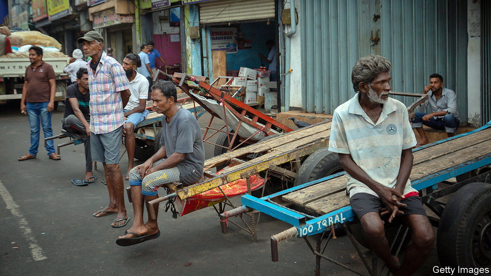

###### Debt in developing countries

# Emerging-market crises have become harder to resolve 

##### But less of a threat to the world economy 

 

> Jul 21st 2022 

Whenever america’s Federal Reserve , investors reflexively worry about a crisis in emerging markets. Today it might appear the usual pattern is playing out. On July 27th the Fed is expected to raise rates by another three-quarters of a percentage point. Meanwhile,  has run out of foreign exchange, Argentina faces another default and . Look more closely, however, and the world economy has been transformed in ways that mean the nature and consequences of  have changed.

The archetypal emerging-market crisis was in 1997-98. As the Fed raised rates, pulling capital back to America, Thailand’s currency peg broke, leading to a panic that floored South Korea and Indonesia. It then spread to Brazil and Russia, and to ltcm, a Wall Street hedge fund that collapsed. Calm was restored by the Fed and Treasury cajoling American banks to roll over loans, and by the imf. Three American officials who led the firefighting were dubbed “the committee to save the world”. A decade or so ago there was a faint echo of 1997-98 when the Fed signalled it would tighten policy, triggering a sell-off in emerging markets.

Yet today much has changed. Emerging economies’ share of global gdp at market prices has risen from 21% to 43%. Asia’s share of emerging-market output has doubled, to 60%, led by China and India, which are more self-contained financially, with state-led banking sectors and bond markets that are largely closed to foreigners. The weight of many crisis-prone places is small: Latin America represents 5% of world gdp and 1.4% of stockmarket value. 

Another change is that many emerging markets have moved away from currency pegs, dollar debt and foreign borrowing. Today only 16% of their debts are in foreign currencies. Governments increasingly rely on local banks. Instead of sudden crises that spill back across borders and to Wall Street, many places face slower-burn and home-grown dangers: inflationary spirals or zombie banks. A collapse of China’s debt-ridden financial system would hurt global growth because the Chinese economy is large, not because investors elsewhere are directly exposed.

The final change is that even where foreign creditors are important, their profile is different. For example, the “Paris Club” of creditors, which is composed mostly of rich countries and multilateral institutions such as the imf, accounts for less than 60% of the poorest countries’ debts, down from more than 80% in 2006. China accounts for about a fifth. 

The good news is that panics in emerging markets seem less likely to inflict serious damage on the rest of the world. We calculate the countries most at risk of default today account for only 5% of gdp and 3% of global public debt. The bad news is that these places have 1.4bn people, or 18% of the global population, and face a huge humanitarian challenge with higher inflation, debt loads, interest rates and expensive oil and food. 

Furthermore, the new distribution of their debts means it is harder to strike deals to provide them with debt relief. The West does not want to give aid that flows into the pockets of Chinese creditors. China is reluctant to participate in debt restructuring, even though any modern-day rescue committee needs a member from Beijing. As a result, even if emerging-market crises pose less of a danger to the global economy, they may pose more of a threat to the people living through them. ■

