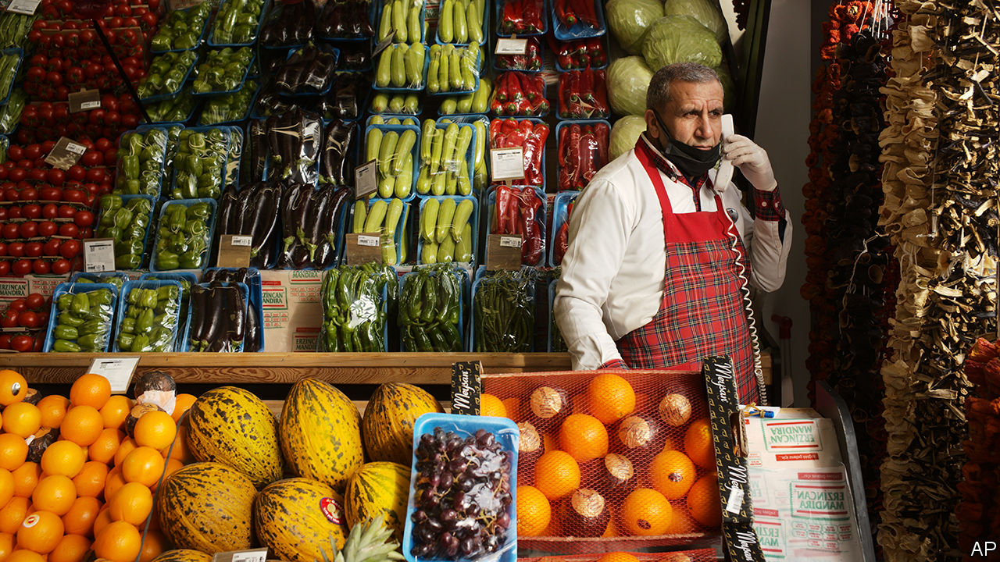
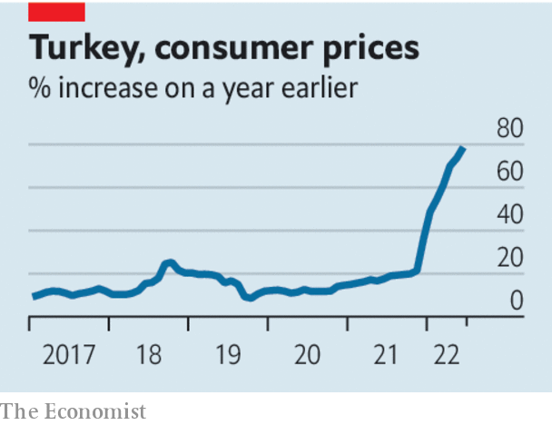

###### Recep for trouble

# Lessons from Turkey on the evils of high inflation 

##### It hurts investment and makes most people poorer 

 

> Jul 21st 2022 

It took for ever and then it took a night. That was how Rudiger Dornbusch, an influential economist , described the gestation of a financial crisis. In the Dornbusch telling, booms go on for much longer than seems rational or possible before they end with a speed that also surprises. The unsustainable can be sustained for longer than you would think.

Were Dornbusch still around, even he might be scratching his head about Turkey. For years it has been running a reckless experiment in . The country’s president, Recep Tayyip Erdogan, believes that higher interest rates are a cause of rising prices, not a cure for them. At the end of 2021, when most countries were either raising interest rates or preparing to do so, he directed Turkey’s central bank to slash them. The result could have been predicted, if not by Mr Erdogan. Inflation surged to almost 80% in a matter of months. Remarkably Turkey’s economy has managed to keep growing. Real gdp rose by 11% last year. Turkey’s boom . 

 


It is tempting to conclude from Turkey’s madcap experiment that high inflation is a nuisance that can nevertheless be coped with. Tempting, but wrong. The harms caused by runaway inflation are myriad, but three are particularly salient in Turkey: a shortening of horizons; pressures on day-to-day decision-making; and an arbitrary redistribution of wealth, which heaps the burden of inflation on those least able to bear it.

Start with shortening horizons. With stable prices, people do not have to pay attention to year-to-year changes in the average price level. Stability allows planning for the distant future. In Turkey, though, the long term is next month. High inflation is volatile. Businesses in the domestic market cannot predict their probable returns in real terms, so they are reluctant to invest in new capacity and opportunities. This harms long-term prosperity. There are immediate costs, too. Suppliers cannot wait months for payment when money is losing its value all the while. As a consequence, the informal credit and trust on which business relationships are built is eroded.

Damage is also done to decision-making. The price signals that direct resources to the best use become distorted. Businesses cannot distinguish between price increases that carry information about demand and supply in their particular industries and those that are a response to the falling value of money. As bad is the constant effort of running just to stand still. Prices have to be renegotiated all the time to stay abreast of the eroding monetary standard. This is exhausting. It is also socially corrosive. The constant haggling creates friction between firms and suppliers, businesses and customers, landlords and tenants. 

This is related to a third big problem, inflation’s effect on the distribution of wealth. Efforts to escape the inflation “tax” often come down to pushing it onto someone else. Businesses rightly complain, albeit mostly in private in Turkey, about the instability caused by inflation. But Turkey’s bigger firms have the resources and know-how to shelter from surging prices. The rich have property and hard-currency deposits to protect their wealth. The rest are not so fortunate. A recent poll found that more than a third of Turks are unable to meet their basic needs. Include those who can barely meet them, and the fraction who are struggling rises to four-fifths. It stands to reason that the poor suffer most from inflation. But middle-class Turks are also in pain. As their purchasing power shrinks and their job security erodes, many are falling out of the middle class, and feeling both anguish and anger at their loss of status. 

The politics of inflation are bad everywhere, but especially fraught in Turkey. Most voters seem to blame Mr Erdogan for inflation. He and his ak party trail in opinion polls for elections scheduled for next June. The big fear is that Mr Erdogan may resort to foul means to cling to power: by locking up his opponents, say, or declaring a state of emergency. Dornbusch’s insight about the unsustainable being somehow sustained has a scary implication in this regard. No situation is so bad that it cannot become worse. ■

