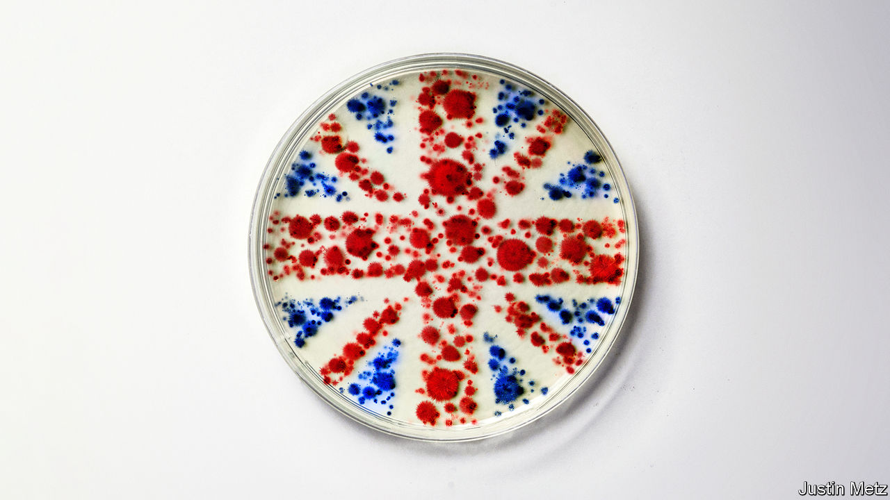

###### The growth cure

# The Tory leadership race and Britain’s growth challenge 

##### The life-sciences industry shows what embracing growth requires 

 

> Jul 21st 2022 

And then there were two. On July 20th Tory mps chose Rishi Sunak, a former chancellor of the exchequer, and Liz Truss, the foreign secretary, to  to become their new leader and Britain’s next prime minister. The candidates, who will campaign for the votes of Conservative Party members over the coming weeks, agree on at least one thing: . The 15-year period between 2004 and 2019 was the weakest for growth in gdp per person since the one between 1919 and 1934—and that was before the shocks of Brexit and covid-19. 

Boosting Britain’s feeble growth will require an honest assessment of what the country does well, not just where it lags behind. That may seem head-smackingly obvious. But it needs saying. The Tories won the 2019 election on the promise of a  with Britain’s largest trading partner. The big idea of Boris Johnson’s government has been , a scheme to reduce regional inequality that has often seemed more like an excuse to bash successful places. The financial-services industry, one of the country’s biggest assets, was an afterthought in Brexit negotiations. Brexit is a fact, and it will yield some opportunities. More should be done to  of northern cities. However if the Tories are to be a party of growth again, they must play relentlessly to Britain’s strengths. 

There is no better example of those strengths—which include scientific excellence, fine universities and a healthy startup culture—than the . Britain hosts four of the top ten universities in the world in life sciences, all of them within the “golden triangle” of Oxford, Cambridge and London. Enterprise is flourishing. British life-sciences firms raised £4.5bn ($5.4bn) in 2021, compared with £261m in 2012. 

In the National Health Service (nhs), the industry has a major asset: a large cradle-to-grave source of data for clinical trials and drug discovery. This ecosystem rose to the challenge of the pandemic. The Oxford-AstraZeneca vaccine —6.3m of them—in the first year of its roll-out than any other jab. The recovery trial, the world’s largest trial for people hospitalised with covid-19, went from first protocol to first patient in nine days. British institutions sequenced more than a quarter of all sars-cov-2 genomes during the pandemic. 

Yet the industry faces plenty of obstacles. In theory the nhs ought to be able to act as a centralised buyer of new medicines and products, giving startups a large market to test innovations. But it is often sluggish and stingy, and seldom cohesive. America’s competitive health-care market is swifter to adopt new technologies. The time from approval of a medicine to it being available to patients is 120 days in Germany, but 335 days in England. Lack of space is another constraint, particularly in the golden triangle: Cambridge had no available lab space in 2021, although property developers are now responding. Labour shortages are a worry: the industry says it will need 133,000 new staff by 2030.

Most important, there is not enough domestic growth capital available to young life-sciences and other technology firms. Investors often pull firms towards other markets, notably America, which has more large companies that can buy promising startups. The public markets in America are more hospitable, too. The London Stock Exchange accounts for less than 1% of the capital raised in global initial public offerings so far this year. Its biggest listing for a decade—a toothpaste-peddling spin-off from GlaxoSmithKline, one of two big pharma firms with headquarters in Britain, which took place on July 18th—is instructive. It raised no new money and involved no new technology. 

There are technocratic answers to such problems. The gap in growth capital would close if pension funds and insurers were able to put more of their money into venture-capital funds; less than 1% of these assets is currently invested in unlisted equities. The government this week endorsed proposals to smooth public listings. Last year it added the job of lab technician to its “shortage occupation list”, making it easier for foreigners with the right experience to get a British work visa.

Real change requires political will. Getting the life-sciences industry, and the economy as a whole, to grow faster will require the new government to face some hard truths. The first concerns Brexit. Leaving the European Union (eu) does yield some opportunities to liberalise: Mr Sunak wants to streamline the approval process for clinical trials, for example. Yet Brexit throws an awful lot of sand in the gears, too. Britain’s medicines regulator is approving fewer new drugs than its peers in the eu, in part because firms are heading to the larger market first. A bill to override the bit of the eu withdrawal agreement about Northern Ireland threatens British participation in the world’s largest multinational scientific-funding programme. Until the Tories stop treating Brexit as a test of ideological purity, its economic costs will only grow. 

Geography is another area where Tory thinking and economic logic collide. In 2021 the government released a plan it called the “Oxford-Cambridge Arc” to turbocharge connections between the two cities. That scheme was fundamentally wise—the fastest way to get between them by rail now is via London. But it was quietly dropped, in part because it was thought to conflict with levelling up, in part because the government is nervous of building anything that spoils the views from voters’ windows. It is reasonable to worry about governments picking winners; only in Britain has it been policy to pretend winners don’t exist. 

The Tory leadership debate about growth has so far focused on . Ms Truss thinks an unfunded giveaway would pep up the economy; Mr Sunak argues, rightly, that it would fuel inflation. In making these arguments, both lay claim to the mantle of Margaret Thatcher. But Thatcher was defined above all by her character, not her policies. Hauling the British economy out of a deep rut took steel and stamina. These qualities are needed again today. It is easy enough to talk about the need for growth, much harder to embrace its consequences: difficult compromises with the eu, more money for already-wealthy areas and unpopular planning decisions taken in the teeth of local objections. The fortunate thing is that Britain boasts world-class strengths. It should play to them. ■


