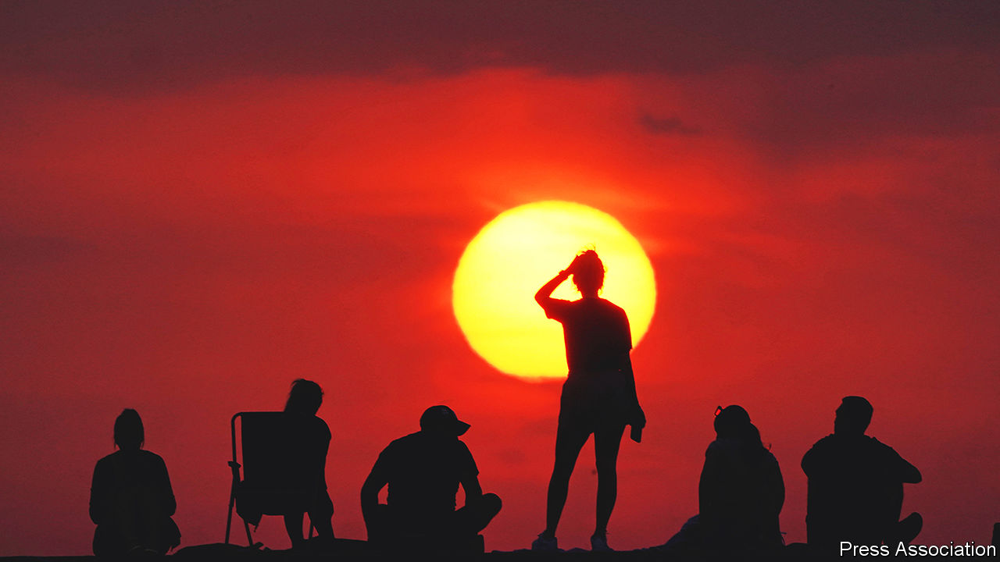

###### Torrid and horrid

# Today’s heatwaves are a warning of worse to come 

##### Adaptation will be disruptive, costly and essential 

 

> Jul 20th 2022 

There comes a moment when the penny drops. And  the sound of dropping pennies was loud. Though Britons are by no means the worst affected by the heatwaves now sweeping the northern hemisphere, they have been in awe of a particular round number: 40°C. This is an air temperature never before recorded in the United Kingdom. But it was matched and exceeded in several places on July 19th. It is one thing to understand intellectually that , quite another to feel one’s own brain baking.

That record rammed the point home in Britain. In the , in parts of China and in North America similar lessons were being learned, with  and people dying of heatstroke. Heatwaves are nothing new. But they have become more frequent and more extreme, and . A recent study found there are now seven times as many days of simultaneous heatwaves in the northern hemisphere as there were four decades ago. That simultaneity is partly a statistical inevitability: more heatwaves mean that more will occur jointly. However, changes in the pattern of the jet-stream, a high-altitude air current which regulates northward migration of hot air from the tropics, may be making things worse.

Increased intensity and frequency (America, for example, had two heatwaves a year in the 1960s and six in the 2010s) is bad enough. Increased simultaneity may have even more baleful consequences. Heatwaves damage agriculture. Simultaneous disruption of plantings or harvests in different places could create crises that cannot be dealt with by moving produce around the world, because there is less to move.

The latest heatwaves have also emphasised how built environments are designed for a bygone climate. To use Britain, again, as an example, parts of the rail network came close to paralysis because the rails on British track beds are optimised to be stress-free at 27°C. Temperatures in the high 30s are outside their comfort zone. Rails can be changed as societies adapt to rising temperatures. But the cost and disruption of upgrading all the infrastructure that will need it, from houses to hospitals to fire brigades, will be immense. Even in rich countries, governments struggle to commit the necessary resources, as America’s is showing with its beleaguered  package.

In poor countries things will be worse. They have less cash to pay for adaptation and more need of it, not least because they tend to be near the equator, in zones where heatwaves can . They also tend to have high population growth, meaning .

A further irony is that in some cases applying technology to adapt to higher temperatures, in the form of air conditioning for inappropriately designed buildings, increases demand for electricity. In Britain, just this week, such demand has risen by 5% compared with the previous week. This is fine if the juice used comes from green sources. But if it originates in fossil-fuel power stations, it will, itself, accelerate global warming.

Adaptation, to this and other manifestations of a changing climate, is a crucial spanner in the toolkit. But it does not absolve people from addressing the problem at source, by encouraging green power-generating and energy-saving technologies and discouraging and decommissioning the “brown” sort. If the dropping pennies released by this summer’s heatwaves inspire action in that direction, the suffering and loss of life will not have been entirely in vain. ■


