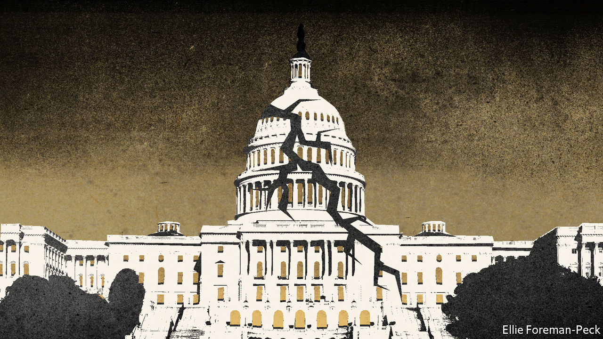
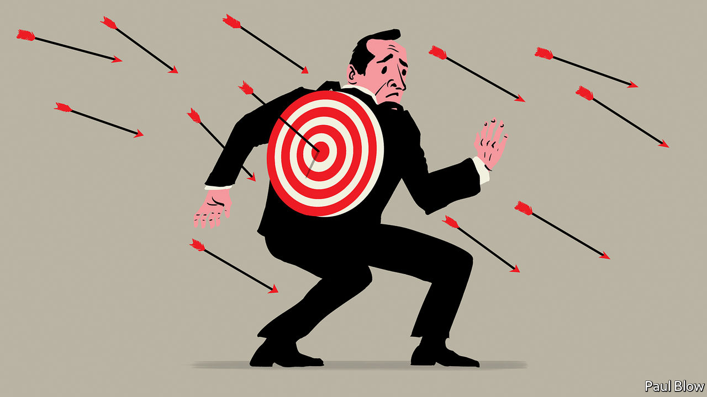

###### On medical data, Singapore, Boris Johnson, Switzerland, servant-leaders

# Letters to the editor 

##### A selection of correspondence 

 

> Jul 21st 2022 


Medical intrusions

As national data guardian for health and adult social care in England I share your sense of excitement about the potential of artificial intelligence to improve health care (“”, June 25th). However, by describing privacy concerns as a “hurdle” to overcome, which governments “fret” about, you take too narrow a view of the unease that people feel about the use of their data. People have strong opinions about who stands to benefit, including financially, from the use of such data. Many also worry that the insights gleaned from the information may be used in ways that disadvantage them or others.

Building and maintaining public and professional trust in how, why and by whom people’s confidential health and care data are used is fundamental to ensuring that the potential benefits we all stand to gain through data-driven research can be fully realised. I am pleased that the British government has made some firm commitments in its recent data strategy to building such trust. 

My panel of advisers and I look forward to contributing to this work as the government’s strategy evolves.

dr nicola byrne

National data guardian


As antiquated as they seem, paper medical records have a permanence and tactile quality that allows searching even after the passage of decades. Having introduced a health record in 2008, Google dropped it in 2012. Resurrected in 2018, it was again taken down in 2021. Given the transient nature of these ventures, one would imagine medical professionals will be slow to commit much data to Care Studio, Google’s latest innovation targeted at doctors.

brian o’brien


You described America’s health-care system as “labyrinthine”, “protected” and “stodgy”. I would describe our system as hopelessly inefficient, irrationally duplicative, financially cruel and disgracefully unequal. 

I wholeheartedly welcome the entry of technology firms into our health-care market, not because I trust them but because I cannot imagine it getting much worse. 

dr nathan claydon


 


Hong Kong v Singapore

You wrote about the rise of Singapore (and Shanghai) as a global financial hub and the decline of Hong Kong (“”, July 2nd). That view aligns with what Lee Kuan Yew, Singapore’s prime minister from 1959 to 1990 and, to my mind, one of the world’s greatest statesmen, predicted would happen to the two cities in his book, “One Man’s View of the World”, published in 2013. Even before the recent crackdowns by China’s Communist Party on civil and political liberties, which have undermined the rule of law and scared businesses away, Lee stressed that Hong Kong, now being a part of China, would grow ever closer to the mainland, with all the strains that come with that. As a result, it would become less attractive to global business and more like a regular Chinese city. 

By contrast, Singapore, being an independent country with a government dedicated to openness, anti-corruption and the rule of law, would grow ever more important to the region and for global business. This is just what we are seeing today. 

aurelio ortiz camacho


 


Boris lacked charm

“The charismatic Mr Johnson” (“”, July 9th). Really? The idea of charisma used to be understood as an exceedingly rare characteristic of leadership. If the word can be applied to Boris Johnson then it has truly lost all meaning. 

Max Weber, a German sociologist, wrote in “On Charisma and Institution Building” that the “charismatic leader gains and maintains authority solely by proving his strength in life. If he wants to be a prophet, he must perform miracles; if he wants to be a warlord, he must perform heroic deeds. Above all, however, his divine mission must ‘prove’ itself…those who faithfully surrender to him must fare well. If they do not fare well, he is obviously not the master sent by the gods.”

Strength in life? Miracles? Heroic deeds? Mr Johnson might make a good case study of failed leadership, but not of charismatic authority.

r.j. mcallister


 


The Swiss model

Switzerland is “nobody’s idea of a forward-thinking place”, you say (“”, July 9th). I beg to differ. The “where-to-be-born” index, published by your own Economist Intelligence Unit in 2013, claims Switzerland is the best country to be born in. For good reasons. The country is ranked second in global competitiveness, first in patent filings per person, second in human development and first in trust in government. It does this with the seventh-highest share of renewable energy as a percentage of total energy.

Admittedly Switzerland is boring. The notion of our citizens storming our capital or the bbc featuring a running total of minister resignations until its prime minister is forced to resign because, well, there are too few left to govern, would be unthinkable. 

What made America and Britain such great countries? And what could they do to regain their excellence? We often complain about this or that, but progress is usually about finding something that works and then reverse engineering it. Perhaps now is a good time to peek over the garden hedge and survey other countries for best practices. The way Hamilton, Jay and Madison did when they conceived the American experiment. Maybe becoming a quietly prosperous, slightly dull nation, at peace with its neighbours, where political high dramas and extremists have no place, where policy arises from careful deliberation and compromise, where gross inequalities are reduced and people feel they belong, is not such a bad place to learn from. 

r. james breiding


 


Latin America

Your special report on Latin America () did an excellent job of summarising the woes faced by the region. But there is another particularly important issue that impedes reforms there: the widespread perception in the region that politics is inherently a zero-sum game. 


The middle income status of most Latin American countries creates high and unmet expectations of how much better things should be. This, combined with the legacy of unsuccessful reforms to increase growth from the last 20 to 30 years, has resulted in a cynical perception by many Latin Americans that reforms are really about how to split the pie, never truly to grow it. Although not unique to the region, my impression is that it is more pervasive there then in almost anywhere else in the world and encourages interest groups to oppose reforms almost reflexively.


Paradoxically, a potential solution to this may be for politics to acknowledge openly the pie-splitting aspect of reforms. Outright stating that badly needed reforms will create some losers might help create a more healthy understanding about the short-term pain versus long-term gain of reforms, helping temper expectations. It would also lower the opposition from vested interests, especially if they receive some short-run compensation for their losses.


PEDRO FRANCO DE CAMPOS PINTO

Assistant professor

Musashi University


 


In “” (June 18th) you state that “Latin America in turn needs to recognise that it has much to gain from rebuilding closer ties [with the West], and that its role in a world dominated by China would be that of a neo-colony”.


I fail to see, however, how this would be any different from how the Central American Free Trade Agreement subjugated poorer nations to raw goods production and manufacturing colonies of the United States.


So long as poorer Latin American states are hamstrung by anti-competitive, protectionist economic policy from the United States and others, the gap between educational promise and economic opportunity for younger Latin American generations will persist. Perhaps the spectre of Chinese intervention in Latin America will cause American politicians to re-assess their economic colonisation of their southern neighbours with more favourable terms. 


I for one am not holding my breath.


NATHAN BYRD


 


In which we serve

Bartleby scoffed at the concept of the “servant leader” (). The phrase can be traced back to the Bible, in 1 Kings 12:7, where a rookie king is given advice that if you serve the people they will serve you. Intriguingly, one 19th-century Hebrew commentary reads this advice as a cynical ploy. Just tell the people you are there to serve them, and they will not stipulate any limitations or conditions at your coronation; eventually you’ll get all the power you want, having caught more 

flies with honey. 

I suspect many a manager would gladly subscribe to this rather devious version of servant leadership.

shalom rosenfeld


The motto of the Royal Military Academy Sandhurst is “Serve to Lead”. It has stood the test of time, although the British army has endured its share of charlatans and poltroons in its officer corps. Sandhurst officer-cadets of a cynical cast of mind often turned out to be the most able, inspiring, and humane leaders, when it counted. Their alternative motto was “skive to survive”. 

pablo miller


