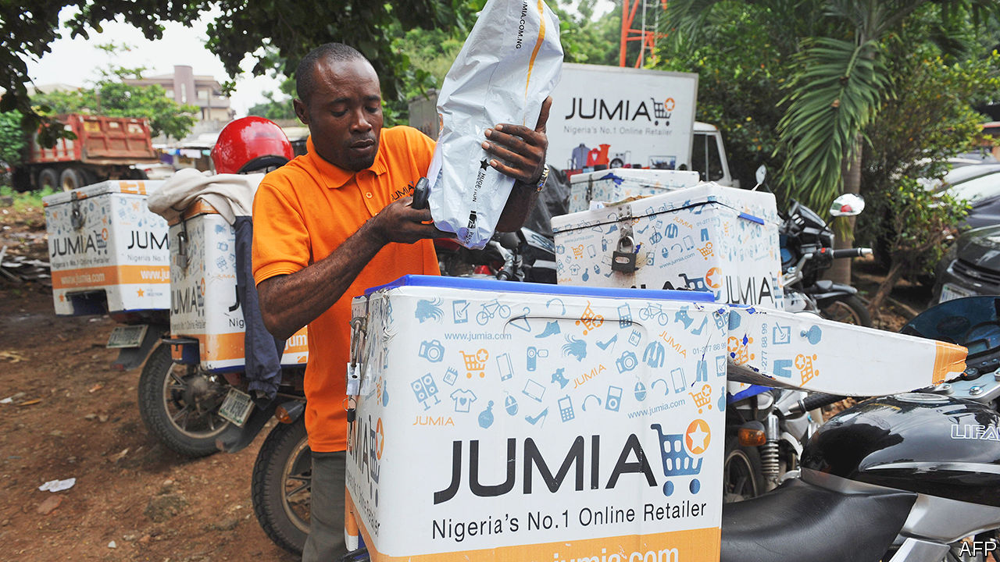
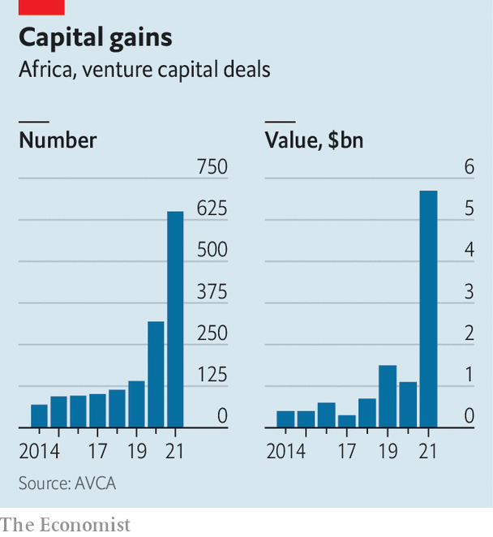

###### Adventurous capital

# African startups are raising unprecedented amounts. What next? 

##### The continent is the only region in the world not suffering from a slowdown in venture capital 

 

> Jul 21st 2022 

When maurizio caio, a fund manager with about 20 years of experience in tech, began raising money in 2015 for an African startup fund, investors were hesitant. “They said to pick either Africa or venture capital (vc),” says Mr Caio, who jointly runs tlcom Capital, a fund focused on Africa. “There is an Africa risk and a vc risk,” was the message. “Don’t combine the two.” 

 


Such attitudes are rarer these days. Last year 604 African startups raised a total of $5.2bn, according to the African Private Equity and Venture Capital Association (avca), an industry group. This was more than the total invested in the seven preceding years (see chart). Though just a fraction of the $600bn invested globally by vc funds, it was a sign of changing attitudes towards a continent that lacks capital and needs more businesses. It is a shift that should endure, despite the global economic downturn. Five of Africa’s seven “unicorns” (startups valued at more than $1bn) won their horns last year.

American investors led the charge, with 357 involved in deals last year, compared with 268 in total in 2014-20. These included such firms as Andreessen Horowitz, Tiger Global and Ribbit Capital, and billionaires like Jeff Bezos and Jack Dorsey, the founders of Amazon and Twitter respectively. “We’ve broken into the mainstream of global venture capital,” says Daniel Yu, the founder of Wasoko, an e-commerce startup that raised $125m in March. He thinks the success of e-commerce firms such as Flipkart in India and MercadoLibre in Latin America has spurred investors to seek similar opportunities in Africa. 

Capital may soon be harder to come by. “Fundraising will be much tougher,” says Marlon Chigwende of Admaius Capital Partners, a fund based in Rwanda. “Africa ends up being one of the last places to look and one of the first places that will get pulled back.” That may end up being the case, but there is not yet a slowdown. Startups in Africa raised more in the first half of this year than in the same period last year, according to data collated by Max Cuvellier, who publishes a newsletter about African vc, making it the only part of the world where such investment is still growing. 

 One reason for this is the growth of Africa-based funds, which invested in a quarter of deals last year, compared with 10% between 2014 and 2020. Richard Okello of Sango Capital, based in Johannesburg, says, “African vc will be left standing in this slowdown,” because the capital they raise on the continent is less flighty. Rich Africans are increasingly dabbling in vc. Successful founders tend to reinvest their wealth in new firms. And Africa’s myriad market failures mean that there are openings for startups that tackle inefficiencies in areas such as retail, energy and logistics. “There is money to be made in these supply-demand gaps,” says Mr Okello. What is more, he adds, valuations are lower relative to revenues in Africa than elsewhere.

“Five years ago the experience of trying to get investors sold was very different,” says Onyekachi Izukanne, the boss of TradeDepot, a Nigerian e-commerce startup. Many investors sought out startups that resembled ones that had thrived in the West; Jumia, dubbed the Amazon of Africa, became the first African unicorn. Though its early backers did well when it went public, the firm has since lost much of its value because of a business model that did not fit poor consumers and creaky logistics. Today, rather than hunt for consumer-facing businesses like Amazon, investors focus on startups that make it easier for firms to send money to each other, transport goods and fill inventories. 

Even so, the vc industry in Africa has a way to go. Because it is still nascent, it has not yet built up a record of mouth-watering returns to tempt a wider pool of investors. And even if startups do well, vc funds worry that plummeting local currencies may yet erode their gains. Diversification might help, but the industry is concentrated in Egypt, Kenya, Nigeria and South Africa. And it may be overlooking the many firms founded by women, who still find it particularly hard to raise money, says Eloho Omame of FirstCheck Africa, a fund that invests in such outfits. 

A shortage of skills is another problem. Software developers are in high demand. Perhaps more important, so are the seasoned managers who can turn potential into profitability. Those with experience in multinational companies often struggle when they move to startups, adds one founder. Legal expertise is scarce, too. That has contributed to a complaint by founders—and later-stage investors—that Africa’s young entrepreneurs give away too much equity, too soon. 

Governments could do more to let the industry thrive. Conservative rules on how pensions use their money crimp investment. For startups, myriad regulations, especially around payments, hamper growth. This matters because investors want to back startups with the potential to scale up across Africa. Rich countries make life hard, too. Getting visas to travel to meet investors is a pain, notes Dare Okoudjou, the boss of mfs Africa, a payments firm. If it were not for his French passport (he also has one from Benin, his country of birth), he says he would not have been able to expand his firm. 

Even if the next few years prove more challenging for African startups and vc, the industries seem likely to continue to grow and prosper. Today few money managers would be laughed out of an investment committee for suggesting an African venture, says Mr Caio. Just as encouraging, there is less reliance on funds that insist that an African business must solve all kinds of social problems as well as turn a profit. These days, “Africa is just a market with great business opportunities—like everywhere else.” ■

