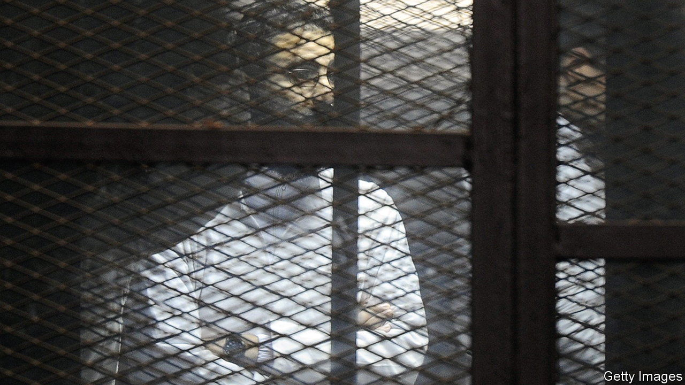

###### Too many prisoners to count

# Egypt locks up “terrorists”, but won’t say which terror group they belong to 

##### President Abdel-Fattah al-Sisi calls for “dialogue” with critics 

 

> Jul 18th 2022 

It was hard to believe. At an annual breakfast gala in April near the end of the Muslim holy month of Ramadan, President Abdel-Fattah al-Sisi suddenly wanted to hold talks with his downtrodden opponents. “The homeland is big enough for all of us,” he said. “Differences of opinion need not spoil it.” To show goodwill he revived a presidential pardons committee. Several thousand ordinary prisoners were freed but very few political ones. All the same, not since toppling an Islamist government in a coup in 2013 has the former general struck so conciliatory a tone.

In any event, the national dialogue officially set to begin this month is unlikely to reverse Egypt’s slide into despotism. The , which ran the previous government and has the largest contingent of political prisoners, has been excluded from the talks. Opposition parties taking part are doing so to get their members freed. Hamdeen Sabahi, a moderate left-wing opposition leader, was shown on television embracing Mr Sisi after the dialogue was announced. Two days later a close comrade was freed. 

When Mr Sisi took power, he at first cracked down on his Islamist foes, especially the Muslim Brothers. But in recent years the repression has been aimed more widely—at anybody who, for instance, criticises the president’s economic policy, or complains of sexual harassment (especially by someone well-connected), or offends conservative mores. All such critics risk going to jail. Fair trials are rare. 

Least accountable for abuses are the security services. In January a leaked video appeared to show torture at a Cairo police station. Rather than investigate the police, the state prosecutor put the alleged victims on trial, accusing them of undermining the police by fabricating a tale of torture. 

Public speech is controlled ever more rigorously. After Mr Sisi came to power, the intelligence services bought several of the main television channels. Officials feed talking points into current-affairs programmes and approve . Even novelists must kowtow. The only Egyptians who publicly denigrate Mr Sisi live abroad. To silence them the security services often arrest their relatives. Human-rights defenders are hit with travel bans, their assets often frozen to make life miserable at home. Hundreds of websites deemed critical are blocked.

Despite the talk of reconciliation and some token releases of political prisoners, the pace of arrests for political reasons, including simply making Egypt look bad, has not abated. In recent weeks Egyptians have been arrested for panning the government on Facebook, for posting videos on TikTok of people dancing in a mosque, and even for encouraging people to meet near midnight dressed as Batman. “It’s a machine of repression and it’s difficult to stop it,” says a rights researcher.

The number of people behind bars for non-violent opposition is impossible to calculate but must number in the tens of thousands. A main reason for the imprecision is that much of the justice system has come under the control of Egypt’s shadowy Supreme State Security Prosecution (sssp). Its caseload under Mr Sisi has exploded from 529 new cases in 2013 to 2,800 last year. Suspects are usually accused of joining a terrorist organisation or spreading false information. Often they are not told which militant group they are accused of joining—”for reasons of national security”.

Where have they gone?

In the year after Mr Sisi’s coup rights groups counted about 45,000 dissidents who had been taken to court. The tally of cases was even uploaded onto a widely shared open-source document called Wiki Thawra (Wiki Revolution). But it soon became harder to track the numbers. Once a critic deemed worthy of silencing is accused of being a terrorist, his or her case is handled by the sssp, which often denies access to lawyers for the defence and keeps the evidence and case files secret—once again, on national security grounds. Prisoners then become harder, sometimes impossible, to count or trace. 

Another difficulty in totting up the numbers is that a single case can embrace a multiplicity of defendants. A rights group that scrutinises the sssp found that it opened 2,800 cases last year. As of June 7th, only nine of them had been referred to trials, encompassing 336 defendants. In 2016 the Arabic Network for Human Rights Information, an Egyptian rights group that was forced to close down this year, estimated that the number of political prisoners had ballooned to 60,000. Its researchers’ latest reckoning is 65,000. Some speculate it is higher, others lower. Many thousands of unknown prisoners are thought to be stuck in pre-trial detention, where prisoners often languish for months and sometimes years. 

Egyptian law sets a two-year limit before suspects should be tried or freed. But prosecutors get around this simply by reassigning suspects to new cases, a device so common that it is known as “rotation”. The sssp can thereby reset the clock and hold suspects indefinitely without trial, even if their only initial offence is to have posted a flippant remark on the internet. 

Egypt’s most prominent political prisoner, , a blogger and computer programmer, was arrested in 2013 for allegedly inciting a protest against Mr Sisi’s draconian ban on protests, which are now exceedingly rare. After serving five years, he was rearrested and spent over two years in pre-trial detention. In December a court sentenced him to another five years, this time for sharing a Facebook post about abuse in prison. Since April, he has been on hunger strike in a bid for freedom. 

Interrogators regularly torture suspects with electric shocks or hang them by their limbs in the hope that they will confess. Sentencing has become more severe. Egyptian courts condemned at least 356 people to death last year, the highest number in the world after China and Iran.

Prisons themselves are houses of horrors. Inmates are often beaten and denied visits, fresh air and urgent medical care. Cells for solitary confinement can be too small to lie down in. More than 1,000 people have died in detention since 2013, including the president Mr Sisi toppled, Muhammad Morsi, a leading Muslim Brother. He died of a heart attack in court in 2019 after being denied treatment in prison for high blood pressure and diabetes. When Ayman Hadhoud, a 48-year-old economist critical of the government, died in police custody in March, his family was not notified until over a month later. The public prosecutor called it a heart attack and denied that there were signs of torture, as claimed by rights defenders. It is reckoned that last year a detainee died from medical complications on average once a week. 

Mr Sisi has said there are no political prisoners. Officials say that instances of torture are very rare, attributing them to bad policemen. But the regime is twitchy about such allegations. This year jails were relabelled “reform and rehabilitation centres.” Prison wardens have been renamed “directors”. Some inmates are being transferred to two new prison complexes with supposedly better conditions. Mr Abd el-Fattah was moved to one in May. His sister has reported that it was the first time in years that he had slept on a mattress. ■

