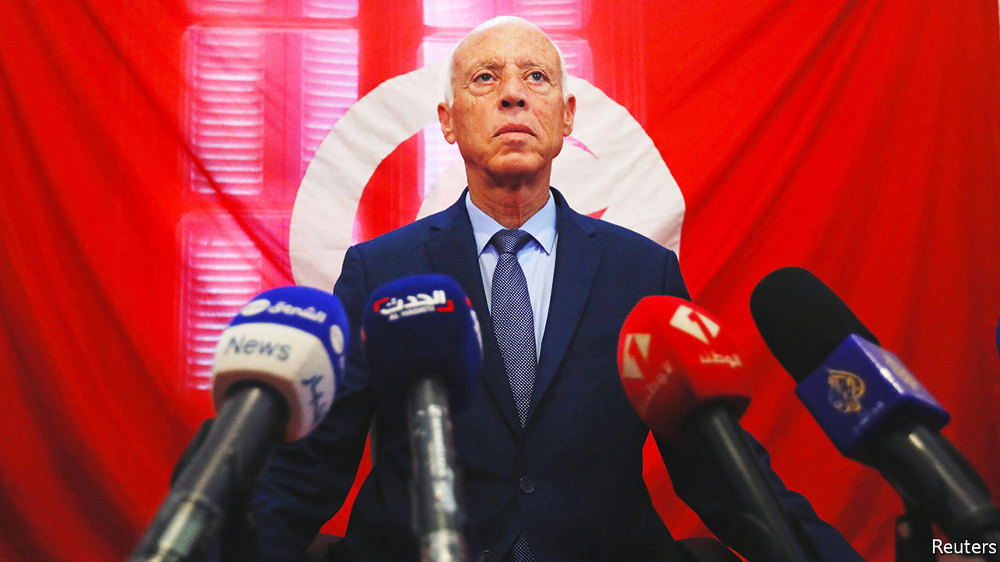

###### Constitutional con

# Tunisia’s president is pushing an ominous constitution 

##### Kais Saied will probably get his way, but his new charter will solve little 

 

> Jul 21st 2022 

In a past life Kais Saied might have flunked himself for turning in such shoddy work. Once a constitutional-law professor with a reputation for exactitude, now Tunisia’s president, Mr Saied gave himself a big homework assignment this year: draft a new constitution. As with many a group project, it got going late, leaving his fellow authors just a month to overhaul the existing national charter. He finally released the text hours before a self-imposed deadline, only to admit a week later that it contained mistakes.

On July 25th Tunisians will mark his handiwork in a referendum. Or, rather, some will: the ballot was scheduled for a long holiday weekend in sweltering midsummer, not a time when many people like to queue at polling stations. 

The new charter would turn Tunisia’s parliamentary system into a strong presidency. Almost 12 years after Tunisians overthrew a dictator in the first revolution of the Arab spring, a small share of them will decide whether to anoint a new one.

The referendum comes a year to the day after Mr Saied suspended parliament (which he later dissolved) and much of the constitution. He has since taken a sledgehammer to Tunisia’s democratic institutions, seizing control of the electoral commission and sacking judges. He now rules by decree. Though he appointed a prime minister last year, her powers are limited.

His new constitution would formalise this power grab. It allows the president, not the prime minister, to hire and fire ministers and to declare an indefinite state of emergency. mps would lose the power to impeach the president, along with some of their parliamentary immunity. They would, for instance, be liable to prosecution for libel or slander. An odd clause on religion and state seems to make Mr Saied the arbiter of God’s will in Tunisia. “It’s unchecked concentration of power in the president’s hands,” says Mohamed-Dhia Hammami, an academic.

The existing constitution, approved in a referendum in 2014, went through multiple drafts over two years. Elected representatives toured the country to hold public debates and parley with civil-society groups. The process was imperfect but gave many Tunisians a say in the outcome.

This time, no one is even sure who wrote the text. Mr Saied asked for input through an online survey, which fewer than 4% of Tunisians bothered to complete. He named a committee to draft the constitution on May 20th. Its work was due a month later. Sadok Belaid, the law professor who led it, has since denounced the final product. He says Mr Saied’s text differs from what the committee submitted and calls it “dangerous”.

Advisers, or the president himself, seem to have made last-minute changes—sloppily. Among the errors Mr Saied acknowledged on July 8th: the constitution failed to specify if parliament would be elected directly, or—as the president has proposed—indirectly by local councils.

Voters had less than four weeks to consider the text before the referendum. The run-up to it has been subdued. Mr Saied has no political party and has done little campaigning. His opponents have done even less to urge a No vote. Instead, several parties, including Ennahda, the Islamist faction that held a plurality in parliament, have urged voters to boycott. Tunisia’s formidable main public-sector union has not taken a position.

Tunisians need little encouragement to stay at home. Voter turnout has been falling since the revolution, from 68% in the general election of 2014 to 43% in 2019. One poll in May found that only 13% of voters planned to show up for the referendum. But no minimum turnout is required to endorse the new charter. 

Still, a derisory showing would be a big blow to Mr Saied. His popularity has slipped in one survey from 82% last summer to 59% in April. Yet once the new constitution is in place, he may ram through an electoral law that scraps party lists in favour of individual candidates, further hobbling the already weak opposition.

None of this helps tackle Tunisia’s most pressing concern, the economy. Unemployment is 16% and inflation 8.1.%. The central bank said in May that the fiscal deficit would reach 9.7% this year, instead of 6.7% as previously expected, partly owing to costlier food and fuel subsidies. The current-account shortfall will be similarly big. Tourism has yet to recover from covid-19.

The government is hoping for a $4bn loan from the imf, but the main trade union opposes cuts in public wages that might come with it. The union flexed its muscles in June with a one-day strike that closed state-run firms, public transport and even airports. Mr Saied has little to say about any of this, delegating economic policy to his ministers while he chases his more abstract political goals.

Before he became president, Mr Saied once described referendums as a tool used by Arab dictators to create a veneer of representative government. Now he is eagerly using them for just that purpose: to provide a façade of democracy while tearing down a flawed but real one. ■

