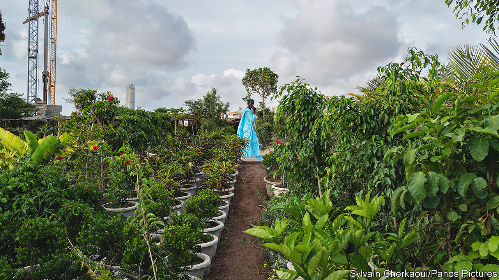
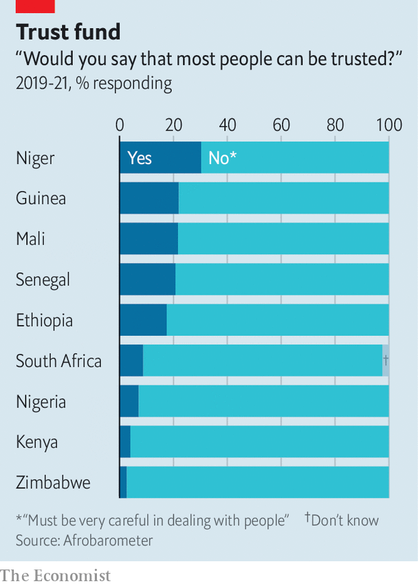

###### Growing trust

# Why nurseries in Senegal leave pricey plants unguarded 

##### Dakar’s unsecured green assets are rarely stolen 

 

> Jul 21st 2022 

Tucked alongside the baking asphalt and dusty curbs of Dakar, the capital of Senegal, are dozens of small oases. In garden nurseries shapely shrubs, bright bougainvilleas and potted palms leaven the heat. Along some roads scores of nurseries cluster together, giving motorists the momentary sensation of zooming through a botanic garden. At night these green-fingered traders simply go home, leaving their leafy assets rustling in the breeze, vulnerable to any passing thief. How odd. 

The value of this unattended flora quickly adds up. Pierre, a nursery owner, says that each of his plants is worth 10,000 cfa francs ($16) on average. He has about 300. With perhaps 30 other plant purveyors on the same stretch of road, some $150,000 of shrubbery is left by the green-fingered to the mercy of the light-fingered. That is a fortune in a country where the average income is only about $4.50 a day.

 


Such a contrast could be a recipe for theft—or a strong argument for a night watch to secure these green investments. Yet Birane, a 70-year-old trader, says he has suffered only one theft in his career. “We don’t have a guard,” he smiles, gesturing to the dozens of nurseries nearby. 

Sometimes there is no one there during the day, either. When your correspondent visited on a public holiday only three of the 30 or so nurseries had anyone present—and one of them was asleep in the undergrowth. Even on normal weekdays many owners simply leave signs with phone numbers for interested buyers to call. 

Such confidence is not uncommon. Pollsters from Afrobarometer found that the Senegalese are the fifth most trusting people in Africa. One in five of them think “most people can be trusted.” That may be enough. Adama, who runs a roadside nursery, says he has suffered only a few thefts in ten years. “If you are friendly to everyone then when you are away they keep an eye out, even at night.”

Ignorance may also play a role. Most people do not know the value of vegetation, explains Birane, pointing out a rare variety worth 50,000 cfa. The only people who might steal such pricey plants are gardeners he knows and works with, he notes with a chuckle. And since he sells his bigger, more valuable ones in heavy pots they are harder to snaffle. Some flora also defend themselves: cacti can spike the enthusiasm of thieves scrabbling in the dark. 

Not everyone is so sanguine. At a small nursery in a posh part of town Moustapha, the young owner, has persuaded some unemployed friends to keep watch overnight. “I’ve invested a lot so I must keep it secure,” he explains. Yet even he falls back on trust of a different kind—in God. I have “mystic security”, he adds with a smile. “He who steals falls sick until death.”

