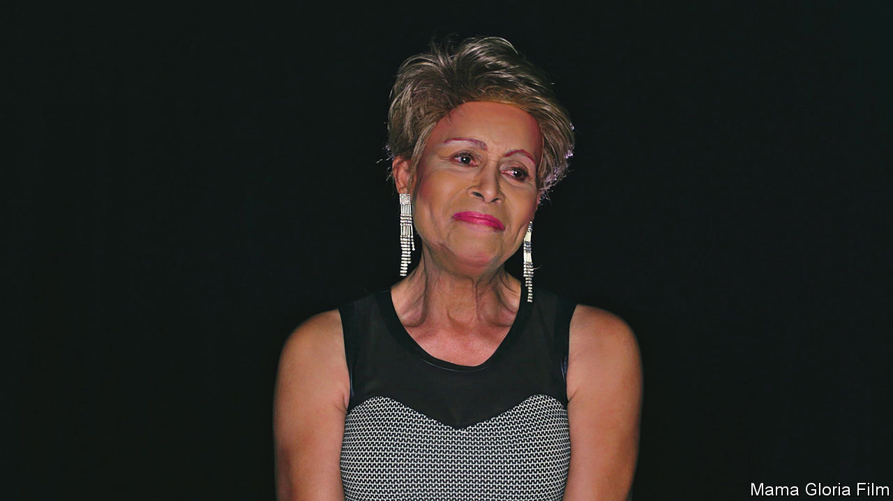

###### How to be a lady

# Gloria Allen ran a charm school for young trans women 

##### Her motto was: “Learn to embrace yourself inside and out” 

 

> Jul 21st 2022 

Centre on halsted, next to Whole Foods, was—and is—one of the best indoor meeting places for lgbtq people in Chicago. Young trans adults, many of them homeless because their families had kicked them out, could socialise there as long as they liked. Their elders, 60-plus, could get a hot nutritious lunch. And if you walked in there after 2012 you might well have spotted a poster on the wall:

CHARM SCHOOL

For young transgender persons

Learn to embrace yourself inside and out!

Hosted by Mama Gloria

The school happened twice a week in Room 205, which didn’t give much impression of any lessons going on. Instead, groups mostly of young trans women would be casually chatting, interrupted every so often by a slim, beautifully turned-out black woman with deep dimples, her mother’s genes. Everything about her, from the pixie haircut to the huge earrings to the halter-neck tops, was a statement of confident femininity. And she didn’t miss a thing. “You sit down like a man,” she would tell one girl. To another: “Do up that jacket button.” To another, “Now, you don’t brush your hair in public.” Mostly, however, she just listened as they poured out their stories. 

Her school made her famous all over Chicago and beyond, a surprise to her as much as anyone. After all, it was so old-fashioned, and she herself was from prehistoric, or at least pre-Stonewall, times. It had all started when she was having the seniors’ luncheon one day and a group of rowdy trans girls came in, gyrating and cutting up and exposing themselves. She went right over and told them to have some respect, cover up, clean up and watch what came out of their mouths. In a word, be ladylike. They paid attention, another surprise, and a bell went off in her head—— “They need a charm school here.” She asked for a room at the Centre, got one, and took things from there.

At the school she taught, in her free-flowing way, social graces, manners, deportment, use of soap and water, how to behave in interviews, when not to put their hoochie mama clothes on, and safe sex. She told them how to do make-up and draw power from their identity as women. When they “graduated” she kept in touch, noting how many went to college or got good jobs, and continuing to tell them how proud of them she was. 

She herself was transgender long before anyone knew that word. Instead she was called a sissy, which didn’t bother her, and because she was prissy and cute and different the men of the family were confused by her. She was the first of eight children and came out, she liked to say, the moment she left her mother’s womb. But she was called George, and her father had wanted a strong, masculine boy. Now he didn’t know whether to be ashamed or to protect her. When her brothers got summer jobs at the steel mill where he worked, he wouldn’t let her join them. 

High school was a trial. She got through it in her boy’s clothes, but if at weekends she wanted to wear a dress and parade down the street she would duck behind cars to avoid people she knew. Stones were thrown at her, and one summer Sunday four boys raped her in an alley as she walked home from the cinema. She dropped out for a year after that, unable to understand how anyone could treat her that way. But it wasn’t only other people who disliked her. Just then she couldn’t, and didn’t, love herself.

Worse times followed. She started hormone injections in her mid-20s, then lengthy reassignment surgery, and every relationship she entered became abusive after a while. She spent ten years with a man called Kenneth whom she loved no end, and they bought a little house together; but he would go round it with a white glove looking for dust, and if he found some he would beat her. He did drugs, and cheated on her with men. In the end she shot him and, though he survived, she walked out. Hers seemed to be the life of too many black trans women: poor, struggling to find jobs and liable to get hit, or worse, by the men they went with. The difference was that, deep down, she had a stash of confidence. 

Three amazing women, her mother, grandmother and great-aunt, had trained her that way from childhood. They not only accepted who she was, but encouraged her. Their own careers embraced the queer scene in Chicago: her mother, a noted beauty, danced in gay clubs and her grandmother, a seamstress, sewed the sparkly g-strings of male strippers. Nothing fazed them. If she borrowed her aunt’s scarves and did the Dance of the Seven Veils round the house, that was fine. If her eyebrow pencil or clothes weren’t right they would immediately say, “Oh no, sister, you do it again.” From them she learned how to speak well and carry herself, head high, with a woman’s dignity. She could always confide in them, and their love was unconditional. Though life as a black trans woman kept hitting up against walls, she could press through them. The only time she entered a closet, she defiantly declared, was to get herself an outfit and a pair of pumps. 

This was what she wanted to pass on in Room 205. She took the poor trans girls who came to her off the streets and made them her chosen family. At first, when they called her “Mama Gloria”, she felt it wasn’t right, since she had no children. But quickly they became her babies, because mothering and listening was what they so obviously needed. If they had no money she would give them some, though she had to clean houses to get enough for herself. Sometimes she would get up early to cook for them. 

Those last years of her life made her famous. Her school inspired a play, “Charm”, and a documentary film, “Mama Gloria”, which showed all over the country. In Pride Month President Joe Biden mentioned her by name. She felt giddy at all this notice, like Snow White just kissed and woken up. But it was only partly manners she was teaching, she would tell people. Her school was really all about love. ■

