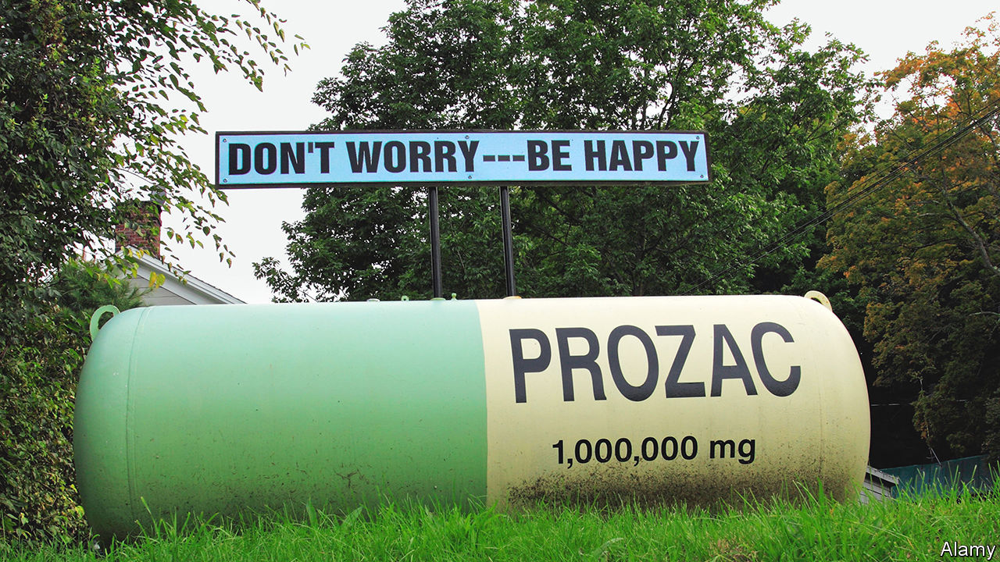

###### Mental health

# A popular medical explanation for depression is rebuffed 

##### A round-up of studies finds no link with serotonin 

 

> Jul 20th 2022 

How most medicines work their magic is understood. But for some it remains a mystery. Among the most mysterious are a group of widely used antidepressants called selective serotonin reuptake inhibitors (ssris), the best-known of which is Prozac. 

For decades, doctors believed ssris operated by boosting levels of serotonin, a chemical which carries signals between neurons in the brain. This supposition was based on the hypothesis that a lack of serotonin causes . But a growing number of investigations suggest that theory does not hold water—a conclusion hammered home by a round-up of reviews of such work just published in . 

This uber-study, led by Joanna Moncrieff of University College, London, covers several strands of research on the link between serotonin and depression. One looks at levels of serotonin and its breakdown products in blood and spinal-cord fluid, taking these as proxies for the amount in the brain, which it is unsafe to measure directly in living people. Work in this strand, the review concludes, shows no difference between the clinically depressed and the healthy. 

Neurons reabsorb serotonin after it has done its job. ssris block this, leaving more of the molecule available. Another body of work thus examined the receptor proteins which respond to serotonin, and the transporters through which it is reabsorbed. This occasionally found indications of higher serotonin activity in people with depression, the opposite of what might be expected. Dr Moncrieff reckons that may actually result from antidepressant use, something not always taken account of when those with and without depression are compared. 

A third line of research depends on the fact that serotonin is made from tryptophan, a substance the body cannot synthesise, and so must ingest from food. In these experiments participants’ serotonin levels are lowered by depriving them of tryptophan. Dr Moncrieff’s team concluded that lowering serotonin in this way did not produce depression in hundreds of healthy volunteers. 

Last, the researchers looked at big genetic analyses. These found no differences between genes that regulate the serotonin transporter in those with depression and those without it. 

If serotonin is not the cause of depression, that raises questions about ssris. These do help some new patients, but not others. And they come at a cost. Possible side-effects include loss of libido and inability to reach an orgasm. They can also be hard to stop taking, leaving some who recover from depression dependent on them for life. 

Already, clinical practice is changing to emphasise dealing with environmental triggers of depression, such as  and poor coping skills, rather than deploying drugs. But it would still be good to understand upfront who will benefit from ssris and who won’t. Without the serotonin hypothesis, doctors are, in this regard, back to square one. 


