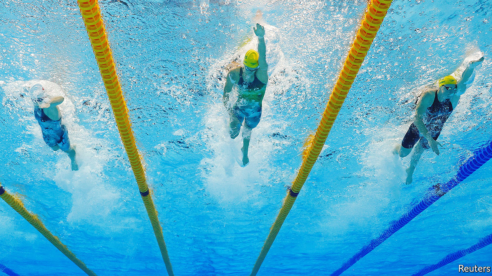

###### Menstruation and sport

# How menstruation affects athletic prowess is poorly understood 

##### Changing that will give sportswomen a new way to improve performance 

 

> Jul 20th 2022 

Just 0.63 seconds separated first from fourth place in the women’s 100 metres freestyle at the recent Tokyo Olympic Games—a race where the winning time was 51.96 seconds. In light of this and similar facts, it is not surprising that elite athletes are constantly searching for ways to get even 1% better. To that end, they hire strength coaches, nutritionists and sports psychologists. And lately, some female athletes have been trying a new tack: working with menstrual-cycle coaches.

Good data concerning the effects of menstruation on athletic performance are scant. However, according to four studies conducted in 2020 on more than 250 athletes from a range of sports, more than half of sportswomen believe their performance fluctuates with the phase of their menstrual cycle. In particular, many said they suffered in the weeks immediately before and during menstruation. World-class performers like Fu Yuanhui, a Chinese swimmer, have spoken openly about this, too. And female athletes also report distraction and worry about bleeding while actively menstruating, a matter which made the news recently when a group of activists protested about the all-white dress code at the Wimbledon tennis championships. 

There is, as well, the question of safety. Again, this is poorly researched. An exception, though, is damage to the anterior cruciate ligament (acl) of the knee. Women are much more prone to acl injuries than men and some studies suggest the level of risk is related to the menstrual cycle. 

Given the wide physiological effects of that cycle, the neglect of its consequences for sport is stark. The intricate monthly tango of oestrogen and progesterone, the main hormones which regulate it, has consequences far beyond preparing the body to reproduce. The complexity of this dance, compared with the hormonal stability of men, is one reason for that neglect. But others are that sport is studied largely by male researchers, and male sport is currently more prominent and better paid. 

A dance to the music of time

The menstrual dance is, indeed, complex. For a start, oestrogen is anabolic, building up muscle, while progesterone is catabolic, breaking it down. Then, at the beginning of the cycle, body cells prefer to metabolise carbohydrates. Later on, they prefer fats. During the luteal phase, immediately after ovulation, when both hormones are high, the body is less resilient to stress and more prone to inflammation. 

At this point women have increased appetites, higher internal temperatures, higher resting heart rates and higher respiratory drive. They also retain water and salt, causing them to put on weight. Their heat tolerance is reduced, too. And their moods and emotional regulation suffer. Here, then, is fertile ground for quite a few of those percentage-point improvements. And that is where menstrual-cycle-savvy coaches come in. 

One possible tactic is phase-based training, in which a coach adjusts the intensity, volume and type of an athlete’s workouts based on where she is in her cycle. Stacy Sims, a researcher at Auckland University of Technology, in New Zealand, recommends athletes increase intensity in the low-hormone follicular phase of the cycle, when the body is primed to bear heavy loads. Later, during the luteal phase, when bodies are less able to adapt to stress, she recommends focusing on steady-state aerobic training to allow proper bodily recovery. This pattern of training, she believes, allows female athletes to push themselves in the most efficient manner.

Such a one-size-fits-all approach may, though, be overly simple. Kirsty Elliott-Sale, a professor at Manchester Metropolitan University, in Britain, thinks there is, as yet, no conclusive scientific evidence to back phase-based training. However, while wary of general guidelines, Dr Elliott-Sale sees the merits of an individualised approach which takes account both of monthly variation within an individual and inter-individual variability. 

This latter source of variety may also help explain why conclusive population-level scientific evidence is hard to come by. A regular cycle can last between 21 and 40 days, and the hormonal details—how fast concentrations change, when they peak and how high they peak—vary. Also, different women experience different sensitivities to hormonal changes. Some have no symptoms. For others, the effects may include debilitating cramps, bloating, migraines and depression. 

Maddy Cope, a professional climber and coach in Britain, emphasises the need to bridge the gap between where research stands and how athletes feel. She notes, for example, that most research does not translate well to her own discipline. 

Climbing is a supremely technical matter, and the tests used in research compare poorly with the actual demands of the sport. Even here, though, a little menstruation-driven thinking may help. Most good training plans for climbers include exercises of a range of intensities and incorporate a “de-load” week, to allow the body to recover. Menstrual-cycle-informed training in this case might be as simple as arranging for the de-load week to coincide with the stress-sensitive luteal phase. 

Menstrual-cycle coaching is, then, in its infancy. But, as women’s sports  for the limelight, and the sums of money involved increase, many more athletes are giving it a go. In this and other areas, female sports-science is a promising field of research, as the fiction that men are the baseline and women an anomaly—a rib, as it were, pulled from the chest of research on men—is put to rest. In sport, as in other areas, it is time for women to unlock their full potential. Period. ■


