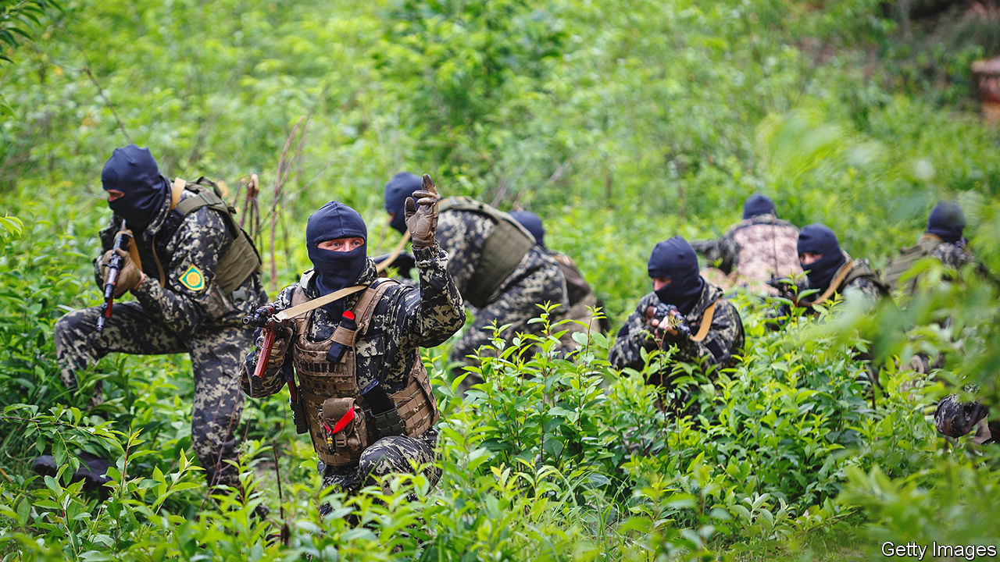
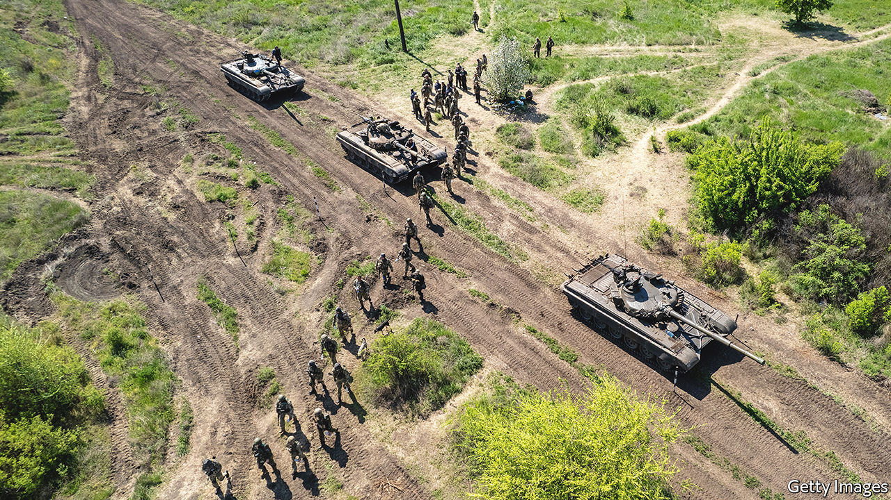

###### Conflict analysis

# Software developers aspire to forecast who will win a battle 

##### Conflict in Ukraine and tension elsewhere means demand is high 

 

> Jul 20th 2022 

Warfare is complex—and, as those who start wars often discover to their chagrin, unpredictable. Anything which promises to reduce that unpredictability is thus likely to attract both interest and money. Add the ability of modern computers to absorb and crunch unprecedented amounts of data, and throw in a live, data-generating war in the form of the conflict now being slugged out between Ukraine and Russia, not to mention the high level of , and you might assume that the business of trying to forecast the outcomes of conflicts is going into overdrive. Which it is.

One piece of software dedicated to this end is the Major Combat Operations Statistical Model, mcosm, developed at the Naval War College (NWC) and the Naval Postgraduate School (NPS) in Monterey, California. mcosm runs algorithms based on data about 96 battles and military campaigns fought between the closing year of the first world war and the present day. When fed information about Russia’s initial push to seize Kyiv and subjugate Ukraine, which began on February 24th, the model predicted, on a scale of one to seven, “operational success” scores for the attacker and defender, respectively, of two and five.

That pretty much nailed it. On March 25th Russia’s forces gave up the idea of taking Kyiv and narrowed their objectives to Ukraine’s east and south, . Nor was mcosm’s forecast a fluke. In the hands of knowledgeable users, says Jon Czarnecki, who created it, it gets seven out of ten forecasts broadly right.

Crunch time

To run an mcosm forecast requires users to estimate 30 values. These cover things like the levels and expected importance, given the fight in question, of each belligerent’s training, firepower, mobility, logistics, reconnaissance, decision-making and ability to sequence and synchronise operations. Keen judgment is needed, for the value of such things is often unknown, or miscalculated, in advance.

The French army that collapsed in May 1940 was, for example, widely thought of beforehand as one of the finest in Europe, just as Russia’s armed forces were thought to have undergone thorough reform since 2008. Nevertheless, Dr Czarnecki, who was a colonel in America’s army before he joined NWC, assigned Russia a dismal value of “one” as its Decisions score. That turned out to reflect well the Kremlin’s overambitious attempt to imitate American shock-and-awe tactics by  from several directions.

Other models are available. Roger Smith of in[3], a consultancy in Orlando, Florida that advises developers of military forecasting models, was once chief technologist at the American army’s simulation office, also in Orlando. He reckons its team is currently developing or upgrading roughly 100 predictive models, small and large. 

Some, like mcosm, are deterministic—meaning the same inputs always produce the same forecast. Others are probabilistic. Consider the matter of, say, a 600-metre rifle shot, taken at dusk against a target who is both walking and wearing a bulletproof vest, with the trigger being pulled by a fatigued, poorly trained sniper. To model an event like this, developers estimate the likelihoods, expressed as percentages, that the shot in question will miss, injure or kill. This typically involves things such as studying past battles, reviewing shooting-range data and taking into account the specifications of the kit involved.

A good example of a probabilistic model is brawler, a simulator of aerial combat produced by ManTech, a defence firm in Herndon, Virginia which is used by America’s navy and air force. brawler crunches hard engineering data on the performance of warplanes, including their numerous subsystems, and also the capabilities of things like ground radar and missile batteries. During a simulation, the virtual representations of this hardware can be controlled either by people or by the software itself. Running the software many times produces probabilities for all manner of outcomes. How much would certain evasive manoeuvres increase an f-16’s chances of dodging a Russian s-400 missile? What about the effects of altitude? Of rain? Of chaff or other countermeasures?

Bar-room brawl

Simulating the physics of all these things is daunting enough. But brawler also includes algorithms that claim to approximate mental and cultural factors. Karen Childers, a retired captain in America’s air force who now works at ManTech, where she is in charge of updating brawler, describes this part of the endeavour as “explicit modelling of the pilot’s brain”.

Take, for example, iff (identification, friend or foe) transponders on warplanes. brawler models both the propagation of iff signals and how their calls on a pilot’s attention distract or slow reaction times. In this, a pilot’s overall cognitive load at a given moment matters. So, Ms Childers says, does the level of skill attributed to each simulated pilot. Beyond that, brawler’s users enter values for each pilot’s sociopolitical background. This requires some leaps of analytical faith. Real pilots from democracies are assumed to be more creative that those from authoritarian regimes that discourage personal initiative.

brawler simulations are typically run with no more than 20 aircraft, but the model can handle thrice that number if needed. Distribution of the full version of the software is tightly restricted, with Britain’s defence ministry the only known foreign recipient. ManTech does, however, sell a version called cobra, from which classified algorithms have been removed. Both South Korea and Taiwan have acquired this.

 


An even bigger probabilistic model, Pioneer, is being developed by Bohemia Interactive Simulations (bisim), another firm in Orlando, which was bought in March by bae Systems, a British weapons giant. Peder Jungck, head of simulation at bae, calls the model, on which more than 400 developers are working, a “defence metaverse”. America’s Marine Corps hope to take delivery of it late next year. 

As with commercial metaverses, Pioneer requires serious computing power and is run on cloud servers. It can simulate the actions and fates of a staggering number of entities around the world. These range from soldiers, tanks, ships and aircraft to buildings, cars, mobile-phone towers, hills, vegetation, weapons and even individual rounds of ammunition. For areas of special military importance, Pioneer’s terrain data include details such as the positions of particular trees, as recorded by spy planes and satellites.

The system also employs real-time meteorological data. If a tank entering a field would thereby sink into mud, Pioneer has it do just that. It also “deforms” terrain as virtual battles unfold. If an artillery barrage blocks a street, Pioneer reroutes traffic appropriately. According to Pete Morrison, a former head of bisim who now leads commercial operations there, Pioneer simulates “the flight path of every single bullet, including ricochets”. It also takes account of a fighting force’s training, level of fatigue and “doctrine” (the principles, derived from military handbooks and intelligence assessments, that guide an army’s actions). Run a few hundred simulations of troops crossing a stretch of enemy territory, Mr Morrison says, and casualty estimates will teach you, without bloodshed, how not to do it. 

Another probabilistic software package is the Advanced Joint Effectiveness Model (ajem). America’s defence department pays about 600 people to operate it. A user first loads the software with engineering specifications for an aircraft, vehicle or boat. If the maker’s files are available, this can be done in less than a month. Otherwise, it may take a year. Marianne Kunkel, ajem’s manager at the American army’s Combat Capabilities Development Command Analysis Centre, dac, in Maryland, says users then employ “kill tables” of the velocities and masses of different projectiles to run “shot lines through the target”.

This lets ajem spit out probabilities related to hypothetical attacks. Were 300 mortar shells fired at two dozen Bradley fighting vehicles moving in a given formation at a certain speed 4km away, ajem would calculate probable tallies for types of damage. These range from “catastrophic kills” to loss of mobility, communications and the ability to shoot. Those estimates are also useful for weapons companies that wish to engineer greater survivability into hardware and lethality into warheads.

Linked in

The next step, according to Ashley Bomboy, a simulations chief at dac, is to lash different models together. Ms Bomboy’s team plans to arrange for yet-bigger (and as-yet-unnamable) simulators to tap into ajem “on the fly, as needed”, for greater fidelity. Another goal is to forecast events beyond the immediate battlespace. , one of the American defence department’s research agencies, hopes to do this by using natural-language processing to comb through the texts of hundreds of thousands of reports from think-tanks, commercial media and the department itself, looking for correlations human readers would probably miss.

Causal Exploration, or CausX, as the software in question has been dubbed, is not yet ready for full deployment. But it is, according to Joshua Elliott, the programme’s manager, already producing “aha moments”. It extracts “really rich and interconnected behaviour”, as he puts it, that encompasses economic activity, public sentiment, crime, and political decisions relevant to war and peace. One goal has been to find links between sanctions on Russia and cyberattacks. When fully developed, CausX will be folded into a software suite called Joint Planning Services that the defence department uses to prepare military operations.

What all this means for Ukraine is another matter. A colonel in Kyiv, who asked to not be named, laments that requests for advanced American forecasting models have produced little. Such software would help the country plan missions, he says. As for what American forecasters are learning about the war, most are staying mum. But Pamela Blechinger, director of the army’s Research and Analysis Centre at Fort Leavenworth, in Kansas, notes one insight. Ukraine’s strong will to fight, she says, is playing a bigger role in that country’s military successes than her team of about 290 forecasters had expected.

Models they use include CombatXXI (for brigade engagements) and Advanced Warfighting Simulation (when more troops are involved). Neither was designed specifically to forecast the will to fight. But software developed at rand, an American think-tank, does focus on that.

rand’s researchers have identified a list of things that influence the . These include the obvious, such as the quality of a soldier’s diet, sleep and kit, and also more subtle matters like the reasons he or she is fighting, what horrors are unfolding, and whether the enemy has demoralising air superiority, or chemical or incendiary weapons. Battlefield success tends to boost morale, a component of will to fight that typically improves marksmanship. But that benefit fades with time. More broadly, an army’s will to fight is weakened by corruption, unemployment, a rising cost of living and political polarisation.

No plan survives enemy contact

Equations developed by rand that approximate correlations between such factors and a force’s will to fight have been folded into defence-department combat simulators called Onesaf and iwars. Without these upgrades, says Henry Hargrove, a statistician at rand, those simulators would assume soldiers are fearless automatons. Failing to account for the will to fight skews results, he opines, because “Humans are not Terminators.”

Running forecasts can be a thrill. As Andrew Ilachinski, a veteran modeller at the Centre for Naval Analyses, in Virginia, puts it, “You sit back and watch the system do its thing,” as patterns of behaviour emerge. Caveats are in order, though, and surprises are common. Assigning numerical scores to human psychology and military know-how is subjective at best and fanciful at worst. As an old saw has it, all models are wrong, but some are useful. 

With this caveat in mind,  asked Dr Czarnecki to use mcosm to predict an outcome for the Russia-Ukraine war’s current, artillery-based phase two. He determined new values for variables that reflect improvements by Russian forces in areas which include information processing, operational sequencing and military judgment. Ukraine, he assessed, has held on to a number of qualitative edges, but these have shrunk. And Ukraine remains heavily outgunned. Dr Czarnecki typed in the data and let the model rip. It forecast “operational success” scores of five for both Russia and Ukraine—in other words, a grinding stalemate. ■


