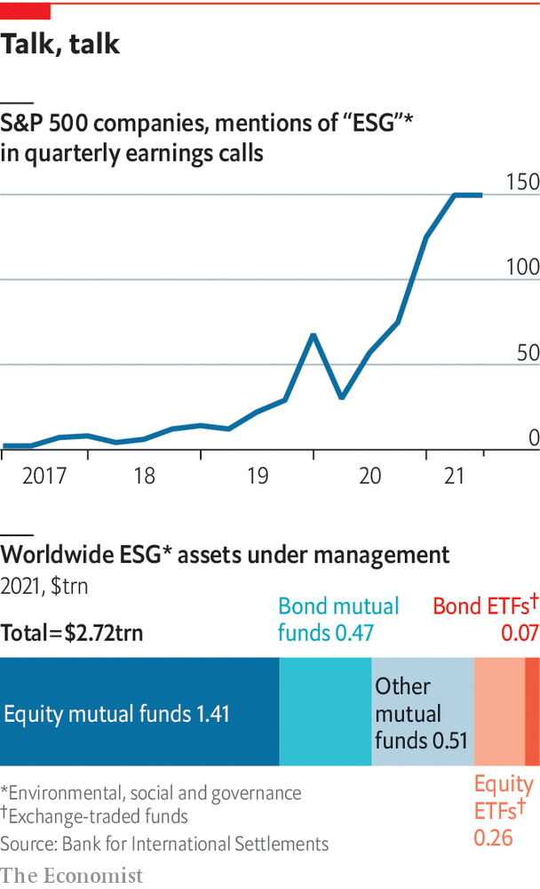

###### ESG investing

# A broken system needs urgent repairs 

##### The environmental, social and governance (ESG) approach to investment is broken. It needs to be streamlined and stripped of sanctimoniousness, argues Henry Tricks 

 

> Jul 21st 2022 

Desiree fixler is, in her own words, “no wallflower”. When she was hired in 2020 to be head of sustainability at dws, a German asset manager affiliated to Deutsche Bank, she reckons Asoka Wöhrmann, her boss, must have known the type of person he was taking on. She was a Wall Street veteran. She was battle-hardened, having traded credit derivatives in the run-up to the 2007-09 financial crisis. She had seen the power wielded by regulators. If you pictured somebody who works in sustainability as a soft touch, think again. “I’m hard core, especially when it comes to compliance,” Ms Fixler says. 

How hard core became clear on May 31st, when 50 German police, investigators and regulators, acting on allegations first aired by Ms Fixler, raided the offices of dws and Deutsche Bank in Frankfurt. Their focus was on alleged “greenwashing”—the extent to which dws may have misstated its use of environmental, social and governance (esg) criteria in its investment portfolio. It cost Mr Wöhrmann his job. It was a chilling moment for big asset managers around the world. And it marked a low point in a year in which esg has turned from an investment craze attracting trillions of dollars on promises to make the world a better place into a source of eye-rolling cynicism. 

dws and Mr Wöhrmann deny the allegations, which they say have been investigated internally. But whether the authorities find evidence of misbehaviour or not, there is much about dws’s esg business that is perplexing. So it is with the industry in general. It is the contention of this special report that, from impact to measurement to disclosure, much of esg is deeply flawed. 

The concept’s popularity has been partly fuelled by real-world concerns, especially climate change. Yet it has had a negligible impact on carbon emissions, especially by the biggest polluters. Its attempt to address social issues such as workplace diversity is hard to measure. As for governance, the esg industry does a lousy job of holding itself to account, let alone the companies it is supposed to be stewarding. It makes outsize claims to investors. It puts unmanageable demands on companies. 

And yet, for all its pitfalls, it may be better to overhaul than to bin esg. At its core, it is a quest for something increasingly crucial in the battle to improve capitalism and to mitigate climate change: making firms and their owners accountable for their negative externalities, or the impact of production or consumption of their products on third parties, such as the atmosphere. By forcing businesses to recognise the unintended consequences of many of their activities, the theory is that they should then have a greater incentive to fix them.

The more regulatory pressure there is to make such information more accurate, the better for the long-term future of companies and the world in which they operate. As it is, measurement of the size of the esg market is confusing, the ratings are too subjective, and the industry over-promises and under-delivers. 

Start with measurement. Asset managers have two ways of thinking about esg. The first is relatively down-to-earth. It is the sale of actively and passively managed funds specifically built around sustainability ratings. In the past two years, these have boomed. Take dws, for instance. In 2021 it said its dedicated esg funds had soared to €115bn ($136bn), more than a tenth of its total assets. In the industry at large, Morningstar, a fund tracker, says esg assets in mutual funds and exchange-traded funds (etfs) were almost $2.8trn at the end of the first quarter. That is roughly the size of the cryptocurrency market. But it is still niche compared with global portfolio investment as a whole. 

The second way of discussing esg, however, is ballyhoo verging on baloney. It is called esg integration, and is the main problem that Ms Fixler claims to have identified at dws. She says there were no tools in place to measure it. esg integration means getting portfolio managers in non-esg funds to use ratings as a risk-management tool, rather as they do to evaluate the dangers of recession or supply-chain disruption. In 2020, when dws called esg “the core of everything we do”, it claimed that the assets to which it applied esg integration were worth €459bn, well over half its total €793bn portfolio. That is a whopping amount. Yet a year later dws scrapped its esg integration number altogether. It said it was changing its approach to disclosure partly for regulatory reasons. But it also followed what Ms Fixler says was her attempt to draw the attention of the authorities to such nebulous numbers. 

Your number’s up

dws’s  suggests that a rethink is needed in the industry at large. Data-gatherers, such as the Global Sustainable Investment Alliance, make eye-popping claims about the size of the esg market. According to its latest report, sustainable investment in 2020 reached $35.3trn, more than a third of all assets under management in the big economies that it covers. That makes it sound as if esg is more important to financial markets than it really is. The vast bulk of it (some $25.2trn), comes from esg integration, which dws’s experience shows may be little more than a finger in the wind. For an industry that prides itself on trying to measure things that are hard to measure, the job it does in measuring itself is hardly confidence-inspiring. 

Next look at subjectivity. When Ms Fixler first arrived at dws, she says one of her surprises was observing that its esg scoring system, using third-party rating agencies, gave Wirecard, a German payments firm in which dws funds were big investors, the second-highest rating for governance. At the time, Wirecard was embroiled in an accounting fraud that would shortly lead to its collapse. And Amazon, the e-commerce giant, had dws’s lowest governance rating, she says.

Such apparent contradictions extend to the industry at large. The esg rating agencies are the veritable acme of inconsistency. A study of six of them found that they used 709 different metrics across 64 categories. Only ten categories were common to all—and they do not include such basics as greenhouse-gas emissions. 

 


Index-providers add to the confusion. In May s&amp;p Dow Jones Indices kicked Tesla out of the esg version of its s&amp;p 500 index, while keeping oil giants like ExxonMobil in. It noted the electric-vehicle maker’s contribution to promoting sustainable transport but gave it short shrift. Instead it penalised Tesla for workplace and governance issues. Elon Musk, Tesla’s boss, was not the only person to consider this absurd. Many detect too much toing and froing over complex ethical questions. Arms-makers, shunned by the esg crowd before the war in Ukraine, are now bemused to find themselves being feted as defenders of democracy. John Gilligan, of Big Issue Invest, a $100m impact fund allied to a social enterprise for the homeless, sums up the subjectivity. “The idea of measuring esg is like trying to find a measurement for your favourite child,” he says. 

The third problem is that esg has become a gravy train for the investment industry. Although it emerged in response to the preferences of investors, especially millennials, to do more with their investments than make money, asset managers have turned this to their advantage. On average, they charge higher fees for esg-related investments than for non-esg ones. In marketing, they claim that esg funds outperform mainstream ones, even if this does not stand up either theoretically or empirically. 

On top of all these flaws, esg has suffered a backlash from those who think that financial elites go too far in pursuit of trendy causes. Right-wing critics of “woke capitalism” see it as a way for sanctimonious ceos to smuggle in progressive ideas that many dislike, such as phasing out fossil fuels. Those focused on returns, such as Aswath Damodaran of New York University’s Stern School of Business, note that esg metrics failed to discount Russia-based companies before the invasion of Ukraine, further undermining their credibility. Others point to an inherent hypocrisy: for example, esg ratings measure the risks that climate change pose to a company, rather than the threat the company poses to the climate. 

The most salient criticism is that by promoting a second-best solution such as esg, the private sector may be giving policymakers an excuse to avoid imposing what many see as the best way to respond to climate change: co-ordinated carbon taxes. Yet it is possible to turn this on its head. esg may be worth preserving precisely because taxes on externalities, such as carbon emissions, have proved so politically hard to push through. 

Tighter regulatory oversight of esg is coming, especially in Europe. In America the Securities and Exchange Commission is hoping to beef up oversight of climate disclosures (though a recent Supreme Court ruling may constrain it.) The hope is that greater supervisory pressure will eventually help capital markets to “internalise externalities”—ie, to reward companies for reducing their carbon footprints through higher asset prices and a lower cost of capital. That means, in the words of Ken Pucker of Tufts University, that it will be necessary to measure less, better. Moreover, Sustainability Inc, as Mr Pucker calls it, will have to jettison the hyperbole that has so harmed its reputation. 

The industry, always striving to be upbeat, notes that during the recent market turmoil money has seeped out of esg funds more slowly than from mainstream ones. Last year, even as dws faced Ms Fixler’s allegations, esg-related money accounted for 40% of its net inflows. In his speech at the firm’s annual general meeting in June, Mr Wöhrmann, after rejecting what he said were unfounded accusations, highlighted those flows. “Our clients have spoken,” he said. Such over-confidence epitomises the asset-management industry. ■

—— 

