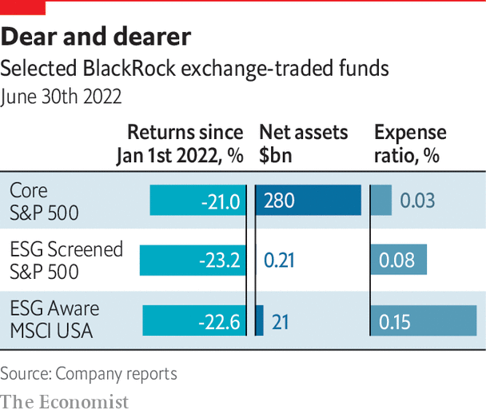

###### ESG fund fees

# How to charge more 

##### Fees for managing ESG funds tend to be higher than for non-ESG ones 

 

> Jul 21st 2022 

It can be hard to tell the difference between exchange-traded funds (etfs) with an esg focus and those without one. Take three iShares etfs all managed by BlackRock: the Core s&amp;p 500 (ivv), which has no esg focus; the esg Screened s&amp;p 500 (xvv); and the esg Aware msci usa (esgu). The top equity holdings in all three funds are Apple, Microsoft, Amazon, Alphabet a &amp; c shares and Tesla. Their biggest sectoral exposures are to tech, health care, financial services and consumer goods. Two of the three have ExxonMobil, an oil giant, as one of their top 20 holdings. ivv also has exposure to “sin” stocks, such as arms and tobacco firms, but they are a tiny fraction of its overall portfolio. All three funds have performed pretty much in lockstep this year: down by a little over 20%. 

 


Where they differ most strikingly is in the level of their fees. For all three, these are lower than at actively managed mutual funds. But fees for xvv are almost three times those for the non-esg fund; for esgu they are five times as high. The obvious inference from this is that even low-fee index funds can charge more for esg funds than for non-esg funds. There are, however, two big caveats. One is that the core s&amp;p 500 fund is ten times the size of esgu and over 1,000 times that of the screened one. Its sheer scale may help it charge lower fees. And esg index funds, though passive, also require more work to construct than plain vanilla ones. Like all things esg-related, the truth is never simple. 

