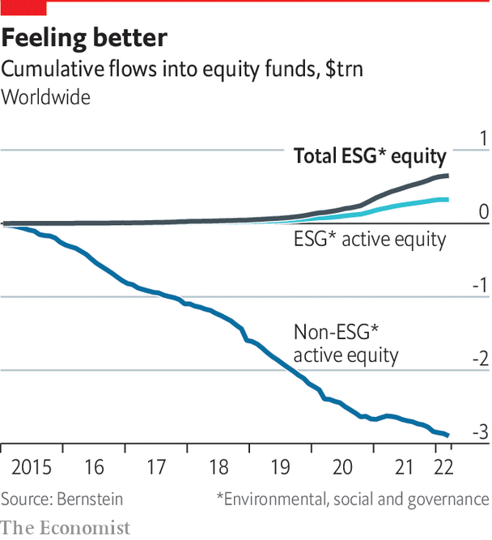

###### Asset managers

# The saviour complex 

##### It’s time to get real about what ESG can—and cannot—achieve 

 

> Jul 21st 2022 

For all the things the sustainability industry tries to measure, it seldom considers its injurious effects on the ear. The field of esg is replete with enough acronyms and platitudes to tear a hole in the English language. Win-win is only the worst. There are also purpose and profit, values and value—and the list goes on. When people cut through such pieties and liken esg to a Wild West, where everyone makes their own rules so as to get as much money as possible, it is time to sit up and listen.

A business that started with sandal-clad clerics making ethical investments has been transformed by the world’s biggest asset managers, such as BlackRock, State Street Global Advisors and Vanguard, which collectively own more than a fifth of the average firm in the s&amp;p 500. Their actively managed esg funds remain a small part of overall assets under management. But as Cameron Brandt of epfr, a firm that tracks fund flows, puts it, net inflows into esg have been like “pixie dust” to investment funds, helping offset outflows in other parts of their portfolios. And their ability to use esg criteria to decide how to vote the trillions of dollars of passive funds that they manage adds to the concept’s importance. 

There are two main drivers behind this focus on esg. The first, revealed by State Street’s bronze statue, “Fearless Girl” , outside the New York Stock Exchange, is that by marketing itself as an environmental and social champion, the investment industry competes to attract the growing wealth of younger savers. Studies suggest that the young like to express their environmental and social preferences through investments (though by no means all are social warriors or tree-huggers). Given that their pensions will accumulate for decades to come, they will also be more exposed to the long-term risks of climate change than older savers. 

In search of fees

The second motive is that the sale of esg products helps asset managers to mitigate the two-decade-old curse of declining fees. A study by Morningstar, a fund-tracking firm, said investors in sustainable funds paid a “greenium” compared with those in mainstream funds. Average annual fees for sustainable funds, albeit modest at 0.61%, were almost 50% higher than for traditional ones. This is clear from a comparison of three BlackRock exchange-traded funds (etfs), all with similar holdings; the sustainability-linked ones charge higher fees (see box on next page). 

In the industry as a whole, the interplay of values-driven marketing with a hunger for high fees raises fears of “greenwashing”. The concern is that funds may oversell the extent of their use of esg purely to attract customers. “We are all grappling with how we manage this tsunami of esg and make it fair for consumers,” says Sacha Sadan, a director at the Financial Conduct Authority, Britain’s securities regulator. 

So far there have been only sporadic signs of a crackdown on esg funds. The highest-profile one is the investigation by American and German authorities of dws, the asset manager owned by Deutsche Bank. In May the Securities and Exchange Commission (sec) imposed a $1.5m fine on an investment unit of bny Mellon, a bank, for allegedly misstating esg information. It was the first time it had reached such a settlement with an investment adviser. In June Goldman Sachs revealed that the sec had launched an investigation into some esg equity funds with assets under management of $725m. It said it was co-operating. 


It is not clear how far the regulatory crackdown may go. In Europe a bigger upheaval has come via regulatory fiat. According to Morningstar, the region accounts for more than four-fifths of sustainable-fund assets. eu regulators encourage more sustainable investing, and police it more carefully.

Last year the bloc introduced a sustainable-finance disclosure regulation, requiring funds that claim to use esg to categorise themselves in three ways, depending on their sustainability ambitions. The lowest level, article six, covers mainstream funds. Those with some esg features, known as article eight, are keen to upgrade to article nine, where esg is their main objective. Asset managers across the world are eagerly repurposing funds to ensure they meet the article-nine criteria, insiders say. 

Yet everywhere concerns about false marketing are growing, and academics, as well as regulators, wish to expose it. A study in May by Aneesh Raghunandan of the London School of Economics and Shiva Rajgopal of Columbia Business School concluded that asset managers did not “walk the talk” when they claimed to be picking stocks that engage in stakeholder-friendly behaviour. Their analysis of American mutual funds between 2010 and 2018 found that companies in esg investment portfolios violated labour laws, paid more fines and had higher carbon emissions than those in non-esg portfolios sold by the same institution.

 


Insiders are speaking out. Tariq Fancy, BlackRock’s former chief investment officer for sustainable investing, issued a critique claiming that the profession is little more than “marketing hype, pr spin and disingenuous promises”. Some asset managers would dispute this, but others say scrutiny may help bring order to the industry, even if it reduces inflows into esg funds. “All of this noise is going to hit the pause button,” says Suni Harford, president of ubs Asset Management, an early entrant into esg. 

Drill down into different esg strategies, however, and it is clear that there is room for improvement—so long as enforcers are given sharper teeth to weed out false claims, investors are more aware of the risks they face, and companies strengthen their own esg-related disclosures. The result may be a smaller universe of funds, more targeted on particular issues, and more credible. “Customisation is coming fast,” says Ms Harford. 

One area of recent attention is so-called exclusionary funds. These old workhorses of the industry aim to shun such sectors as fossil fuels, tobacco or guns, either for ethical reasons, or because investors hope to shame the industries into behaving better. They are in the spotlight because stocks from some formerly untouchable industries have rallied sharply, partly as a result of the war in Ukraine, encouraging some fund managers to reconsider whether it is right to keep them at arm’s length.

This is not just a cynical ploy. There is increasing evidence that divesting from dirty industries simply shunts assets around, creating no net benefit to anyone except those who are happy to hold “sin” stocks. And, as is borne out in a paper by Jonathan Berk, of Stanford Graduate School of Business, and Jules van Binsbergen, of the University of Pennsylvania, it does not meaningfully raise the cost of capital, making it harder for them to do business. A better way to effect change is for socially conscious investors to buy stock and use their proxy votes to influence or even take control of a firm, the academics argue. 

That strategy is known as engagement, which Zhihan Ma, head of esg at Bernstein, an investment firm, calls “the new buzzword”. It took centre stage last year when Engine No. 1, an activist hedge fund, won critical support from BlackRock, Vanguard and State Street to help it replace three directors on the board of ExxonMobil to strengthen its response to climate change.

It is not always like this. BlackRock, which supported almost half of environmental and shareholder proposals in 2021, has said it will reduce its backing for them because they are overly prescriptive. Cue a volley of criticism from climate activists, who want BlackRock to use the full extent of its power to force companies to lower emissions. Others, however, claim that stewardship, particularly over trillions of dollars in passive funds, is a dangerous way for asset managers to push their own agendas, rather than those of their clients. 

A letter to the sec in April from 22 law and finance professors, led by Lawrence Cunningham of George Washington University, pointed to studies showing that individual investors do not show the same enthusiasm for esg as the big institutions. Vivek Ramaswamy, entrepreneur and author, says that the influence of what he calls a “monarchical technocracy” is not felt principally through the esg funds that they raise. It is the vast number of shares they can vote over their holdings, influenced in turn by their own esg priorities. 

Taking such concerns into politics, 12 Republican senators proposed in May an “Investor Democracy is Expected Act”, which would allow individuals to vote their shares rather than Wall Street firms acting on their behalf. It was partly aimed at stemming the ability to stoke what one senator calls “the left’s woke agenda in corporate America”. Already the industry is taking heed of the political winds. In June BlackRock said that, since October, clients with $120bn of assets had opted to vote their own shares, taking the number up to $530bn, or 25% of its passive equity funds. Mostly this is institutional money, but it wants individuals to express voting preferences too. 

For those keen to ensure that esg investment is not just box-ticking, more funds are available that offer returns which are more than financial, such as life-saving water, health and sanitation projects in poor countries. The average value of assets under management at such “impact funds” was around $100m in 2020, says the Global Impact Investing Network. This is enough to attract big private-equity funds, such as kkr. The International Finance Corp, a unit of the World Bank, says that under its strictest definition of impact investment, or “measured impact”, there were $636bn of total assets in 2020, 45% of which came from private equity. But as the amount grows, fears of “impact washing” grow too. As with esg in general, it needs monitoring. 

How quickly the universe of esg will expand depends partly on how much investors’ appetite for adventure may suffer from higher interest rates and seemingly greater market turbulence. Paul Bodnar and Eric Van Nostrand of BlackRock insist that the firm’s “bottom line” when it comes to sustainability funds remains their investment performance. They also say that, although many esg funds have underperformed recently, especially those weighted against fossil fuels, this is a healthy reminder that returns can go down as well as up.

In the long run, changing investor preferences and the energy transition should mean that esg funds outperform, Mr Bodnar and Mr Van Nostrand predict. “Let’s not confuse the short-term volatility for the long-term outperformance that is the principal basis for our focus in this space,” Mr Van Nostrand says. That claim of outperformance, though, is increasingly controversial.■

