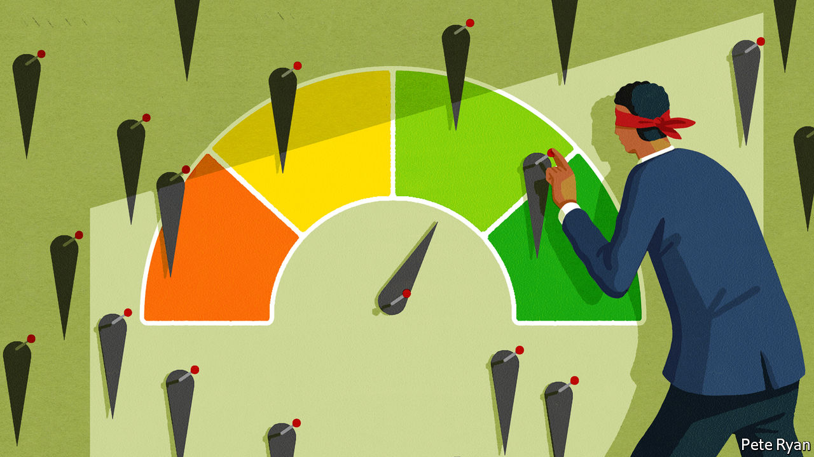

###### Rating agencies

# The signal and the noise 

##### Measurement of ESG data needs a big overhaul 

 

> Jul 21st 2022 

When michael jantzi, founder of Sustainalytics, an esg research firm, started analysing the responsible-investing field in 1990, it was a “curiosity, to put it nicely”, he says. To start with, there were “a lot of lean years”. But the ball got rolling with the collapse of Enron, an energy giant, in 2001. Along with other corporate scandals, it gave rise to the Sarbanes-Oxley act, passed in 2002, which overhauled audit and financial reporting for public companies, boosting the g side of what is now esg. 

Growing concerns about climate change and rising inequality after the 2007-09 financial crisis have increased demand for data on the e and s sides as well. esg rating companies, which have grown to as many as 160 worldwide, have begun to consolidate. In 2020 Sustainalytics became wholly owned by Morningstar, the fund-tracker firm. It now rates 14,000 companies globally.

The idea behind esg ratings is to measure how exposed a company is to non-financial risks, and drive its share price and cost of capital accordingly, forcing laggards to shape up—or go out of business. But a lack of reliability, comparability and transparency in what is being measured produce too much noise to provide accurate signals. The title of a recent paper on divergent esg ratings by Florian Berg, Julian Kölbel and Roberto Rigobon, from mit Sloan School of Management, sums it up. It is “Aggregate Confusion”. There are plenty of other criticisms of the business, and not only from the likes of Elon Musk (Tesla’s impact report of 2021 opens with a blistering attack on esg rating methodologies, calling them “fundamentally flawed” because they do not assess the scope of positive impact on the world, but only “the dollar value of risk/return”).

The International Organisation of Securities Commissions (iosco), a regulatory body, says there is little clarity on what esg raters intend to measure and what their methodologies are. It asks whether they suffer conflicts of interest by providing consulting services to companies they rate, and whether they incorporate developing as well as developed-country firms. It notes that the market is largely unregulated. Securities supervisors such as the eu’s European Securities and Markets Authority hope to change that. 

esg raters sometimes like to seem like credit-rating agencies, which have a long (albeit chequered) history. But there are differences. The biggest is in the disparity of their ratings. Whereas the credit-rating arms of Moody’s, s&amp;p Global and others produce results that are close to 99% correlated, esg scores produced by them and other firms such as Sustainalytics and msci tally barely more than 50% of the time.

The “Aggregate Confusion” paper spells out how ratings differ in what it calls scope, measurement and weightings. On scope, one rating agency may include corporate-lobbying activities, but another may not. They measure differently, with one assessing labour practices based on employee turnover, and another counting the labour-related court cases against the firm. And they assign different weights to their esg scores, such as putting more emphasis on labour practices rather than lobbying. 

For now, regulators put most attention on how the firms rate environmental practices. The oecd club of mostly rich countries found that some esg rating agencies put less emphasis on e than the other two bits of esg, so that investing in companies with high esg scores does not necessarily imply they are managing carbon emissions well. It noted companies with high esg scores also frequently had high emissions. Moreover, it found that the mere act of disclosing well-crafted climate strategies determines the e score more than the quality of interim targets or the steps actually taken to reach them.

Asset managers say that for all the misgivings about e scores, they are more trustworthy than s ones, which many would like to exclude. One talks of them dismissively as “extra-curricular activities”. Another says that in some countries, such as France, too much data-mining on workers may violate privacy laws. He adds that some rating firms push the ethical boundaries by seeking out employee data on social-media sites such as LinkedIn.

Thus numerous flaws exist in esg ratings. And though the rating firms object to the idea that regulators may force them to harmonise what they measure, they also know that there is room for improvement, especially to make ratings more forward-looking. “The last 10-15 years have been about the impact of environmental and social issues on a portfolio. The next ten years will be as much about the impact of investment on the environment,” says Mr Jantzi. Conveniently, that is the direction that regulators want to take the esg market as well.■

