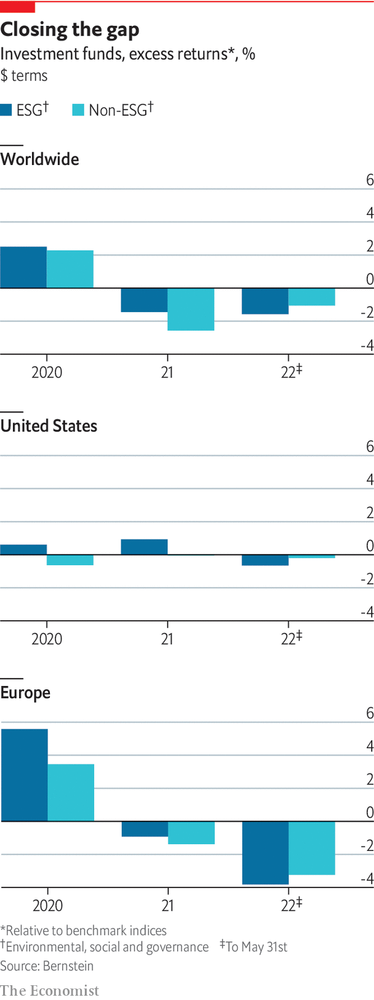

###### Investors

# The warm glow 

##### It’s a myth that ESG investments inevitably outperform. You can’t have it all 

 

> Jul 21st 2022 

David blood proudly holds up on a Webex screen a framed  article written in 2004 when the former Goldman Sachs banker, together with Al Gore, a former American vice-president, set up a new investment firm, Generation Investment Management. It includes the inevitable quip about men named Blood and Gore launching a sustainable-investing business. But he is keener to point out the title, “Does it add value?” He says: “This may be your question today.” 

A lot has happened in 18 years. When the firm started, some of Mr Blood’s former colleagues thought the idea was “completely nutty”. Now sustainability has moved into the mainstream. But he retains two beliefs. First, long-term investing is best-practice, sustainability improves economies, and esg is a useful tool to understand business and management. Second, esg is hard. “When somebody tells you it’s always a win-win, they’re not being truthful. Very often there are trade-offs.” So he welcomes the increased attention on the asset-management industry’s misuse of language, inconsistent data and greenwashing. And he is right that the biggest question remains: does it add value?

It has been easy recently to say yes, not least since esg funds broadly defined have outperformed the non-esg sort in America and Europe since 2010. However, part of the outperformance was because esg funds invested heavily in growth stocks, such as big tech. Rising interest rates and war in Ukraine have hit such firms hard this year. Though the energy crisis has exposed the need for more renewables, especially in Europe, this year returns from fossil fuels and other old-economy stocks have outperformed those in clean energy. Sin stocks have made out like bandits. 

 


In reality, returns depend on how esg is measured. As Alex Edmans of London Business School points out, some strategies pay off over long time horizons, but others do not, especially if they are not material to a company’s core business. This focus on materiality is important. In an  article in 2019, “Where esg fails”, some of sustainability’s strongest advocates from Harvard Business School (hbs) made what looked like a heretical admission that companies rated highly on an array of esg metrics did not in fact produce better shareholder returns. But they offset this by reprising a paper, co-written by hbs’s George Serafiem in 2015, which showed that when companies focused their sustainability efforts on esg issues material to the bottom line they outperformed impressively.

Linking esg to materiality makes intuitive sense. An energy company’s carbon footprint is more material to its business than a bank’s. The first is more likely to look at emissions from an economic perspective than a social one, encouraging it to manage them better. Yet the conclusion remains controversial. In a paper this year, Luca Berchicci of Erasmus University Rotterdam and Andrew King of Boston University recrunched the numbers from the 2016 materiality study and found them to be a “statistical artefact”. Mr King says this stands to reason. Efficient-markets theory suggests that excess returns are always hard to find, especially when information is widely available. 

No free lunch

Others have challenged the underlying idea that virtue could ever be a free lunch. In 2017 Cliff Asness, boss of aqr, a quantitative-investment firm, noted that investors in a portfolio that shuns sin stocks should not expect to do as well as those that have no such restrictions. That should be the whole point of esg, he suggested. By selling out of sinful companies, virtuous investors push share prices down, which offers buyers the prospect of higher returns—even though driving up polluting companies’ cost of capital should make it harder for them to make money. “Frankly, it sucks that the virtuous have to accept a lower expected return to do good, and perhaps sucks even more that they have to accept the sinful getting a higher one. Well, embrace the suck as without it there is…no good deed done at all,” he said.

More recently Aswath Damodaran of New York University’s Stern School of Business has come to a similar view when assessing whether esg bolsters corporate profits. He says that it may be true that “bad” companies face higher funding costs, but points to scant evidence that good esg firms generate higher income or growth. He draws attention to the causation problem: do successful firms embrace esg or does esg make firms successful? When it comes to outperformance, he says the best idea is to get ahead of the curve and jump on stocks that show potential for improvement. Wait too long and the effect will become priced in. 

Some argue that it is rewarding to scour emerging markets for “esg improvers”. Companies that turn their performance around are an indicator of management quality. If investors want to have a positive impact, it is better to back a dirty company that can be influenced to cut its carbon emissions than one that already has a negligible carbon footprint and so scores highly on esg. Even if esg does not guarantee bumper returns, there are other ways to attract investors. One is through risk-adjusted returns. If investors have long time horizons, it makes sense to have risk-management mechanisms to screen companies for problems like climate change, regulatory or reputational damage. 

Another is to give investors the “warm glow” of doing good by not obsessing over short-term returns. This may be more applicable to younger than to older investors. A study in 2019 by New York Life Investments found that investors aged 25-39 were most likely to want to consider climate change in their portfolios, whereas those aged 55 and over focused more on data fraud and theft. Lukasz Pomorski of aqr says the desire to do good applies even in the world of hedge funds, where he sees many investors now looking for esg strategies. aqr recently transformed some funds into esg ones, but it first sought investors’ blessing. It made clear the switch could hurt returns. “Most said ‘just do it’,” he says. 

S.P. Kothari of mit Sloan School of Management agrees that people passionate about climate and other causes may want to promote them through their investments. But he notes that even if some put their preferences before profit, there is a limit to how far they will go. He recalls a case in 2018 when Jason Perez, a police sergeant in Corona, California, became fed up with the pro-esg stance of Calpers, America’s biggest public pension fund. Its returns were having a financial impact on him, his family and public servants at large. He campaigned for a Calpers board seat, won and ousted its sustainability guru. esg “all sounds good until it starts to bite your bottom line,” concluded Mr Kothari.■

