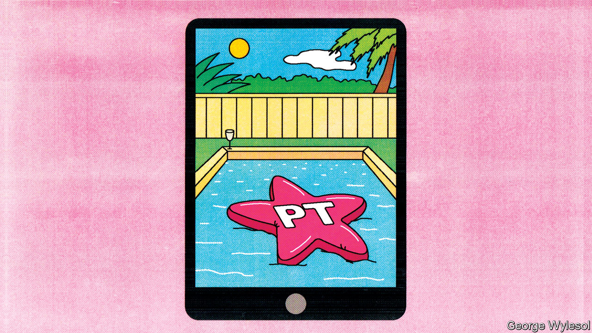
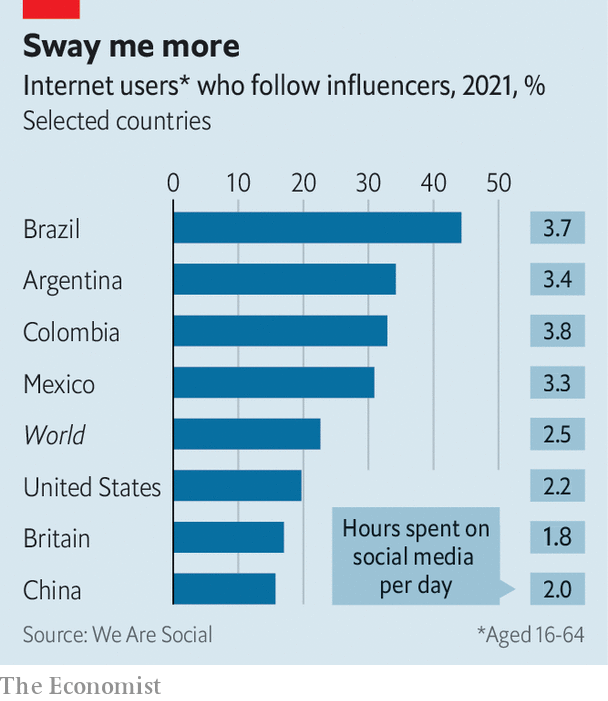

###### Follow the influencers

# Latin American politicians court social-media stars, often ineptly 

##### Voters in the region love influencers. But politicians are a harder sell than lipstick 

 

> Jul 21st 2022 

Last year, three months after her new husband fell off a hotel balcony and died, Deolane Bezerra, a 33-year-old criminal lawyer, launched a reality show on YouTube. Her personal tragedy generated copious publicity, since her husband, MC Kevin, was a well-known singer and the circumstances of his death apparently involved alcohol and adultery, reported in salacious detail by the media. 

Many Brazilians, it turned out, wanted to follow the daily lives of Ms Bezerra and her sisters. Today she has more than 14m followers on Instagram, a photo- and video-sharing platform. She has claimed she charges between 400,000 reais ($73,000) and 1.8m reais for advertising contracts ( tried to interview Ms Bezerra, but she did not show up). That would make her one of the most highly paid digital celebrities in Brazil. Recently she was invited to meet Luiz Inácio Lula da Silva, known as Lula, an ex-president from the Workers’ Party (pt) who is favoured to win his old job back at elections in October. “Glad to know that everything I hope for my Brazil is in your manifesto,” she posted afterwards, along with a picture of him kissing her on the forehead. (On July 14th police raided her home in a money-laundering probe. She denies wrongdoing.)

Ms Bezerra is an influencer: an internet celebrity who persuades her followers to buy things. By some measures, influencers are more influential in Latin America than in other regions, which is no doubt why politicians as well as perfume-makers are scrambling to win their approval. 

Selfie nation

 


A survey by We Are Social, a media agency, suggests that 22% of internet users worldwide follow an influencer (although definitions of influencer vary). In Brazil the figure is a whopping 44%. In Argentina and Colombia, around a third do, compared with 20% in America (see chart). According to a consumer survey conducted by Statista, a data company, two-fifths of Brazilians say they have bought a product because of an influencer, the highest share among 56 countries surveyed. Nielsen, a market-research firm, estimates that Brazil has 500,000 potential influencers on social media (which it defines as those with more than 10,000 followers). That is more than anywhere else. 

Latin American influencers can be ordinary folk as well as celebrities—Ms Bezerra was little known until last year. But they can punch above their weight. Launchmetrics, an analytics firm, has created a metric refined by machine-learning that attempts to measure what an influencer’s endorsement is worth by comparison with the cost of mounting a conventional advertising campaign that would generate the same degree of engagement among its audience. 

It found that when JeanCarlo León, a 25-year-old Colombian influencer, uploaded a post on Instagram for Prada, an Italian fashion brand, it generated publicity worth $620,000 over six months. That may sound puny when compared with Kendall Jenner, an American influencer and model, who generated six times as much publicity ($3.7m-worth) with a post on Instagram for Prada over the same period. But Ms Jenner has 250m followers, more than 40 times as many as Mr León. Mr León’s seem to be paying more attention.

The region may be especially susceptible to influencers because Latin Americans are especially keen on social media. Colombians, Brazilians, Argentines and Mexicans are estimated to spend a combined average of three and a half hours a day on social media, one hour more than the global average. Argentines who use Instagram on an Android phone spend a whopping 17 hours on the app each month. By contrast Americans on an Android phone spend less than eight hours on the app each month. One survey estimated that WhatsApp, a messaging app, was downloaded on 99% of Brazilian smartphones. 

Influencers the world over often advise followers on improving their appearance, which is already a big business in Latin America. In Argentina one of the biggest private health insurers offers plans that include one plastic-surgery procedure a year. Brazil, where 13% of the world’s elective cosmetic surgery takes place, according to the International Society of Aesthetic Plastic Surgery, started offering tax rebates for cosmetic operations in 2010. A member of the revenue service was quoted by Bloomberg as explaining that “cosmetic surgeries are also about health, physical and mental”. Influencers often discuss the procedures they undergo. Ms Bezerra has talked about how she got a labiaplasty to make her vulva more symmetrical. 

Young people trust influencers more than political parties, says Camila Rocha, who co-wrote a study on youth and democracy in Argentina, Brazil, Colombia and Mexico. Javiera Mieres, a Chilean fashion influencer, thinks that because influencers put up posts and speak with their fans almost daily, “people feel...they are basically interacting with a friend”. When they talk about politics, their followers listen.

Jair Bolsonaro, Brazil’s populist president, harnessed social media to win an election in 2018. Pro-Bolsonaro groups spent millions of dollars flooding WhatsApp with unflattering talk about his opponent, Fernando Haddad from Lula’s party, the pt. By contrast the pt has been slower to embrace digital campaigning. In April Lula tweeted that he had been “asked to rejuvenate” his social-media presence; his post came with a photo of him wearing pink sunglasses. He said he would be opening accounts on TikTok and Kwai, two video-streaming platforms. He also began courting influencers, many of whom have encouraged 16- and 17-year-olds, who can vote but are not obliged to do so, to register. 

But influencers can be tricky allies. On July 13th Anitta, a Brazilian pop star with 63m followers on Instagram, gave Lula’s campaign a surprise boost by posting a photo of herself leaning against a stripper pole in a red catsuit, with Lula’s party logo emblazoned on her bottom. She said that she did not support the pt but offered to repost messages in support of Lula from anyone who wanted “to make [Lula] rock here on the internet, TikTok, Twitter, and Instagram; just ask me and if it’s within my reach and not against electoral law I’ll do it.” Three days later she reiterated that she was not a pt member and forbade the party from using her image in its campaigns.

Politicians also risk looking foolish. José Antonio Kast, a devout Roman Catholic who ran to be president of Chile last year, invited an influencer called Daniella Chávez to headline his final campaign event. That confused some of his more straitlaced supporters. Ms Chávez is a Playboy bunny with a channel on OnlyFans, a racy subscription platform, where she posts videos with captions such as “I can’t wait to show you what’s between my legs!!” 

Similarly in Argentina, President Alberto Fernández invited L-Gante, then a 21-year-old singer, to his residence shortly before midterm elections in November. Mr Fernández perhaps hoped that their meeting, a video of which he posted online, would attract young voters to his left-leaning coalition, which claims to work for the poor. Unfortunately, L-Gante has the word “rich” tattooed on his face. Mr Fernández was mocked for trying to look cool. 

Some influencers do not want to post about politics for fear of losing money. Ms Mieres in Chile used to upload videos supporting Gabriel Boric, the new leftist president, after graduating from university. But now that she is a full-time influencer, she only mentions politics in her Instagram stories, which are deleted automatically after 24 hours. “No influencer wants to take the risk of being too political because otherwise brands stop hiring you,” she says. Luísa Sonza, a Brazilian singer, recently claimed that brands were boycotting those who denounced Mr Bolsonaro.

Perhaps because of the difficulty of convincing influencers to rally behind them, some politicians have taken up the mantle themselves. In Colombia’s presidential election in June Rodolfo Hernández, a 77-year old candidate, almost won by posting prolifically on TikTok, where his tagline was “oldie but delicious”. He amassed over 5m likes. It was not enough to get him elected—but he came close. ■

