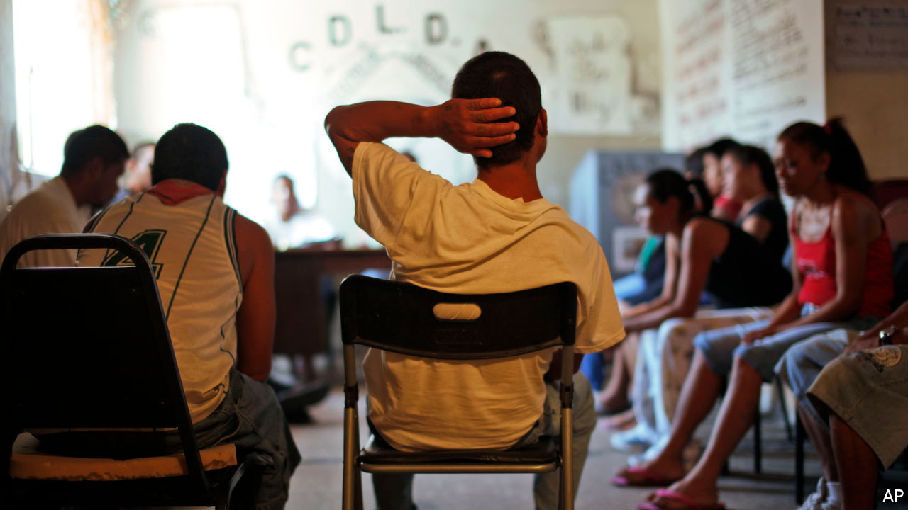

###### Mired in meth

# Mexicans are increasingly consuming illegal drugs 

##### The rise of synthetic drugs is wreaking havoc on both sides of the border 

 

> Jul 21st 2022 

In reto a la juventud, a live-in treatment centre in Ciudad Juárez, in northern Mexico, Jenny Chávez describes how her addiction to drugs led to her losing her job as a maid, her house and her family. The 39-year-old mother of five started taking cocaine ten years ago, but it was after she moved onto methamphetamine, or meth, a potent stimulant, that things began to unravel. “It’s hard because everyone takes it around here,” she explains. 

Mexico is home to hundreds of gangs shipping illegal drugs north. Domestic use of such substances, however, has historically been low. That is changing. Mexico’s most recent national survey, from 2016, shows that 10% of people reported having tried an illegal substance in their lives, up from 7% in 2011. Synthetic drugs in particular have become more common over the past five years. In 2021 36% of users at a government network of treatment centres sought help for addiction to meth, compared with 15% in 2016.

Consumption of meth is doing “terrible damage” to the country, says Javier González, who heads the addiction agency for the state of Chihuahua, home to Ciudad Juárez. That city is particularly badly affected because of its location on the border. But the problem is national. According to data from the network of treatment centres, meth overtook marijuana in 2020 as the drug that most people sought help with. 

The demography of drug users is changing, too. More women are taking drugs, while youngsters are having their first experience at an earlier age. During the pandemic consumption of illegal drugs rose among 15-24 year olds.

Analysts trace the increase in drug use to a decision around a decade ago by the Sinaloa gang, which is Mexico’s main producer of synthetic drugs, to sell their wares at home as well as to traffic them. It works as a recruitment tool. The low price of synthetic drugs, as well as their potency and addictiveness, make it especially easy to get people hooked on them. According to Ms Chávez, a dose of meth costs eight pesos (40 cents) in Ciudad Juárez. That is less than a bag of crisps or a can of Coke. 

The United States and Mexico have made preventing drug use a focus of bilateral efforts. President Joe Biden and Andrés Manuel López Obrador, Mexico’s president, discussed this when they met in Washington on July 12th. “We are making an important transition to treating addiction as a health problem rather than a criminal one,” says Gady Zabicky of the Mexican government’s addiction agency, part of the health ministry.

In a few places change is afoot. A pilot project in Ciudad Juárez sends offenders to a special court that tries to avoid doling out any criminal conviction. The offenders, often young men who have been found with a small amount of drugs on them, agree to undergo treatment in exchange for a suspended sentence. If they complete it, they will have no criminal record. Jorge Ramírez, the magistrate who leads the project, says the drugs courts dealt with 7,000 cases last year. The federal government may try to copy the project. 

But despite this there is little sign of change at the national level. Government adverts are crude, says Rebeca Calzada of Mexicans United Against Crime, a think-tank, suggesting that drugs equal death and that people should “just say no”. Mexico lacks treatment centres. Those that exist are often shoddy.

The government is also in a muddle about another area of drug policy: legalising cannabis. Making it lawful runs the “risk of normalising” the drug that is the first step down a slippery slope for many people, reckons Xochitl Mejia of Tonalli, a centre that treats addicts in the capital. But it would also help to combat the profits made by drug gangs. In 2018 the Supreme Court ruled that cannabis should not be banned. The government ignored the ruling, so in 2021 the court itself changed the law to allow people to apply for permits to use it. Such indecision within the government hardly inspires confidence that Mexico can get its drug policy right.■

