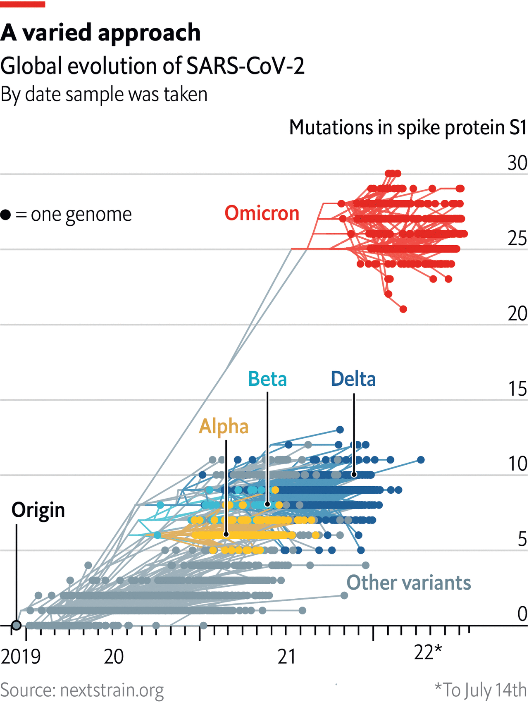

###### The Economist explains

# Why have new Omicron strains of covid not been given Greek names? 

##### What lies behind the World Health Organisation’s conservative approach 

 

> Jul 18th 2022 

WHEN THE World Health Organisation (WHO) decided in May 2021 to use the  to name “variants of concern” of SARS-CoV-2, it did so for reasons of simplicity. The first was Alpha, the second Beta, and so on (though the WHO skipped Nu and Xi because of the potential for homophonic confusion). But since  of the virus, new strains have been given names such as BA.4, BA.5 and BA.2.75. Why has none been given a Greek letter? 

 


The WHO has multiple naming systems for different audiences. Pango, the naming system responsible for alphanumeric epithets such as BA.5, is meant for scientists. It distinguishes between a host of  to keep track of transmission at a granular level. The public, on the other hand, needs information about those variants of concern. If a strain is , causes severe illness or evades tests or vaccines, it will be labelled as such. That makes it eligible for a new Greek letter. 

The subvariants that have emerged since Omicron do not make the cut, though they differ from the original strain. BA.1 and BA.2, the two direct descendants of Omicron, differ from each other by 23 mutations. (For reference, Alpha had 23 mutations compared with the original SARS-CoV-2 virus.) But the quantity of mutations alone doesn’t mean much; how these mutations affect the structure and function of the virus is far more important. ​BA.5, for example, has three important mutations on the spike protein, which is crucial for infection and transmission​. People can catch BA.5 just weeks after catching BA.2. Some scientists think Alpha and Delta are more similar than BA.2 and BA.5. And several subvariants appear to fit the criteria for variants of concern. BA.4 and BA.5 are more infectious than the original Omicron and better able to evade immunity from vaccines or previous infection. But none differs from Omicron as much as Omicron differed from Delta.

The WHO argues that, because none of the subvariants results in a disease significantly different from Omicron, they should be classed as “lineages under monitoring” for now. This foot-dragging is in contrast with March 2021, when the WHO seemed to designate new variants of concern nearly as quickly as the virus itself could replicate. In just over a week it renamed four lineages as Zeta, Eta, Theta and Iota. None remains in popular memory. There are trade-offs between naming a new lineage quickly and waiting to see how prevalent it becomes. Covid evolves far too quickly and spreads too unpredictably for anyone to be certain that a strain will become dominant. Prematurely assigning a variant the importance of a Greek letter risks confusing the public. And the Greek alphabet has only 24 letters; Omicron is the 15th. 


