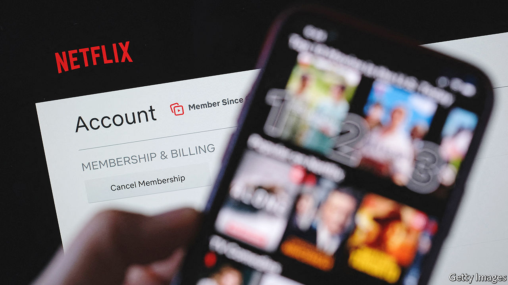

###### The world this week

# Business 

#####  

 

> Jul 21st 2022 

The  raised its benchmark interest rate for the first time in a decade, taking it from a negative rate of -0.5% to zero. The ecb has been slower than its counterparts in America, Britain and elsewhere to lift rates in the face of stubbornly high inflation. The euro gained against the dollar ahead of the ecb’s announcement, having fallen to a 20-year low. 

 annual rate of inflation rose to 9.4% in June, from 9.1% in May. Motor-fuel prices were up by 42%, the highest rate since the current series of data began in 1989, the cost of food increased by nearly 10% and clothing by 6%. The price of second-hand cars, a big contributor to inflation a year ago, continued to fall. The figures add pressure on the Bank of England to bring in bigger increases to interest rates. Andrew Bailey, the bank’s governor, said a rise of half a percentage point was “on the table” for its next meeting on August 4th. 

The London Stock Exchange saw its . , a spin-off from GlaxoSmithKline, began trading with a market capitalisation of £30.5bn ($36.4bn). It is a rare example of a significant listing in London. In recent years the lse has struggled to attract new entrants and compete with the listing sprees in Hong Kong and New York. 

 grew by just 0.4% in the second quarter, year on year, the second-worst rate of growth in 30 years (the country’s gdp contracted at the start of the pandemic). The government has only just lifted severe lockdowns in Shanghai and other cities. Meanwhile, banks in China were told to support property developers where they could, amid a growing boycott of  on new housing projects that have fallen far behind their construction schedule. 

 in America fell sharply again in June, according to the National Association of Realtors (the tally excludes newly built properties). But the median price of a home climbed to a new record of $416,000, suggesting that housing affordability is not just a problem confined to America’s big cities. In the South prices were up by 17%, year on year. Mortgage rates are rising; the average 30-year fixed-rate mortgage is around 5.5%, up from 2.9% a year ago. Mortgage applications are at their lowest level since 2000.

Bank of America’s net profit fell by 32% in the second quarter, year on year. America’s other —Citigroup, Goldman Sachs, JPMorgan Chase and Morgan Stanley—have also reported double-digit drops in profit. All reported big declines in revenue from investment banking, but income from trading was up. 

Must-watch television? 

 


 said it lost a net 1m subscribers worldwide in the second quarter, or about 0.5% of its user base. The number was less than the 2m it predicted three months ago, when it reported its first drop in customers for a decade, causing its share price to plummet. It added users in Asia, but lost 1.3m in the United States and Canada. Revenue grew by 8.6%, year on year, more slowly than in recent quarters and far from the 19.4% growth in the same quarter of 2021. Netflix forecast that growth would slow again in these three months to 4.7%, but it blamed a large part of that on the strength of the dollar, because 60% of its revenues now come from outside America. 

Pilots at  ended their 15-day strike after agreeing to a pay deal. sas filed for bankruptcy protection on the second day of the strike. 

The French government provided more details of its plan to fully renationalise  by buying the 16% of shares it doesn’t own. The state has set aside €9.7bn ($9.9bn) for the buy-out, which has to be approved by parliament. 

China’s cyber-security regulator fined  8bn yuan ($1.2bn) to conclude an investigation into mishandling of privacy data at the ride-hailing giant. Didi’s clash with the authorities began in June 2021, when it went ahead with its ipo in New York (it later decided to delist). Since the start of the investigation it has been barred from signing up users on its app. 

 reported solid earnings for the second quarter, in spite of warning about supply-chain disruptions to its business. The company also revealed that it has now offloaded 75% of its holdings in bitcoin, the price of which has collapsed. 

We’ll see you in court

A judge ruled that a trial in the dispute between  and  over their takeover deal will be held in October. That is a victory for Twitter, which had asked for a September date. Mr Musk, who now says he doesn’t want to buy the company, wanted the trial to be held in February. Twitter continued to play hardball, urging shareholders to vote in favour of Mr Musk’s takeover at a special meeting, the date of which is yet to be decided. 

 launched a trade dispute with , accusing it of favouring its state-owned electricity and oil companies to the detriment of energy produced in America, notably clean energy. Mexico’s president, Andrés Manuel López Obrador, wants to regain state control of the electricity industry. Mr López Obrador was dismissive of America’s complaint; “Oooh, I’m so scared,” he said at a press conference. 

