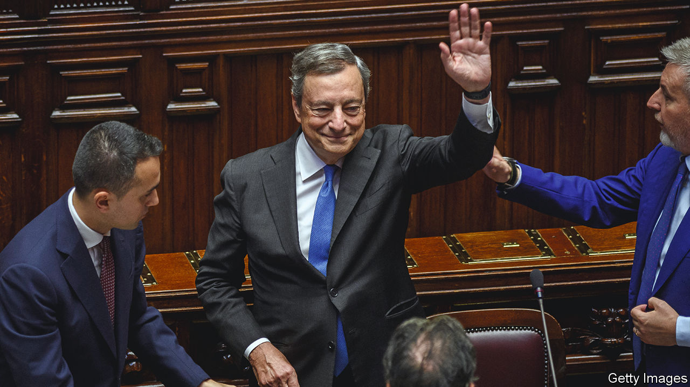
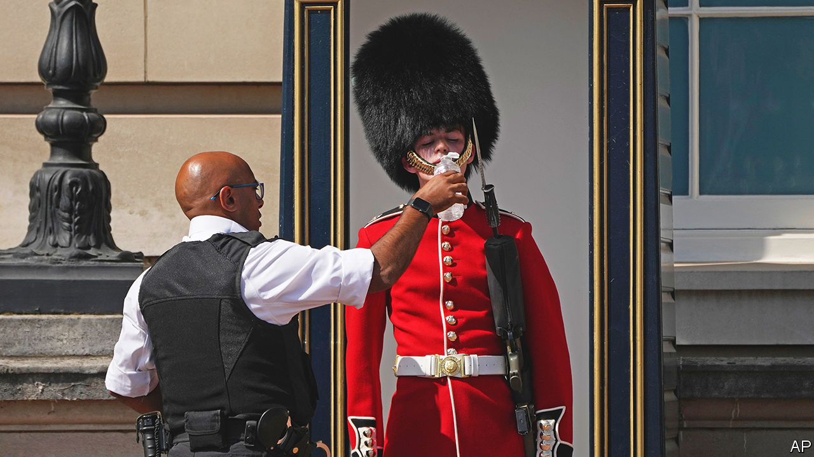

###### The world this week

# Politics 

#####  

 

> Jul 21st 2022 

Mario Draghi tendered his resignation as prime minister of , after three of the four main parties in his governing coalition refused to support him in a motion of confidence. Unless a fresh government can be formed, which looks unlikely, the probable outcome is an early election. Polls predict that will bring a hard-right alliance to power. The upheaval imperils the reform package Mr Draghi drew up, which has allowed Italy to access €200bn ($204bn) from the eu’s covid-recovery fund.

Russia resumed  through the Nord Stream 1 pipeline, albeit at reduced levels, according to its operator. There had been concerns that Russia would cut off the flow of gas following a ten-day maintenance period. Earlier, the eu urged member states to reduce their gas use by 15% compared with the five-year average, as it fears Russia may again curb or suspend supplies. The imf warned that such an embargo could cause the economies of the European countries most reliant on Russian gas, such as the Czech Republic, Hungary and Slovakia, to shrink by around 5%. 

 parliament approved the removal of the prosecutor-general and the head of the security service, amid allegations of collaboration with Russia among staff at the agencies they oversaw. Volodymyr Zelensky, the president, said 651 cases of treason were being investigated and that more than 60 people at the agencies had been working with the Russian invaders. A further 28 officials were suspended from duty. 

 foreign minister, Sergei Lavrov, confirmed that Russia’s war aims in Ukraine extend beyond capturing the Donbas region to include “Kherson, Zaporizhzhia and a number of other territories”. America has denounced Russia’s “annexation playbook”, whereby it conducts sham referendums in occupied areas to justify their seizure. 

mps in  Conservative Party settled on  to put forward as their new leader, and thus prime minister, following the defenestration of Boris Johnson. Rishi Sunak, whose resignation as chancellor of the exchequer helped topple Mr Johnson, and Liz Truss, the foreign secretary, will battle it out among party members, who will vote during August. 

The Trump playbook

Facing a possible defeat in October’s election, Jair Bolsonaro,  right-wing president, cast more doubt on the reliability of the electoral process, once again claiming, without any evidence, that the country’s voting system is vulnerable to fraud. Mr Bolsonaro said that the army should participate in the process to guarantee safe elections. He is trailing his opponent, Luiz Inácio Lula da Silva, by double-digit margins in the polls. 

 Parliament  as president, a week after Gotabaya Rajapaksa resigned and fled the country amid mass protests. Mr Wickremesinghe had been prime minister since May, a job he had held six times. He must now lead the country out of its economic morass. 

The party of Imran Khan, who was ousted as  prime minister in April, won a  in 15 by-elections in Punjab, the country’s most populous province. The surprising result is a boost for Mr Khan, who is demanding early national elections, and bad news for Shehbaz Sharif, his replacement as prime minister, who faces growing discontent over rising prices. 

 Supreme Court granted bail to Mohammed Zubair, a co-founder of a respected fact-checking service who was arrested last month for insulting religious beliefs. His arrest was widely seen as politically motivated. The court said it saw “no reason” for him to be held in custody. 

A number of Chinese cities and provinces wrestled with outbreaks of covid-19, as new infections rose across the country.  strict covid controls are , which spread fast and are hard to detect. Some 260m people in 41 cities are under lockdown or subject to other restrictions, according to one estimate.

Joe Biden made his first visit as America’s president to , where he failed to secure an immediate agreement for more oil to be pumped onto the world market or to persuade the Saudis formally to join a regional defence axis that would include Israel. The Saudis did agree to open their airspace to flights to and from Israel. 

Russia’s president, Vladimir Putin, visited , where he met Turkey’s president, Recep Tayyip Erdogan, as well as Iran’s supreme leader, Ali Khamenei, who implied in a speech that America was equally at fault for Russia’s invasion of Ukraine.

The military government of  ordered the un to suspend all flights and rotations of peacekeepers after detaining 49 blue-helmeted troops from Ivory Coast whom it claimed had entered the country illegally. un forces are helping to fight jihadist insurgents in Mali.

The Oromo Liberation Army, an opposition armed force that claims to represent  biggest ethnic group, slaughtered hundreds of Amharas, the second-largest ethnicity, in an attack in June, according to eyewitness accounts gathered by Amnesty International, an ngo. 

America’s House of Representatives passed a bill that would protect  under federal law. The legislation, supported by 47 Republicans, is a response to the Supreme Court’s decision to overturn the federal right to an abortion. Gay and interracial marriages were similarly legalised by court decisions. It is unclear if the bill will proceed in the Senate. 

An  by the legislature in Texas into the  in Uvalde blamed “systemic failures” in the police’s response to the incident, and accused police of putting their own safety above those of the children. Nineteen children and two adults were murdered. Video has emerged of one officer stopping to sanitise his hands in the school. 

Scorched earth

 


The  that has afflicted France, Italy, Portugal, Spain and other countries in southern Europe, moved north. Britain, where summers are normally tepid, saw temperatures in excess of 40°C (104°F), smashing the previous record. In Spain temperatures have passed 45°C in places. Lousã, Portugal, recently recorded 46.3°C. Excessive-heat warnings were also issued in all or parts of 28 American states. In Texas some cities have endured temperatures of over 38°C for more than a month. 

