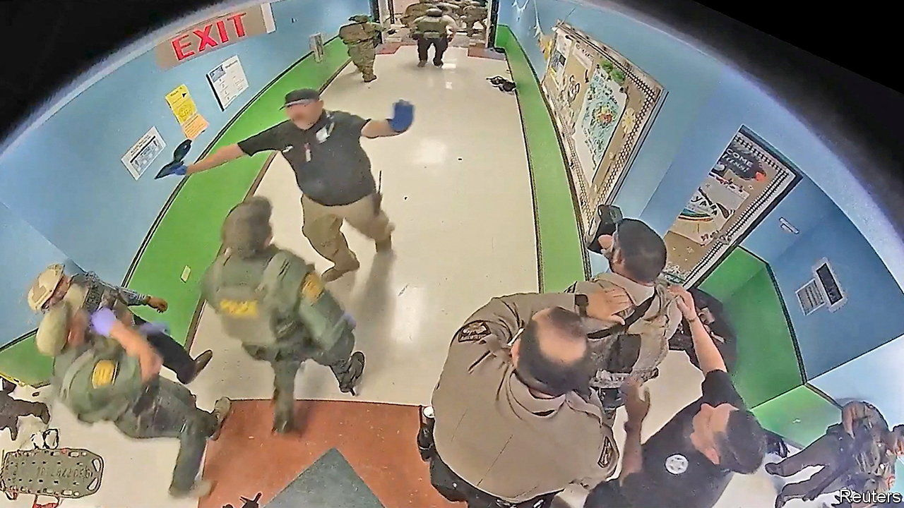

###### Lifting the veil on Uvalde

# A report sheds light on the deadliest school shooting in Texas’s history 

##### But it could distract from solutions to prevent more gun violence 

 

> Jul 21st 2022 

“It could have been worse. The reason it was not worse is because law-enforcement officials did what they do.” So said Greg Abbott, the governor of Texas, at a press conference in May, the day after 19 children and two teachers were fatally shot at an elementary school in Uvalde by Salvador Ramos, an 18-year-old. Mr Abbott must feel sheepish. On July 17th a committee of the Texas House of Representatives released a report on its investigation into the shooting. The image that emerges from the 77 pages is of a police force in chaos. The tragedy at Robb Elementary School will not only be remembered because it was the deadliest shooting ever at a school in Texas, but also because the response was botched.

The inquiry revealed that it took 73 minutes from when the first officers arrived at the school to when they entered the classroom and confronted the shooter there. The delay deprived victims of medical care that might have saved lives, the report notes. In all, 376 law-enforcement officials were deployed to Robb Elementary. None took command. And they disregarded training on how to neutralise an active shooter in a school setting, which has been established practice since the shooting at Columbine High School in 1999.

Police also wasted valuable time searching for a key to the classroom (even though the door may not have been locked) and did not share crucial details with each other, including that students were phoning for help from inside classrooms targeted by the shooter. Law enforcement “failed to prioritise saving the lives of innocent victims over their own safety,” the report concludes.

The police are now in the public’s crosshairs. Residents of Uvalde, a town of 15,000, are calling for the school-district police chief to be sacked. The town’s acting police chief was placed on administrative leave within hours of the report’s release.

The investigation and its findings are vital. But some worry that a focus on police error will detract from other failings, without which the shooting might not have happened in the first place: a lack of mental-health treatment, and lax rules on gun purchases. In the Lone Star state there is no political momentum to tackle either of these. As Texans search for lessons from Uvalde, they may be missing the biggest ones.■


