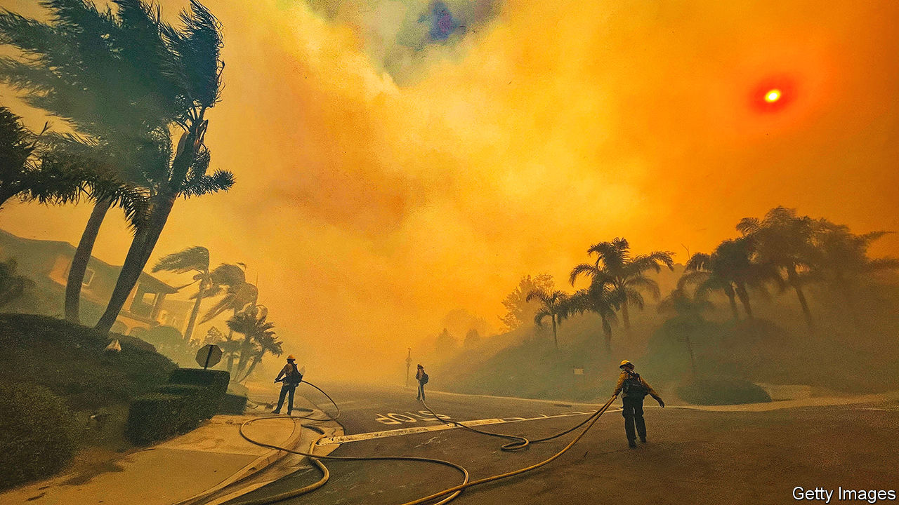
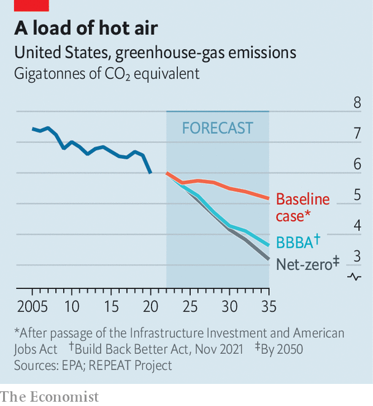

###### Tick, tick, boom

# American climate policy is in tatters 

##### Almost single-handedly, Joe Manchin has scuttled Joe Biden’s plans 

 

> Jul 21st 2022 

Even as americans and Europeans swelter in heatwaves, the chance of Congress passing serious climate-change legislation has gone cold. When the Democrats gained unified control of the White House and Congress 18 months ago, they had grand ambitions for a swift decarbonisation of America’s economy. By 2030 emissions were to be half their level in 2005. By 2035 all electricity would be produced without carbon pollution. And by 2050 emissions would, in line with the temperature goals of the Paris agreement, reach net zero. 

All this was to be accomplished by spending hundreds of billions of dollars on tax credits and subsidies for clean energy and electric vehicles; creating the first national clean-electricity standard; mobilising Americans to retrofit homes; and creating a  to employ thousands of people in conservation work. But as the negotiations dragged on over months, those ambitions steadily diminished. On July 14th they seemed to have gone up in smoke.

The proximate cause was Joe Manchin, the old-style centrist Democratic senator from West Virginia. Because the Democrats control the narrowest possible majority in the Senate, Mr Manchin’s vote is essential to pass legislation that Republicans unanimously oppose. In December he rejected Build Back Better (bbb), President Joe Biden’s signature legislative proposal that devoted $555bn to climate measures. Since that setback, Chuck Schumer, the Democratic majority leader in the Senate, had been quietly working with Mr Manchin to craft a bill more to his liking, which would have included some concessions to the fossil-fuel industry (with which the senator is closely associated), no clean-electricity standard but at least a rumoured $300bn in tax credits for clean-energy projects. On July 14th Mr Manchin apparently walked away from that deal, too.

Still, some Democratic bungling was also to blame. In July 2021 Mr Manchin and Mr Schumer signed a deal to devise a scaled-down version of BBB that would have limited spending to $1.5trn. But by the autumn Mr Schumer had got behind a more maximalist iteration of that deal. The West Virginian pulled out. Inflation, a bugbear of Mr Manchin’s, was rising and the president’s approval rating was slipping. Colleagues pleaded with him that the new deal would help reduce energy costs, and that revenues raised from corporate taxes would help pay down the national debt. But the senator was spooked.

The latest news leaves Democrats in the lurch. “It’s a colossal failure to get nothing done on climate,” says Ro Khanna, a Democratic congressman from California. Restrictions—like a fee on methane leaks or nationwide caps on emissions—had always seemed tough for Mr Manchin to accept. But he had signalled openness to plans for investment in solar, wind, geothermal and carbon-capture projects. That Democrats failed to secure those is therefore “a big miss”, says Mr Khanna.

 


The costs to the environment look significant. To hit the 50% reduction target by 2030, America would need to cut emissions to below 4.2bn metric tonnes of carbon-dioxide equivalent (COe). Modelling by the repeat Project, a research outfit at Princeton University, shows by how much the country might now overshoot that. Without any change to its current policies, it finds that America will exceed the target by 32% in 2030, emitting an additional 1.3bn tonnes that year (see chart). Had last year’s bbb deal become law, 91% (or 1.2bn tonnes) of the excess could have been shed. The recently scuppered Senate deal was modest only by comparison, reducing annual emissions by 67-75% of that goal, or 800m to 1bn tonnes.

Mr Biden is left with few options. He can attempt to pursue sweeping environmental policy by executive order, knowing his ambition will be circumscribed by existing laws and future lawsuits. “Plan B is going to be a bunch of standards and regulations. Those are much more blunt instruments”, which cannot boost the economy through investment, says Leah Stokes, a professor of politics and environmental policy at the University of California, Santa Barbara. This outcome would be all-too-familiar for the former vice-president. Barack Obama was put in the same position after it became clear that Congress would not enact his climate agenda. In a haunting precedent for Democrats, the Waxman-Markey bill of 2009, which would have established a cap-and-trade system for greenhouse-gas emissions, passed the House of Representatives but failed to come up for a vote in the Senate—despite the party’s control of both chambers.

So far, environmental agencies run by Mr Biden’s appointees have held off on issuing the most demanding rules. This may have been from fear of upsetting Mr Manchin while legislative negotiations were ongoing. Now there is little holding the president back. In a speech delivered in a former coal plant in Massachusetts on July 20th, Mr Biden pledged to use his executive powers to combat the climate crisis, which he called a “clear and present danger”. He did not declare a national emergency over climate change (as some activists had wanted), which would have enabled him to cancel certain oil-drilling projects and compel the construction of renewable-energy projects. Environmental agencies could set in motion rules enforcing lower pollution limits for household appliances, cars, lorries and power plants. In theory, the administration could also phase out the programme that leases federal land for oil and gas drilling. In reality, it has been desperately trying to expand it over the past two months as the political cost of high petrol prices becomes clear.

Hearteningly, some notable efforts are under way in the states. Gavin Newsom, the governor of , recently signed a budget authorising $54bn in new spending to mitigate the effects of climate change. The California Air Resources Board, perhaps the second-most significant environmental agency in the country, has long operated a cap-and-trade programme. A new mandate by the board requires that 60% of electricity produced by 2030 be drawn from renewable sources, up from around 35% in 2020. It is likely to decide this summer that all new cars sold in the state must be electric or zero-emission by 2035. Though they vary in their stringency, other states including Illinois and Nebraska have passed legally binding clean-electricity standards and emissions-reductions targets.

Substantial as these subnational efforts are, they will not be enough without significant federal action on climate change. Some Democrats are still hoping that Mr Manchin will come around before mid-term elections in November, after which Republicans are expected to regain control of at least one chamber of Congress. The senator claims he is waiting for inflation statistics for July to make up his mind, and is willing to pursue climate talks in September. Democratic colleagues say they have watched that film before.

More likely is that a divided Congress will doom the prospects of legislation for at least two years. A Republican presidential victory in 2024 would probably do so for at least a further four after that. In a report released in April, the Intergovernmental Panel on Climate Change found that keeping global warming below 1.5°C of pre-industrial levels would require global emissions to peak before 2025. By 2030 they would need to drop by 43% from their levels in 2019 for 1.5°C. That would require an extraordinary mobilisation. Not long ago, America seemed at last ready to do its part. No longer. ■


