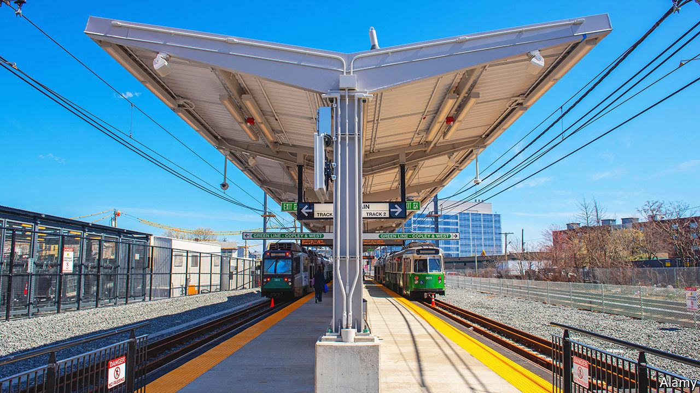

###### Derailed

# American public transport faces a post-pandemic reckoning 

##### Temporary problems risk permanently putting many passengers off 

 

> Jul 21st 2022 

For most of the past decade, Doug Anderson, a bartender, has commuted the 40 minutes from his home in Logan Square in north-western Chicago to his workplace in Streeterville, in the centre, on the city’s L  train. When his shift ends at 4am he shuts up and heads home. But increasingly, he says, getting back is “a nightmare”. At those hours, trains run infrequently; these days they often fail to show up at all, meaning lengthy waits. Mr Anderson’s journey often takes twice as long. He does not always feel safe on empty platforms in the early hours, so he sometimes carries a knife.

Chicago’s public-transport system is just one of many across America that have been badly damaged by the pandemic. When covid-19 hit America, passenger numbers collapsed. Nationwide, in the second quarter of 2020, they fell to a quarter of what they had been in the same period in 2019. But though bars are now open again, planes packed and roads busier than ever, trains and buses remain relatively quiet. According to the American Public Transportation Association (apta), passenger numbers in early July were still around half their level before the pandemic. New York City’s have climbed back to only around 60% of what they were. In Washington the number of average daily boardings on its Metro so far this year is less than a third of what it was in 2019.

Yet the pandemic could have ravaged America’s public transport systems. The number of fares collected plummeted as millions began to work from home. Sales-tax revenues, which in many cities also fund transport, fell sharply early on. But in fact, big cuts to service were avoided on the whole. In many cities fares already covered only a relatively small share of spending, and they could make up the rest from their budgets. Even big older cities, where fares cover a higher share of the costs, were able to benefit from a federal-government bail-out of $70bn through the cares Act and other laws. As a result, says Yonah Freemark of the Urban Institute, a think-tank in Washington, most agencies did not have to cancel many bus or train services. The Los Angeles Metro system, among others, was even able to stop charging people to use its buses for almost two years.

Transport systems are nonetheless struggling to get back to normal. Earlier this month Dorval Carter junior, the president of the Chicago Transit Authority (cta), wrote an article in the  apologising for the city’s continually sub-par service, which he put down to staff shortages. Many bus and train drivers have left to take more lucrative jobs driving delivery vans; others have retired. Mr Carter has promised to redouble recruitment efforts. Other cities have even bigger problems. In Washington in October, Metro pulled more than half of its trains from the network for safety checks after one derailed. Most of those are not yet back in service, with the result that trains are packed even though passengers are fewer. 

Poor service makes it even more difficult to lure riders who have the option of working from home. In Chicago the cta has experimented with cheaper fares and Metra, the city’s suburban commuter rail system, has offered hefty discounts. But as with Mr Anderson, most passengers care as much about reliability, safety and speed as they do about cost. It does not help that systems that were set up to shuttle people in and out of downtowns at rush hour must now adjust to more irregular patterns of travel. Crime has risen, too. Chicago and New York have sent more officers to patrol trains after shootings and other violent incidents. In April, ten subway passengers were shot by a gunman in Brooklyn; remarkably, none died.

Funding is not the issue. More money than ever is available, thanks to the infrastructure act that President Joe Biden signed into law last year. Paul Skoutelas, president of the apta, enthuses about the possibilities. But he admits that the sector is in its “most vulnerable moment”. Knowing what to invest in is tricky. Before the pandemic, bus use had fallen in America for decades, as cars became more affordable for the relatively poorer people who most often travelled by bus. Networks were neglected. By contrast light-rail projects and subway systems thrived, as more white-collar workers commuted to city centres. But since the pandemic they have suffered as those workers have stayed at home, and mostly poorer folk are again filling buses. Bus passenger numbers fell the least among transport systems, and are now closest to pre-pandemic levels. This divergence is creating “existential questions” for public-transport providers, says Leanne Redden, executive director of Chicago’s Regional Transportation Authority, such as whether downtown commuting will ever come back, and if transit agencies need to rethink their central purpose.

Another fear is that, even as new projects are drawn up, some passengers may already have disembarked for good. Americans are driving more than they were before the pandemic. That bodes badly for dense cities like Chicago or Washington. Earlier this year Chicago’s mayor, Lori Lightfoot, called Chicago a “car city”. In fact, before the pandemic, over half of its workers commuted to the Loop, its central business district, and the wider downtown area. Decent public transport helps explain why the city has thrived as competitors such as Detroit or Cleveland declined. If Chicago’s is not restored, the city could get into trouble. ■


