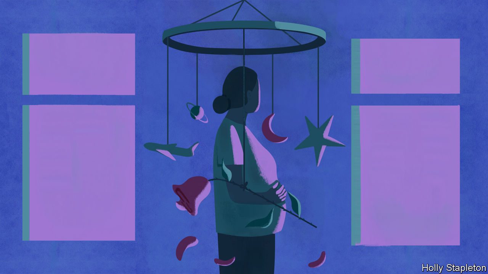
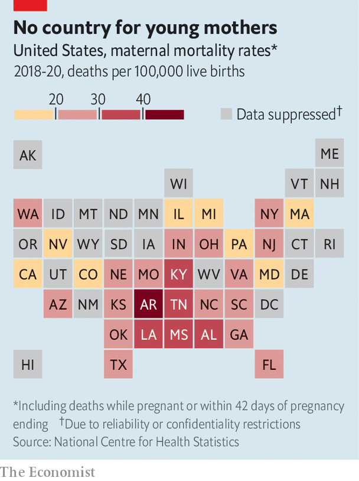

###### Mortal danger for mothers

# America’s already-dreadful maternal mortality rate looks set to rise 

##### After Roe, abortion bans will take their toll 

 

> Jul 19th 2022 

The young woman’s waters broke when she was 19 weeks pregnant. The doctors told her the baby stood no chance of surviving, but that if the pregnancy continued the woman risked an infection, which might lead to sepsis and kill her. They could not perform an abortion, though. Months earlier Texas, where she lived, had passed a law banning terminations after detection of a fetal heartbeat unless there was danger “of death or a serious risk of substantial impairment of a major bodily function”. This wording worried the doctors: if they did an abortion while she still appeared healthy and the baby had a heartbeat, they could be prosecuted. They suggested she fly to Colorado instead.

So she did: booking a seat, as advised, near the toilets in case she went into labour. She reached the clinic in time and is now healthy. But things could have turned out differently, if she had , say, or if no clinic had been able to give her an appointment. “It is barbaric to put a woman in distress on a plane to another state,” says Carole Joffe, a professor at the Bixby Centre for Global Reproductive Health at the University of California, San Francisco. “It is not how you do medicine in a civilised country.” 

 


America has the highest maternal mortality rate in the industrialised world. With the , the Supreme Court ruling that abortion was a constitutional right, it . International comparisons are imperfect but in 2018, while in the Netherlands and Norway there were no more than three maternal deaths for every 100,000 live births, in America there were 17. Most states that now ban abortion, or soon will, allow exceptions if a woman’s life is in danger. But abortion providers and obstetrician-gynecologists (ob-gyns) say laws tend to be so vaguely worded that they often do not know if they are breaking them.

Nisha Verma, an ob-gyn who performs abortions in Georgia, where they will soon be illegal after six weeks, says such laws are not written by medical experts—and it shows. They fail to recognise that a woman can develop a condition that may not put her in immediate danger but that, without an abortion, could nonetheless kill her. Waters breaking before a fetus is viable is one such condition; cancer that necessitates chemotherapy (which may hurt the fetus) is another. The list goes on: high blood pressure, cardiomyopathy and renal disease are all conditions that can arise or worsen during pregnancy. Reports have already surfaced of women denied crucial medical care to complete a miscarriage or end an ectopic pregnancy for fear it could be construed as aiding an abortion.

Doctors should not have to weigh up whether following their training and instinct will put them in legal jeopardy. Besides the personal toll, it raises the possibility of conflicts that have no place in medicine. “The dystopia I fear is a situation in which pro-life doctors are saying, she has a 50% chance of living, while pro-choice doctors and lawyers are saying she has a 50% chance of dying,” says Ms Joffe. “And while they argue, the woman dies.”

Bans mean abortions are routinely delayed, exacerbating medical problems in pregnancy. Shelly Tien, a doctor at a Planned Parenthood clinic in Jacksonville, Florida, says that soon after Texas’s “heartbeat bill” took effect last September she saw a woman who sought an abortion at seven weeks but did not get to Florida until 21 weeks—a common scenario, she says. She expects to see  among those now “flooding into Florida” from nearby states, including Alabama (where is abortion is illegal) and Tennessee (where it soon will be).

Dr Tien warns too of a “terrible snowballing effect” when the time it takes for a woman to raise funds for an abortion, and the necessary travel, means her pregnancy progresses so far that the cost of the procedure rises. She then delays again while she raises more funds. This will worsen, Dr Tien says, as clinics become busier.

The states in which pregnant women are probably in greater danger are those that have long had high maternal mortality rates. Alabama, Arkansas, Kentucky, Louisiana, Mississippi and Tennessee score worst (with over 30 deaths per 100,000 live births). They have also long had restrictive abortion regulations and, following the end of , have either banned abortion or plan to. There is no proven link, but it seems likely that some women have died when they needed abortions but had been unable to get them.

Yet there are other causes, too. States with high maternal mortality rates tend to share three other features: large black populations, high levels of poverty and poor access to health care. In Mississippi, which , Medicaid is cut off 60 days after a woman gives birth, yet many problems arise after this time. Black women (who made up the majority of patients in the state’s last clinic before it closed for good on July 6th) are nearly three times likelier than white women to die from pregnancy-related complications.

Another reason why America’s maternal mortality rate has long been high, say doctors, is a lack of ob-gyns across the country. This too may worsen without . If doctors fear their expertise will clash with badly written laws, putting them at risk of imprisonment, fewer people may want to specialise in the field. Those who do, in states in which abortion is illegal, may miss a crucial part of their training. Where access to health care is already poor, the harms will be particularly grievous. And so the tragedy piles up. The states with higher rates of pregnancy-related deaths are also among those in which more babies die before they turn one. ■


