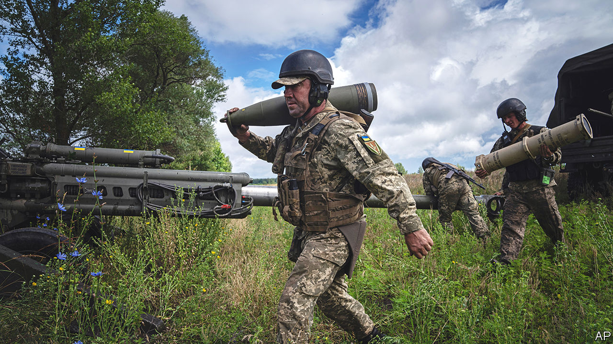

###### A MAGA worry

# Is America growing weary of the long war in Ukraine? 

##### Inflation, wayward allies and venomous politics at home are eroding support for the proxy conflict against Russia 

 

> Jul 17th 2022 

President joe biden pledges to support Ukraine for “as long as it takes”. His administration has spent about $8bn on military aid alone. In May, Congress passed a $40bn supplemental budget—more than Mr Biden had asked for, and more than the annual defence budgets of most European allies—to assist Ukraine and deal with the war’s global consequences.

But nearly six months into the fight, with the prospect of a  to come, even Mr Biden’s closest allies are asking whether America might soon tire of the burden. The president is more unpopular even than Donald Trump was at this point in his presidency. Inflation has hit a four-decade high. And Republicans are set to make important gains in , where they are likely to take control of the House of Representatives and possibly also the Senate.

In an article in , Chris Coons, a Democratic senator and close ally of Mr Biden’s, praised nato’s show of unity at a summit in Madrid last month. He also said he was “concerned about the commitment of the American people and its elected leaders to stay the course as the invasion grinds on.” Vladimir Putin, Russia’s leader, he separately told , “is counting on the West losing focus”.

The aid for Ukraine is meant to last only until the end of September. Few in Congress think another big package can be passed before the mid-terms; many say it will probably be hard to get lawmakers to agree to one thereafter. “It will be an uphill battle,” says a Republican Senate staffer. “The sales pitch from the last time is not good enough now, because the war has fundamentally changed and the domestic situation at home is different.”

Americans broadly support helping Ukraine, and many want the government to do more despite the economic price they must pay for that. According to a YouGov poll conducted this month for , 39% of respondents—a plurality—think that the Biden administration’s policy should be “tougher”. Half or more support various forms of assistance. But given America’s polarisation, Republicans are warier than Democrats. About one in five Republicans say Mr Biden should be less tough. A plurality, 43%, do not want to give more money to Ukraine. They are also less likely than Democrats to favour giving it advanced weapons.

Congressional aides point to three factors likely to affect support for Ukraine. The first is the complexion of Congress after the mid-terms. If Republicans retake one or both chambers, it will matter which faction in the party has the upper hand. Will it be the old establishment represented by Mitch McConnell, the Senate minority leader who in May took senior colleagues to Kyiv to meet Ukraine’s president, Volodymyr Zelensky? Or will it be the devotees of Mr Trump and his maga (“Make America Great Again”) nativism?

Mr Trump still holds much of the party in . He denounced the recent aid for Ukraine, saying: “The Democrats are sending another $40bn to Ukraine, yet America’s parents are struggling to even feed their children.” His base might be energised if, in coming weeks, he announces he will run for president again in 2024. “Fact is if the Republicans take over the House in 2022 us support to Ukraine will come to a halt,” tweeted Ruben Gallego, a House Democrat. Republican leaders, he predicted, would not be able to stop Trumpists like Marjorie Taylor Greene and Matt Gaetz “from dictating our Ukraine policy”. Mr Gaetz shot back: “Ruben is correct.”

Such boasting amounts to “wish-casting”, says Eric Edelman, a former Pentagon official under George W. Bush. maga disciples are still a minority among congressional Republicans. Still, he frets, they could grow larger after the elections. If they make up a bigger share of Republicans in the House—where spending bills originate—and particularly if they hold the balance of power, it will become harder to provide more aid to Ukraine. Few expect the fickle Kevin McCarthy, the Republican House leader, to resist the Trumpian right, even though he has praised Mr Zelensky as “a modern-day Winston Churchill”. Pressure will increase on the Senate (whether controlled by Democrats or Mr McConnell’s Republicans) to tame the excesses of maga-world. The matter of Ukraine, says Mr Edelman, is part of “the larger battle for the soul of the Republican Party”.

A second factor is the extent to which allies are willing to keep helping Ukraine confront Russia. “How much are our European partners doing? That&#39;s literally the first question I get,” says Mr Coons. For most Americans, he notes, Ukraine is “half a world away”. European countries are closer to Russia’s military threat, and also more , the loss of Russian energy supplies and the outflow of refugees.

Perhaps the biggest consideration is the third factor: Ukraine’s progress on the battlefield. If the Biden administration can show that it is helping Ukrainians to gain ground, rather than getting bogged down in another “forever war”, support will be easier to rally. But a protracted conflict looks all too likely. Ukraine has lately had success in using , a guided-missile launcher supplied by America, to strike command posts and ammunition dumps behind Russia’s front line. But Ukrainian forces are still heavily outgunned and on the defensive.

Mr Biden’s aim in the war is unclear. His administration has stopped talking about helping Ukraine “win”, and instead speaks of preventing the country’s defeat. It is delivering himars in small packages of four launchers at a time (it says that it takes time to train Ukrainian forces); three lots have so far been sent, and one more has just been promised. But Mr Biden’s central concern is plain: to avoid a direct conflict between nato and a nuclear-armed Russia. America has demanded assurances that the 84km-range gmlrs munitions provided with himars will not be fired at Russian territory. And it has so far refused to provide atacms munitions, which have a range of about 300km.

To some the war is unwinnable: they say Mr Biden should make haste and find a diplomatic deal. But for Ukraine’s supporters, whether on the left or right, the answer is for Mr Biden to hurry up and win: by giving Ukraine more military help, doing it faster and accepting more risk. “If they think stalemate is the answer, or even if they are not intentionally playing for a stalemate,” Mr Edelman says of the Biden administration, “they’re going to lose on the battlefield, and they’re going to lose the battle for public opinion at home.” ■


