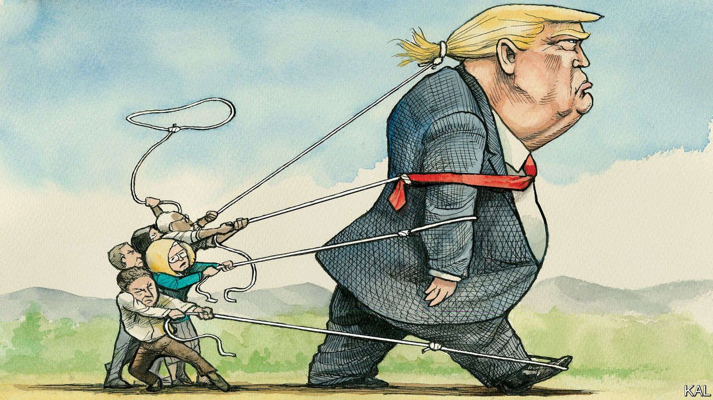

###### Trumped

# The January 6th committee has hobbled Donald Trump 

##### But it has not blocked his return to the White House 

 

> Jul 21st 2022 

America should count itself lucky that Donald Trump tried so hard to overturn the election of 2020. That is the biggest obstacle—though far from an insurmountable one—standing between him and a return to power. 

Democratic leaders have been saying for years that Mr Trump and his cult-like following threaten the republic, and they’re right. They have not acted accordingly. Through a mix of magical political thinking, internal bickering and mismanagement, they have sharpened and handed back to him two of his three most potent causes: crime and illegal immigration. Sheer bad luck might help excuse their bestowal of the third, economic performance. They threw in a botched execution of the withdrawal from Afghanistan. In a recent cnn poll four out of five Americans surveyed said things were going badly for the country; more than two-thirds felt President Joe Biden had neglected the most important problems.

Even memories of how Mr Trump whipped up the attack on the Capitol might have faded, or been challenged and revised, were it not for the excellent work of the January 6th committee investigating the insurrection. The committee’s nine members have not only kept the political class, and much of the rest of the nation, from looking away from that day. They have obliterated claims that the mob acted spontaneously, and that  it might use violence to stop the certification of Mr Biden’s victory. 

Consider a world without the committee: revisionists would be far freer to minimise Mr Trump’s role in rousing the mob and to burnish or invent memories of his accomplishments. Instead, the panel has been reminding the party’s leaders, operatives, donors and even some of the rank and file just how debilitating Mr Trump’s leadership was. True zealots still delight in rallying to Mr Trump, but Republican congressmen who were merely cowed are rediscovering how tiresome it is to defend him.

Other potential Republican candidates sense an opening. , Florida’s governor, has declined to say he will not run for president if Mr Trump does; he has been courting the Fox News audience and recently invited Republican governors and donors to a day-long conference in Fort Lauderdale. Mike Pence, the former vice-president who stood up to Mr Trump and certified the electoral vote, has refused to regret that choice or forswear a run; he is endorsing competitors to Mr Trump’s own election-denialist candidates in some races. Mike Pompeo, Mr Trump’s secretary of state, has shed more than 40kg and has said that if he decides to run he will do so “wholly independent” of anyone else’s choice.

But do not imagine that Mr Trump is fading away. “Half of gop voters ready to leave Trump behind, poll finds”, read a recent headline in the  about a survey it conducted with Siena College. It is wiser to emphasise the darker view, that the glass remains half empty. The intense loyalty to Mr Trump of  means that, the more Republican candidates choose to run, splitting his opposition, the better it will be for him. Betting markets are placing a higher probability on Mr Trump’s being the next Republican presidential nominee than on Mr Biden’s being the next Democratic one.

In a sign that the committee’s work is not reaching, or at least not persuading, many Americans, the same poll found that fully three-quarters of Republican primary voters believe that on January 6th Mr Trump was “just exercising his right to contest the election”. If Mr Trump reached the general-election campaign, he would be able to count on the polarisation of American politics to draw the party together behind him, as in 2016. 

Anyone who doubts  that millions of Americans feel for Mr Trump should attend one of his rallies, or just watch one on YouTube. Each is a vicious, exhausting festival of the counterfactual, and his crowds glory in it. If Democrats had not cheated Mr Trump out of his second term—he actually won all 50 states “plus the islands, too”—Iran would have signed a nuclear deal within a week; just three weeks in, he would have finished his wall along the border with Mexico, and foreign adversaries would not be emptying their prisons into America; America’s streets would not be “flowing with the blood of innocent crime victims”; petrol would be cheap; Vladimir Putin would have left Ukraine alone, because Mr Trump would have withdrawn so smoothly from Afghanistan. Indeed, during Mr Trump’s term of office, “everybody was happy”; it was “the greatest period, I believe, in our country’s history, in many ways”. At least, until “the horrible plague” came in from China. 

The enemy within

Most chilling are the indications of how Mr Trump would govern—“rule” would be a better word—if he regained the White House. At a recent event in Las Vegas he said he regretted allowing Democratic mayors to retain control of their cities. “I wouldn’t do that a second time,” he said. A day later in Anchorage, Alaska, he left no doubt as to who the enemy was: “Despite great outside dangers, our biggest threat remains the sick, sinister and evil people from within our country.”

“We will fight for America like no one has ever fought before,” he said, after 90 minutes of fear-mongering and rambling. “The tyrants we are fighting do not stand even a little chance.”

It’s like sitting in gridlocked summer traffic as a New York cab driver leans on his horn; you feel helpless, bludgeoned, you just want it to stop. But Mr Trump’s blaring matters. His talk is dangerous regardless of what he does—dangerous if he does not run; more dangerous if he runs and loses again; most dangerous if he runs and wins. Had Mr Trump conceded defeat, however ungraciously, his path back to the White House would be wide open. His own broken psyche, and the work of the January 6th committee, have given his opponents in both parties a chance to stop him, and there is no more urgent political project. ■


