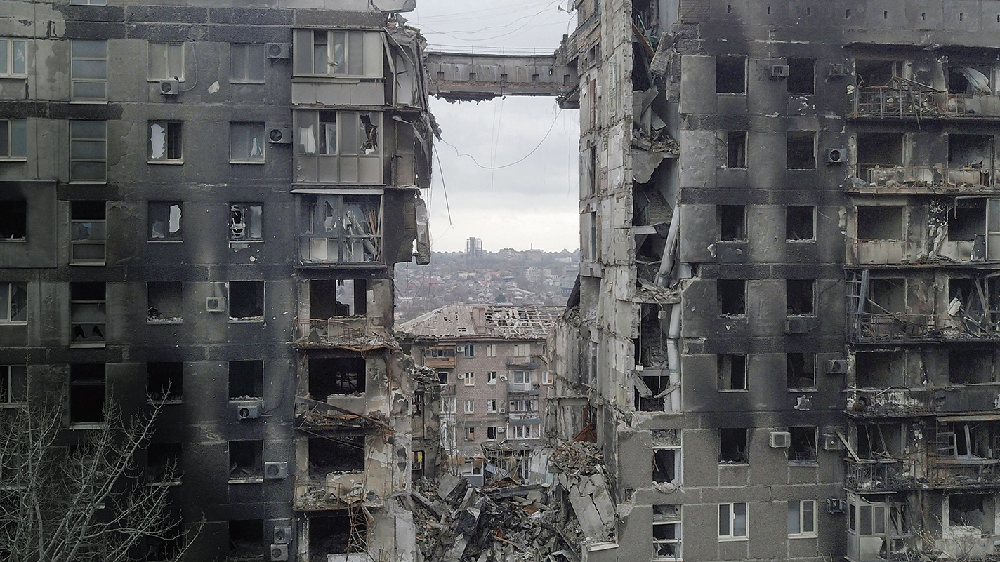
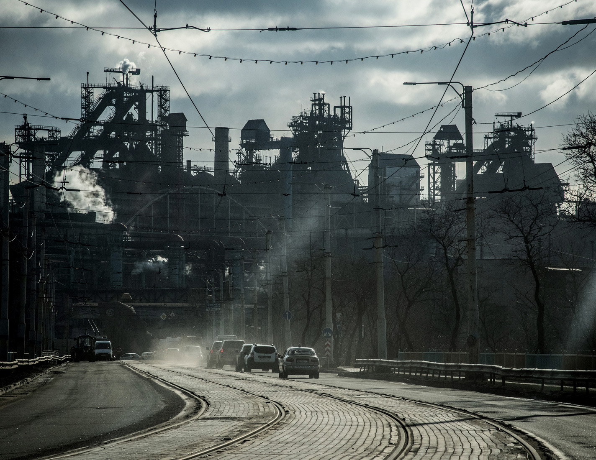
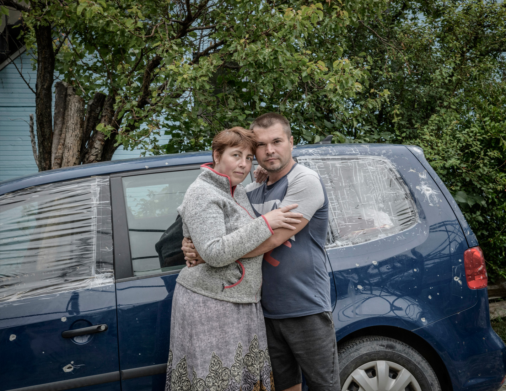
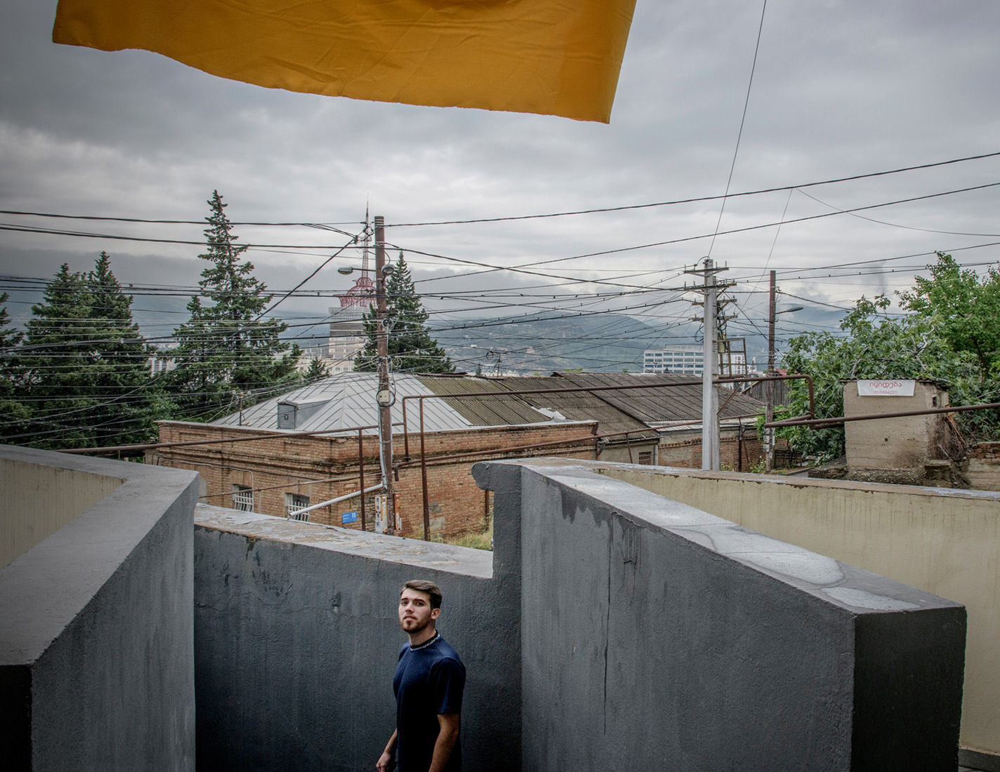
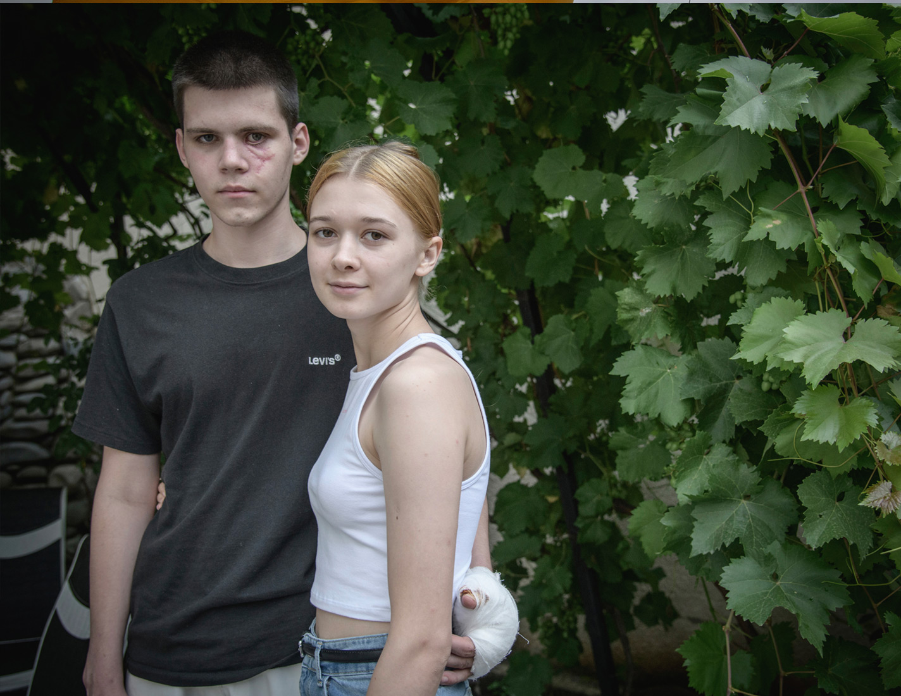

###### Summer reading

# East of Mariupol: what happened to the Ukrainians who fled to Russia? 

##### Some refugees who went east faced interrogations. Others were met with cups of tea and kindness 

 

> Jul 28th 2022 

n February 23rd Natalya Balabas took $1,000 in cash out of the bank in preparation for going on holiday to Istanbul. She and her family weren’t particularly worried when the shooting started the following day. Russia and Ukraine had been at war in eastern Ukraine since 2014 and the people of , where Natalya lived, had become used to the thud of explosions: the front line was just 10km away. Natalya and her family thought the noise signalled yet another flare-up in hostilities. Vova, Natalya’s 24-year-old son, asked if they should buy extra food. Natalya told him they had plenty.

The bombing grew closer and more intense a week later. On the night of March 2nd the electricity, heating and water cut out. There was no internet, mobile-phone or tv reception. “It was like living inside the shell of an egg,” said Natalya.

The family boarded up the windows of their ground-floor flat. They collected food from abandoned shops and distributed it to neighbours. They managed to fill a large tank with water from a well – everyone in the family stopped washing, to make the water last longer. Nastia, who was 12, curled up with her cat on a mattress and hardly moved. “It was pitch dark at night with no lights, dark in the day behind the blacked-out windows,” said Natalya. At night the temperature was below freezing and they wore jumpers and coats all the time.

Early in the war,  broke into a flat on the fifth floor of the block to use the balcony as a firing position. Residents begged them not to, but the soldiers ignored them. The shooting inevitably drew fire from the Russians. The block was hit and began to burn downwards from the roof. Locals battled the flames for several hours. By some miraculous intervention, the wind blew the fire away from the Balabas’s flat. The fighting grew ever closer. Jets screamed overhead and the air was filled with sparks and smoke.

The Balabas family had once led a happy and prosperous life in Mariupol. Natalya and her husband Roma worked at the Azovstal iron and steel works, which employed nearly 11,000 people. Vova was finishing a degree in metallurgy and working at the plant to save money for a house. The younger children, Kostya and Nastia, were still at school.

The province of Donetsk had been divided in two since 2014, when the Maidan protests ousted the pro-Russian president, Viktor Yanukovych. Russia backed a group of separatists who proclaimed themselves the Donetsk People’s Republic and fought a war against the Ukrainian state. Russia used its regular army to back the insurgents. Mariupol remained under Ukrainian control, but many people in the city had been indifferent to the revolution that overthrew Yanukovych and disliked the violent clashes with police. “We wanted to throw a big bowl of water over their heads so they would go home,” Natalya said. Like most of those in Mariupol, the Balabas family spoke Russian and had Russian friends. They were dismayed by the divisions the fighting caused. “Families were split up. Neighbours fought,” Roma said. They didn’t want to choose sides: “We are not political,” Natalya told me several times.


On March 15th, nearly three weeks into the war, Vova managed to get hold of a radio and the family learned more about what was going on. Russian stations mentioned the “special operation” in Ukraine only briefly between lengthy broadcasts of concerts. Ukrainian stations advised residents of  to evacuate, but gave no practical information. Some neighbours who had tried to drive out reported being turned back at Ukrainian checkpoints.

The Balabas family had delayed too long. The city was encircled. “At first, my parents said we’ll worry about it when the Russians are in the city,” said Vova, rolling his eyes at their obtuseness. “When the Russians were in the city, they said ‘we’ll stay until they bomb our street’. Then when our street was hit, they said ‘we’ll stay until our block is hit’. In fact we stayed until we were almost destroyed.” Natalya is now inclined to agree. “The clever people got in their cars and left immediately. We were not clever.”

Natalya described the horrors of that month in Mariupol matter-of-factly, in neat, precise sentences. From time to time she would pause and take a breath, half-sighing, half-recharging, then continue. She drew me a map of the city to illustrate the events. By the time we reached March 16th it was a mess of blue biro. The little circle that marked her flat was right between the Ukrainian and Russian front lines.

Russian troops had occupied the housing blocks in the next street where Kostya’s girlfriend, also called Nastia, lived. A neighbour told them her building was on fire and the young couple went to investigate. Russian soldiers were positioned at every entrance. One soldier checked Kostya’s arms for pro-Ukrainian tattoos. At first Kostya, 16, was scared but, as they talked, the soldiers seemed like normal people. They told him that buses would be evacuating people eastwards. Kostya said his family had its own cars. The soldiers told him to avoid the main road because it was a shooting gallery. Leave as soon as possible, one said, “It’s going to be hell tonight.”

There’s usually a long sound,” said Natalya, “a peeeeeeee-ow, before the boom, so you have a little time to get under something. This time there was just a bang.” As the family was packing up the cars, a shell exploded in the courtyard. Vova was thrown to the ground; he couldn’t feel his left leg. When he looked up, he saw his father limping but still standing. Shrapnel had torn Kostya’s face open and his index finger was hanging by a thread of skin. Natalya’s sister was bent over her son, Vadim, desperately trying to stanch the fountain of blood spurting from his neck. Vova could tell from his glassy eyes that he was dead.

 


 


Details of that night are jumbled and gory: Kostya, suddenly hot, suddenly thirsty, crying out that he didn’t want his girlfriend seeing his face like this. Roma throwing the bags out of the car, laying Kostya on the backseat, then driving to the hospital, as his own thigh bled, weaving desperately through streets strewn with rubble.

The hospital had no running water or heat, no anaesthetic or medicine, and no surgeons, only an exhausted junior doctor. Natalya stole a dirty, bloodied blanket from a heap of discarded clothes to wrap around a shivering Kostya. The doctor told them it was better to leave the shrapnel in the back of Vova’s knee. He stuffed a wad of bandages into the hole in Roma’s thigh and told them to keep the wounds clean with antiseptic.

“We don’t have antiseptic,” Natalya told him.

“Use vodka.”

“We don’t have vodka.”

“Then you can use urine,” he said.

Natalya can’t remember how they got home. The whole family lay in the same room, wounded, shaking and cold. No one slept. As the Russian soldiers had promised, the shelling was heavy all night; the walls shook and plaster dust thickened the air. The next morning, before dawn, they finally left. Roma took the wounded boys and Kostya’s girlfriend Nastia in the blue car; Natalya drove the brown car with her daughter and her 85-year-old mother – the windows were all blown out and one tyre was flat.

There were two routes out of besieged Mariupol: west through Ukrainian lines, or east through the Russian lines into the Donetsk People’s Republic. Inhabitants of the city, deprived of news and caught between two armies, had to choose according to logistics and luck. Based on the advice of the Russian soldiers, the Balabas family headed east.

At the first Russian checkpoint the troops waved Roma and his wounded sons through and radioed for an ambulance to meet them. Natalya was told to wait and follow a convoy of buses. When they set off, two hours later, the flat tyre meant her car crawled so slowly that she lost the convoy. Hunched over the steering wheel, she drove through the outskirts of the ruined city, before bumping into a Russian tank column. “You’ve got a flat tyre!” the lead tank gunner called cheerily.


Six hours after setting off, Natalya reached the village of Bezimenne (which means “no name” in Russian) in the Donetsk People’s Republic. Natalya saw Roma’s parked car. Soldiers told her the occupants had gone to hospital, but they didn’t know where. They pointed her towards a long queue of cars waiting at a so-called filtration point, where officials interview and register  before they can proceed farther east. (The Soviet Union employed a similar process at the end of the second world war, to assess the ideological soundness of Russians returning from German prisoner-of-war camps.)

Natalya walked for 40 minutes along the queue of cars. Some people had been waiting there for three days. At the end a huge tent had been set up, with desks inside where refugees sat for interviews and camp beds where a few of them could rest. Natalya was desperate: without a permit, she couldn’t find her husband and sons. Exhausted, filthy and freezing, she was directed to a large stone building providing shelter to the elderly and families with young children, but it was already full. Natalya collapsed, crying. The man in charge said they could stay in a corridor.

One soldier drove her to get her tyre fixed. Others poured her consoling cups of coffee and gave her biscuits and sandwiches. They helped her exchange her dollars into roubles – she still had the $1,000 she’d withdrawn for her holiday – and called round hospitals to find out where her family members had been taken. “They were Ukrainians wearing military uniforms. They were not Russian soldiers,” Natalya said. “They had no aggression towards us and we had no aggression towards them.”

A soldier at the shelter let her use his hotspot, and she went online for the first time in a month. Her Viber groups lit up with messages – Where are you? How are you? – including one from a cousin in Moscow with whom she had barely spoken since 2014. He owned a large, empty house in Bezimenne. A neighbour had the keys, he said. Natalya could stay as long as she liked.

The house had electricity but no heating. Natalya chopped wood for the stove, bought potatoes and butter, and managed to get through to Roma and her sons, who were in different hospitals. Natalya was told she wouldn’t be called for her filtration interview for at least a week, but the Donetsk soldiers managed to bump her up the queue so she could get to her wounded sons faster.


At the filtration point, soldiers searched her car boot and bonnet. People in military uniforms checked documents: they registered her name, examined her id, took a photograph, face-on and in profile, and scanned her fingerprints. At another desk she was told to unlock her phone, then a man read through her Telegram messages, Viber chats, Facebook posts and WhatsApp messages. After 40 minutes of scrolling, another official told him to hurry up: “Either detain her or let her go!” The man said he wouldn’t be rushed. He connected her phone to a computer and downloaded the entire contents.

At the next table Natalya filled out a long questionnaire: have you met any member of the Ukrainian intelligence services? Do you have friends or relatives in the Ukrainian military? Did any of your neighbours display the Ukrainian flag? “I answered no to all of them,” she said. The process took around three hours. At the end, Natalya received a permit. Everything would be fine from now on, she was told.

More than 6m  since the war began. Most of these went west, but around 1.5m have entered Russia, according to the un (some think this is an overestimate). Many who have gone east have come from . In the early weeks of the war there were reports of Russians forcing people onto evacuation buses and transporting them to the Donetsk People’s Republic.

Those who want to leave Russia must travel over 800km to the Caucasus and cross the mountains into Georgia, or go in a great loop to reach the Baltic states, or traverse Belarus to reach Poland. Digital grapevines on social media offer advice and assistance. Some have been set up by benevolent Russians.

Masha Belkina’s family left Moscow three years ago to escape government repression and moved to neighbouring Georgia. After war broke out in February, Belkina launched Volunteers Tbilisi on Telegram to help Ukrainians get to safety. The organisation offers refugees shelter in rented houses, as well as distributing food and other necessities. Helping to Leave, also based in Tbilisi, has 450 volunteers all over the world, answering queries and co-ordinating evacuation plans.

Helping to Leave and Volunteers Tbilisi both have networks inside the occupied zone in Donetsk and Russia assisting Ukrainian refugees. “We call them our foggy volunteers,” Belkina said. “No one knows who they are and no one needs to know. I have never met any of them.” Over the past three months, she estimates that 1,000 people from all over Russia have volunteered to help Ukrainian refugees book hotel rooms, buy bus tickets or find a place to stay.


These volunteers have a particular insight into the filtration process. There seem to be no standard procedures. Some filtration points are staffed by locals, often middle-aged women who had been government employees or police. In parts of , such as the south around Kherson, Russian soldiers usually man them. All are overseen by the fsb, the successor to the kgb.

Officials may be friendly, indifferent or menacing. Men usually have to strip in case they have pro-Ukrainian tattoos or bruises inflicted by the recoil of a rifle. Some interviews are cursory, others intimidating. Most  pass unharmed, but there are stories of people being harangued, beaten or disappearing.

Anna, a volunteer living in Stockholm who runs a team for Helping to Leave (and prefers to remain anonymous), said it was “impossible” to say how many Ukrainians had been arrested because all the information was anecdotal. One of the phone calls she received was about 200 people from the same village, mostly men, who had been detained for over a month. (They have since been released.)

Once through filtration, Ukrainians either stay in the Donetsk region or board buses that take them across the border to Russia. Here they can stay with relatives, rent apartments or leave the country, if they are able to. Those who find themselves in Russia with no friends, relatives or money – Ukrainian bank cards don’t work there and sanctions mean no one can transfer funds from abroad – are at the mercy of the system. These people are put on special trains – “We call them deportation trains,” said Anna – and can’t choose their destination.

Conditions in Russia vary. Some are housed in hostels, sanitoria or old army barracks. Anna knows of one family in a city in central Russia living in a nice hotel with good food – though staff are rude to them because of their nationality. Others are stuck in villages with almost no amenities and live on porridge and watery soup. Some have been sent as far east as Vladivostok or to Murmansk, north of the Arctic Circle.

“The bad news is that most people stay in Russia,” said Anna, and are left stranded not just by a lack of money but lack of knowledge about other routes. Some Ukrainians in Russia become victims of propaganda: they are warned that Ukrainians are ill-treated in Europe and fed images of Mariupol returning to normal life. That same propaganda means many Russians see all Ukrainians as the enemy – even as the Kremlin’s contorted narrative portrays the refugees as victims of ’s so-called Nazi regime.

 


 


When Vova got to hospital in the Donetsk People’s Republic, a Russian soldier saw the small Ukrainian-flag patch on the shoulder of his Azovstal uniform and exploded in fury, hectoring him about how he had been fighting Ukrainians for eight years. Vova said it was a work jacket and ripped off the patch. “If I see another Ukrainian symbol on you I will make you swallow it,” the soldier replied. Others in the hospital were friendlier. An old woman brought homemade blinis, tutting at how sorry she was for him.

Among those recovering on Vova’s ward was a man from Mariupol in his 50s who had spent 25 years in prison for a crime that he wouldn’t reveal; a soldier in the Donetsk militia who couldn’t believe that Mariupol was once a prosperous city (Vova described him as “dense as a block of wood”); and a Russian soldier from Dagestan, a region in the Caucasus mountains. He had taken an army contract for the money but couldn’t understand why two Russian-speaking nations that shared a religion were at war. “What’s going on here? It’s like fighting in one family,” he said.

Doctors removed the shrapnel from Vova’s knee, but he still couldn’t walk. He worried about permanent nerve damage and contacted the German Red Cross about getting to Germany for more treatment. Many people who fled east from Mariupol were waiting in the Donetsk People’s Republic until the fighting stopped, hoping to return home. Natalya and Roma were content to stay at their cousin’s house in Bezimenne. “For my parents, there was a house. They could live in it. They didn’t care under whom,” said Vova. “But I was thinking about how I could work, about a future. And there is no future in Bezimenne.” I asked what had convinced his parents to leave? Vova laughed. “Google is very good!”

Natalya heard about Volunteers Tbilisi and contacted Belkina to find out where they could stay when they got to Georgia – and whether it was true that Ukrainians could get free medical treatment. Belkina worked out which filtration point might issue documents fastest and advised every family member to scrub their phones of contacts, images and chat history. They had addresses of relatives in Russia at the ready, in case they were questioned about where they were heading. In the event, the officials at the filtration point did little probing. Natalya told them that her sons needed treatment in Russia – Belkina had suggested they play the victim card – and within five minutes their papers were stamped.


The crossing into Russia took longer: the family were stopped for five hours while both their cars were searched thoroughly. Twenty hours after setting off, the Balabas family finally arrived at their destination of Rostov-on-Don, a Russian city near the Ukraine border. Exhausted, they pulled into a petrol station in their two cars, the bullet holes still evident. Noticing their Mariupol number plates, a Russian man bought them a tank of petrol and ice-cream, and helped them find a hotel. Their single room was in a cheap, rundown hostel. “But it had hot water!” Natalya said, smiling at the memory. The Balabases showered for the first time in a month: “Black water ran off our bodies.”

The family got varying reactions in Russia. One man, whose flashy car had a letter Z on the side, looked right through them. Another stuffed money into Kostya’s pocket. Natalya called dozens of mechanics before finding someone who took pity on them and patched up the two cars without charge.

In early April, the family set off again. They drove for two days without stopping to reach the only border crossing to Georgia. The Russian border guards complained that they didn’t have the right immigration cards; the Georgian border guards worried that Kostya and Natalya’s mother didn’t have passports. Eventually the whole family was waved through. Belkina, the founder of Volunteers Tbilisi, met them on the other side. Around 25,000 Ukrainians have travelled to Georgia since the beginning of the war.

The Balabas family had been in Georgia for two months when I met them in mid-June. Kostya’s hand was bandaged into a mitt after a bone graft to strengthen his thumb – he had lost his index finger. The corner of his blinded left eye drooped slightly and the cheek below was scarred. He is a teenager, and is still growing, but he carried himself with a steadfastness at odds with his boyish looks.

Like his parents, Kostya had been neither pro-Russian nor pro-Ukrainian before the war. He maintained that view after the invasion. “In war, your mind narrows. We were fighting for survival. We didn’t care if we were under the Russian flag or Ukrainian flag…I saw that the Russians helped us evacuate. I thought the Russians were good.” Distance has changed that perspective. “Since I’ve been able to get away from that stressful period, my mind has opened up again and I can see the bigger picture. Now I think: Russians, fucking bastards; Ukrainians, wow! Those are the great guys.”

Vova’s leg has healed. Ever industrious, he had recently taken an online course in interior design and been to several anti-war demonstrations, where he was heartened to see exiled Belarusians and Russians holding Ukrainian flags. “People say the Russians are bad, but Russians are victims of Putin just as we are,” he said. Vova believed that the Ukrainians had tried to defend Mariupol as best they could. His parents were more equivocal: “Russia says they are saving Ukraine from Nazis. Ukraine says they are saving Mariupol from Russian aggression,” Roma told me. “But no one thinks of the people.”

The family was deciding whether to resettle in Canada or Austria. Vova was torn – his girlfriend in  wanted him to go to Germany with her. But none of them wished to return to Mariupol. Their flat is a ruin and there isn’t any glass in the windows. According to the neighbours, a Russian man is living there now. ■

 has reported from Ukraine for  since the beginning of the war. Additional reporting by Maradia Tsaava

You can read Wendell’s previous dispatches from Ukraine for  , and the rest of our coverage, .

PORTRAITS: 

ADDITIONAL IMAGES: PAVEL KLIMOV, GETTY

