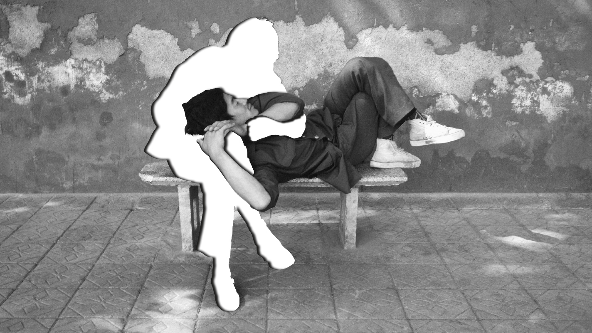
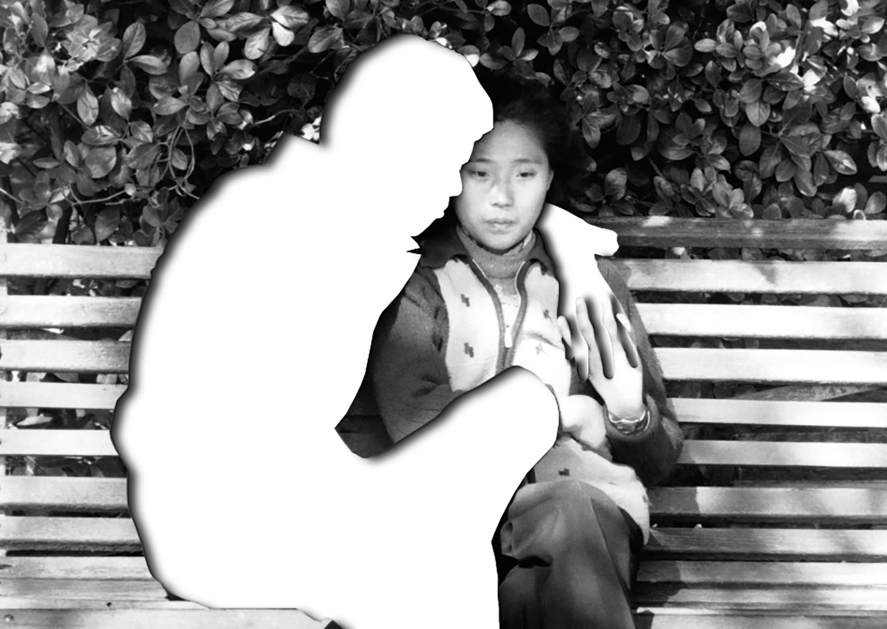

###### Summer reading

# How to go to therapy without talking about your feelings 

##### Two Chinese psychologists talk about divorce, stockpiling and crying into your mask 

 

> Jul 28th 2022 

Chuan He 

I was born in Ningxia province, where the goji berries are grown. I studied psychology at medical school. But in the late 1980s, when I graduated, people thought psychologists were only for lunatics. It was shameful to see one – if you worked in that field, you starved. I taught medical ethics for six years, then I started a business. Potatoes grow naturally on Ningxia’s high plateau, but it’s so remote that many rot. My company imported starch-making machines, and for almost 20 years we sold potato starch for cooking. It was exhausting. In the second half of my life I remembered my original dream to be a therapist. So in 2013 I started my training in Shanghai.

Yun Juan

I’m from Wuhan, born and raised. I had some misconceptions about psychology at first. . That wasn’t for me. My ideas changed when I became a Christian. I was making hospital visits and realised that talking was a way to help people, so I started training in 2009. I was thankful for that when the pandemic came.

The virus first appeared in Wuhan, which locked down in 2020 just before Chinese new year. We usually celebrate with our families, but that year I was alone with my daughter; my husband and parents were locked down in other parts of the city. We knew so little then, we were afraid even to open the windows. The city was silent and dark. No cars, no sounds, just the garish new year’s gala playing on tv all bright colours and laughter. It hurt my eyes. In my 58 years, I had never felt that kind of loneliness.

But soon we were busy. My daughter went out to volunteer and I started providing therapy online. There was a woman, nearly 70, whose husband had been infected and taken to a quarantine facility. She was panicking. She threw everything that belonged to him outside. She’d call me in a sweat – it was winter, but her clothes would be soaked. I’d say, “Listen to my voice.” I’d tell her to lie on the bed or sit down. I’d teach her to breathe.

You can’t limit sessions like that to 50 minutes. You stay with people on the phone or computer, sometimes for the whole afternoon. You ask them to think of a happy memory, a time they felt safe. Sometimes they fall asleep, and that’s good. Or you help them cry, and that’s good, too.

Chuan He

Some of my patients were surprisingly happy when the lockdown began. There was a couple and the husband had had an affair. The wife was in pain, thinking, should I fight with my spouse, avoid him, or let myself go numb? Then suddenly they were inside together for months, forced to face their relationship. Things actually improved.

Other couples struggled. One of my clients is a high-performing businessman. At first he was OK, busy in his study all day. But after the fourth, fifth week of lockdown, work annoyed him and he started yelling at his wife and kids. He didn’t want to get up in the morning; he napped at lunch and then played mahjong and watched videos on his phone until 3am. He felt powerless and started to ask: What am I working for? What is this life for? Is there still meaning? That is depression. He needed a professional to tell him: “You’ve met something unprecedented. This is a stress response. It doesn’t mean you’ll always be like this.”


We dealt with many crises. I met one man whose parents had both been sent to hospital and he couldn’t reach them. He and his siblings were begging for help in every direction, but their money and connections had no effect. He was spiralling: When would it all end? What if they died? I helped him realise that his fear of what might happen was hurting him more than the reality of his parents being in hospital.

To be honest, I felt anxious and helpless, too. I remember thinking about whether to eat my last egg or save it for the next day, and then asking, why are we locked up, why must we fight for food? How could this be happening in Shanghai? Such questions fill you with anger, but what can you do as an ordinary person? So you drop the anger and go to the next stage: sorrow.

Many of my clients don’t live in Shanghai – they prefer talking to someone far away, because they worry that a local therapist would leak their stories. I often see common themes. Many Chinese are afraid of two things: negative feelings and shame. Often, if a grandparent dies when the child isn’t there, parents don’t tell them about it until later. The parents don’t want to “disturb” their children with bad news. They can’t allow them to be sad. So they deny their children the chance to say goodbye, which creates a deep sense of loss. The child needs help to reconstruct the scene and say what they feel.


There’s an idea that family harmony is more important than anything. I had a couple who’d already been divorced for half a year but didn’t tell anyone because they’d lose face. So they didn’t turn up to family get-togethers; they’d pretend to be on business trips. I’ve seen parents who divorced when their child was in primary school and tried to keep that secret until they were in high school. Of course, the kids always know. You’re performing for your child, but they know. Actually, you’re lying to your child. You think it’s a form of protection, but the child will have no sense of security. They feel deceived.

As a therapist, it’s against my ethics to encourage people to stay married or get divorced. When a case ends in divorce, that doesn’t mean therapy didn’t work. The two people come out with clearer minds. They understand what happened in the past 10 or 20 years and what kind of life they want to live. But both society and the courts here encourage couples to stay together. Many women absorb that pressure. They feel if they’re divorced, they’ve failed, they’re bad at marriage. So I try to give them courage. I tell them it’s not shameful to be honest.

Yun Juan

Many families have problems with in-laws, especially when one member of the couple was raised by grandparents while their parents migrated to the city for work. One woman I treated struggled with her mother-in-law. Her mother hadn’t been around. Now she had someone who could finally be her mother, but she didn’t know how to build a relationship as an adult. When her mother-in-law said something critical or nagging – “Aiya! You did this wrong. You are slow!” – the wife reverted to childhood. She didn’t want to live with her mother-in-law anymore. This harmed her relationship with her husband, who was worried about his wife but wasn’t willing to cross his mother. And the in-laws would never come to therapy.

The older generation doesn’t understand. They lived through so many crises, and say things like: “You’ve had it too easy. If you could eat bitterness like us, you’d be fine.” My own mother was a child during the second world war. Her parents left the village to join the war effort with the nationalists. When the Cultural Revolution began, my mother’s family was marked as counter-revolutionary. The Red Guards would barge in to hold “struggle sessions” against her parents, breaking things, screaming at them and putting up posters denouncing their ideological crimes. Of course my mother was affected. Throughout her life she tried to join the Communist Party to prove she was a good citizen, but was never allowed to. That’s why she married my father: he was from a peasant family, which was considered good because Maoist ideology elevated the peasantry.

My mum always cites a saying: “If you made a mistake, fix it; if you didn’t, take the punishment as a warning.” I hate that. It’s what innocent people told themselves to survive that era. If they were attacked, they’d say: “It’s fine, I deserve it.” My mother treated me the same way. If my brother did something wrong, she’d discipline me, too. I had to be strong and self-sufficient. These things sit like a glacier between us. They also distorted my relationship with my husband. Before I had therapy, I became defensive easily. Because even my mum would never help me, I didn’t trust anyone. There was a distance in all my relationships.

My parents have always kept their supplies stocked up. My father buys too much, freezes it and fills an entire storage cupboard. He can never have enough. The two of them are constantly preparing “for war, for famine, for the people”, as they said in Mao’s time. They’re waiting for the moment when they lose everything. My parent’s generation passed this fear and numbness on to us, and we passed it on to our children.

Chuan He

After the Mao era, many people my age began to emigrate, get a Western education and express themselves differently. But in much of China, especially in the villages, people still live in the same, inward-looking way. In the past we were a suppressed people in a suppressed culture. Now we are an anxious people in an anxious culture. The years of reform brought super-fast development. Too fast. Our material lives reached a certain level, but our internal lives, our culture and our spirit couldn’t catch up. Everyone wants to get rich, everyone wants a big house, everyone wants their kids to go to good schools. You’re afraid to fall behind. Every day you’re rushing, but you don’t know what you’re rushing for.

 


Yun Juan

Did it get better after the lockdown was lifted? For so long everyone had one thought: I must live. Yet when the city opened, we felt not relief, but fatigue. I see clients in person now, but not their whole faces. Sometimes they cry until their whole mask is soaked, but they’re afraid to take it off.

And it isn’t over yet. . The community workers walk the streets with bullhorns shouting at us to test. If your neighbourhood has positive cases, guards come to the front door and lock you in. When you see someone who isn’t wearing a mask, you back away. When you forget to wear one, your heart clenches. It’s like we’re all strings on an instrument that has been wound too tight.

If anyone tries to bring up what happened under lockdown, someone else will cut in: “Forget about it. Let’s ganbei, drink up! Cheers that we’re alive!” People say everyone has been through the same thing, so why talk about it? But it’s also because of the government – they don’t want you to discuss negative things.


I volunteered as a therapist during the Shanghai lockdown, and out of nowhere, during lunch one day, I started crying. I was sitting in a restaurant with people staring at me. I thought, watch me if you want. I can’t control it. I’m sad now and I’m just going to cry.

As an ordinary person in China, self-reflection hurts, because you have no say. If you come to Wuhan, you’ll see the streets overflowing at night. Everyone is out eating, drinking, partying. When the cases come, the government closes everything down. We sleep in our offices, we prepare for “war”. When the cases go, we eat and drink again. How can we keep living like this, so mindlessly?

Chuan He

Everyone is expected to look calm and flat on the outside. We are not expressive or effusive. In the past, there was a saying that women should “smile without showing your teeth”. When I was younger, in my high-school photos, I looked like I was 40 years old. Women cannot speak loudly, cannot show their teeth, must sit and stand the right way. We are shrunken in and folded over – even our happiness can’t be expressed. So what about unhappiness?

Yun Juan

In China we are used to instructing our bodies with our brains, telling ourselves what we should feel. We are always saying, don’t be scared, it doesn’t hurt, don’t be angry, forget about it.  If you’re angry, you should defend what has been violated. This is why I feel my work is meaningful. It can help us live more truthfully. We are all wearing masks with big smiles drawn on our faces. We should take them off. ■

As told to , senior China correspondent for . Both therapists’ names are pseudonyms. These interviews have been edited for clarity and brevity

You can read the rest of s summer reads and weekly coverage 

ILLUSTRATIONS: 

