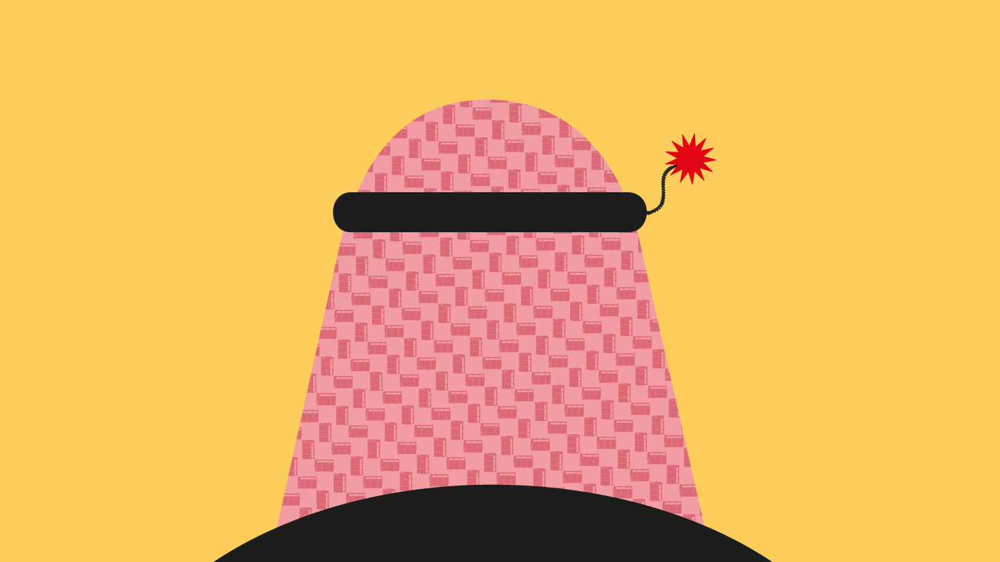
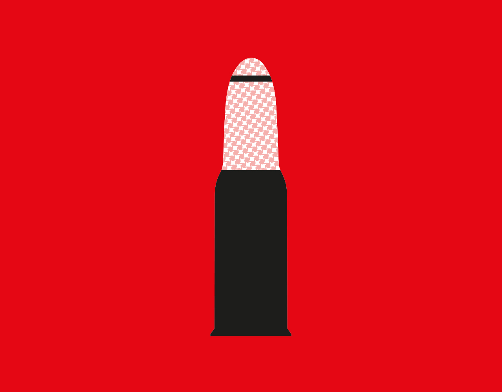
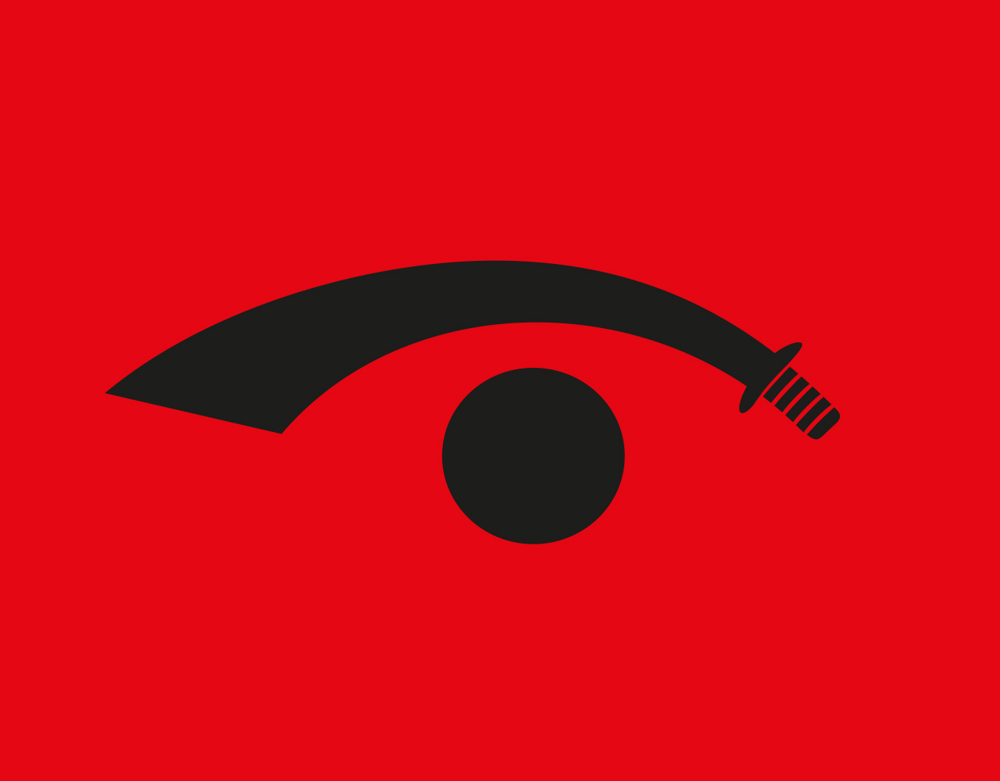
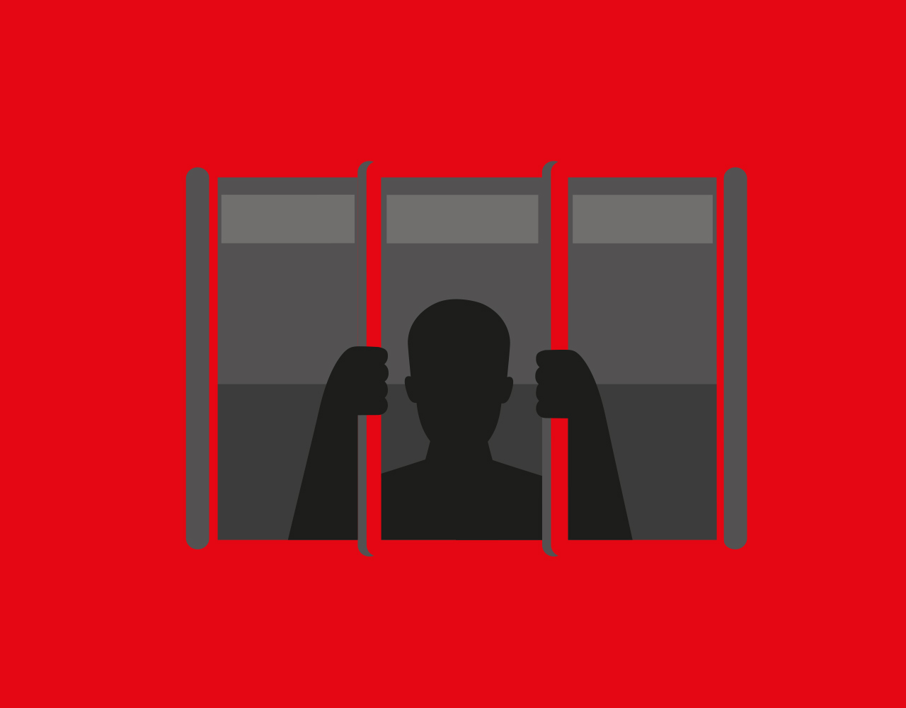

###### Summer reading

# MBS: despot in the desert 

##### A volatile millennial wields absolute power in Saudi Arabia. What will he do next? 

 

> Jul 28th 2022 

No one wanted to play football with Muhammad bin Salman. Sure, the boy was a member of Saudi Arabia’s royal family, but so were 15,000 other people. His classmates preferred the company of his cousins, who were higher up the assumed order of succession, a childhood acquaintance recalls. As for the isolated child who would one day become crown prince, a family friend recounts hearing him called “little Saddam”.

Home life was tricky for bin Salman, too (he is now more commonly known by his initials, mbs). His father, Salman, already had five sons with his first wife, an educated woman from an elite urban family. mbs’s mother, Salman’s third wife, was a tribeswoman. When mbs visited the palace where his father lived with his first wife, his older half-brothers mocked him as the “son of a Bedouin”. Later, his elder brothers and cousins were sent to universities in America and Britain. The Bedouin offspring of Prince Salman stayed in Riyadh to attend King Saud University.

As young adults, the royals sometimes cruised on superyachts together; mbs was reportedly treated like an errand boy, sent onshore to buy cigarettes. A photo from one of these holidays shows a group of 16 royals posing on a yacht-deck in shorts and sunglasses, the hills of the French Riviera behind them. In the middle is mbs’s cousin, Prince Alwaleed bin Talal, a billionaire investor dubbed “the Arabian Warren Buffett”. mbs, tall and broad-shouldered in a white t-shirt, is pushed to the farthest edge.

Fast forward to today, and mbs has moved to the centre of the frame, the most important decision-maker in Saudi Arabia, the world’s biggest oil exporter. Saudi Arabia is an absolute monarchy but mbs’s 86-year-old father, though nominally head of state, is rarely seen in public anymore. It has been clear for several years that mbs is in charge. “In effect,” a former Saudi intelligence agent told me, “King Salman is no longer king.”

At first glance the 36-year-old prince looks like the ruler many young Saudis had been waiting for, closer in age to his people than any previous king – 70% of the Saudi population is under 30. The millennial autocrat is said to be fanatical about the video game “Call of Duty”: he blasts through the inertia and privileges of the mosque and royal court as though he were fighting virtual opponents on screen.

His restless impatience and disdain for convention have helped him push through reforms that many thought wouldn’t happen for generations. The most visible transformation of Saudi Arabia is the presence of women in public where once they were either absent or closely guarded by their husband or father. There are other changes, too. Previously, the kingdom offered few diversions besides praying at the mosque; today you can watch Justin Bieber in concert, sing karaoke or go to a Formula 1 race. A few months ago I even went to a rave in a hotel. Saudis and foreigners danced barefoot on the sand until dawn, a couple kissed, women stripped down to tank tops and fruit juice laced with alcohol was served at an open bar.

But embracing Western consumer culture doesn’t mean embracing Western democratic values: it can as easily support a distinctively modern, surveillance state. On my recent trips to Saudi Arabia, people from all levels of society seemed terrified about being overheard voicing disrespect or criticism, something I’d never seen there before. “I’ve survived four kings,” said a veteran analyst who refused to speculate about why much of Jeddah, the country’s second-largest city, is being bulldozed: “Let me survive a fifth.”

The West, beguiled by promises of change and dependent on Saudi oil, at first seemed prepared to ignore mbs’s excesses. Then, in late 2018, Saudi officials in Istanbul murdered a  columnist, Jamal Khashoggi, and dismembered his body with a bone saw. Even the most pro-Saudi leaders turned away.

Today, thanks to another autocrat, Vladimir , the Saudi prince is back in demand. After Putin invaded Ukraine in February, the price of crude shot up. Boris Johnson was on a plane within weeks. Turkey’s Recep Tayyip Erdogan, previously a sworn enemy of the crown prince, embraced mbs in Riyadh in April. War even forced America’s president into a humiliating climbdown. On the campaign trail in 2020 Joe Biden had vowed to turn Saudi Arabia into a “pariah”. But on July 15th he went to make his peace with mbs – trying to avoid shaking mbs’s hand, he instead opted for a fist bump that left the two looking all the chummier. Even critics at home acknowledged mbs’s victory. “He made Biden look weak,” said a Saudi columnist in Jeddah. “He stood up to a superpower and won before the world.”

For mbs, this is a moment of triumph. His journey from the fringe of a photograph to the heart of power is almost complete. He will probably be king for decades. During that time, his country’s oil will be needed to sate the world’s enduring demand for energy.

A kingdom where the word of one man counts for so much depends utterly on his character. The hope is that, with his position secure, mbs will forswear the vengefulness and intolerance that produced Khashoggi’s murder. But some, among them his childhood classmates, fear something darker. They are reminded of the Iraqi dictator Saddam Hussein, a one-time moderniser who became so addicted to accumulating power that he turned reckless and dangerous. “At first power bestows grandeur,” a former Western intelligence officer told me, of mbs. “But then comes the loneliness, suspicion and fear that others will try to grab what you grabbed.”

 


During the early years of mbs’s ascent, I was vaguely aware of him as one prince among many. I probably wouldn’t have paid him much attention if an old contact of mine hadn’t joined his staff. His new boss, my contact said, was serious about shaking things up. He arranged the meeting at a faux-ancient mud-brick village on the outskirts of Riyadh in 2016. As my  colleagues and I approached, the gates of mbs’s compound suddenly slid open, like a Bond-villain’s lair. In the inner chamber sat mbs.

Reform has often been promised in Saudi Arabia – usually in response to American hectoring – but successive kings lacked the mettle to push change through. When the Al Sauds conquered Arabia in the 1920s, they made an alliance with an ultra-conservative religious group called the Wahhabis. In 1979, after a group of religious extremists staged a brief armed takeover of the Grand Mosque in Mecca, the Al Sauds decided to make the kingdom more devout to fend off a possible Islamic revolution, as had just happened in . Wahhabi clerics were empowered to run society as they saw fit.

The Wahhabis exercised control through the Committee for the Promotion of Virtue and Prevention of Vice, otherwise known as the religious police. They whacked the ankles of women whose hair poked through their veil and lashed the legs of men who wore shorts. The arrangement suited the House of Saud. Wahhabism provided social control and gave legitimacy to the Saudi state, leaving the royals free to enjoy their oil wealth in the more permissive environments of London and Paris, or behind the gates of their palaces.


I’m loth to admit it now, but as the prince talked in Riyadh about his plans to modernise society and the economy, I was impressed by his enthusiasm, vision and command of the details. He gave what turned out to be accurate answers about how and when his reforms would happen. Though he was not yet crown prince, he frequently referred to Saudi Arabia as “my” country. We arrived at around 9pm. At 2am, mbs was still in full flow.

mbs was affable, self-assured, smiling. His advisers were more subdued. If they spoke at all, it was to robotically repeat their master’s lines. Yet when mbs left the room to take a call, they started chatting animatedly. As the prince re-entered, silence fell.

Like many in those early years, I was excited about what mbs might do for the kingdom. When I returned to the capital a few months later I saw a number of men wearing shorts. I kept looking over my shoulder for the religious police, but none came – they had been stripped of their powers of arrest.

As crown prince, mbs has introduced a code of law so that judicial sentencing accords with state guidelines, not a judge’s own interpretation of the Koran. He criminalised stoning to death and forced marriage. The most overt change involved the role of women. mbs attacked guardianship laws that prevented women from working, travelling, owning a passport, opening a business, having hospital treatment or divorcing without approval from a male relative. In practice, many Saudi women have found these new rights hard to claim in a patriarchal society, and men can still file claims of disobedience against female relatives. But mbs’s reforms were more than cosmetic. Some clerics were jailed; the rest soon fell into line.

mbs seemed to relish breaking religious taboos. His new state tv channel broached the subject of homosexuality. In September 2017 he lifted a ban on Tinder, a dating app. The following year one of Mecca’s imams was dragooned into dealing the first deck at a new card-game competition, a pastime hitherto denounced as a sinful distraction. He brought many new sports to the kingdom: boxing, wrestling, monster-jam motorsports for turbo-charged 4x4s and even a Pamplona-style running of the bulls. “He’s a fucking rock-star,” said an American spectator who’d watched him receive a standing ovation at the Formula 1 race in Jeddah late last year.

For foreigners, Riyadh is less forbidding these days. “I’m afraid I’ll be caught for not drinking,” a teetotal businessman told me. “There’s cocaine, alcohol and hookers like I haven’t seen in southern California,” says another party-goer. “It’s really heavy duty stuff.” A former senior Saudi official says sex workers, many from eastern Europe, can earn $3,000 for attending a party and $10,000 for staying the night.

When mbs first entered public life he had a reputation for being as strait-laced as his father, rare among royals. That quickly changed. Many of the people interviewed for this article said that they believe mbs frequently uses drugs, which he denies. A court insider says that in 2015 his friends decided that he needed some r&amp;r on an island in the Maldives. According to investigative journalists Bradley Hope and Justin Scheck in their book “Blood and Oil”, 150 models were recruited to join the gathering and were then shuttled “by golf cart to a medical centre to be tested for sexually transmitted diseases”. Several international music stars were flown in, including Afrojack, a Dutch dj. Then the press blew mbs’s cover.

Thereafter, the prince preferred to unwind off the Red Sea coast. At weekends his entourage formed a flotilla by mooring their yachts around his, , which has a driving range and a cinema. According to a former official, “dj mbs”, as his friends called him, would spin the discs wearing his trademark cowboy hat. The yacht is only one of the luxuries mbs has splurged on. He also bought a £230m ersatz French chateau near Versailles, built in 2008 (the meditation room doubles as an aquarium). He is said to have boasted that he wanted to be the first trillionaire.

We put these and other allegations in this article to mbs’s representatives. Through the Saudi embassy in London, they issued a broad denial, saying “the allegations are denied and are without foundation.”

mbs’s loosening of social mores reflects the values of many of his youthful peers, in Saudi and beyond – as does his taste for the flashier side of life. Yet despite the social revolution, the prince is no keener than Wahhabi clerics on letting people think for themselves. Shortly before lifting a ban on women driving in 2018, mbs’s officials imprisoned Loujain al-Hathloul, one of the leaders of the campaign for women’s rights. Her family say jailers waterboarded and electrocuted her, and that Saud al-Qahtani, one of mbs’s closest advisers, was present during her torment and threatened to rape her. (A un investigation found reasonable grounds to believe that Qahtani was involved in the torture of female activists. Qahtani allegedly told one of these women: “I’ll do whatever I like to you, and then I’ll dissolve you and flush you down the toilet.”) Hathloul was charged with inciting change to the ruling system. The message was clear: only one person was allowed to do that.

Mbs is ruthlessly ambitious – he reportedly loved reading about Alexander the Great as a teenager – but he also owes his rise to some extraordinary twists of fortune. Succession can be an unpredictable affair in Saudi Arabia. The monarchy is only two generations old, founded in 1932, and the crown has so far moved from brother to brother among the founding ruler’s sons. That has become harder as the prospective heirs age. mbs’s father wasn’t tipped to be king, but after his two older brothers died unexpectedly in 2011 and 2012, he was catapulted up the line of succession.


When Salman became the heir-designate aged 76, he needed a chief of staff. Most courtiers expected him to choose one of the suave, English-speaking children of his first wife. Instead he appointed a son who spoke Arabic with a guttural Bedouin accent. (mbs has learned English fast since then: when we met in 2016 he sometimes corrected his translator.)

The choice to elevate mbs was less surprising to those who knew his father well. Salman had dedicated himself to his job as governor of Riyadh rather than chasing more lucrative commissions, and was a stickler for 8am starts, even in his 70s. He was known as the family disciplinarian, not averse to giving wayward royals a thwack with his walking stick or even a spell in his private prison. He clearly saw something of himself in his sixth son. mbs might love video games, but he was also a hard worker and keen to advance.

mbs put few limits on what he was prepared to do to achieve control. He earned the nickname Abu Rasasa – father of the bullet – after widespread rumours that he sent a bullet in the post to an official who ruled against him in a land dispute (Saudi officials have previously denied this rumour). He was fearsome in private, too. “There are these terrible tempers, smashing up offices, trashing the palace,” says a source with palace connections. “He’s extremely violent.” Several associates describe him as having wild mood swings. Two former palace insiders say that, during an argument with his mother, he once sprayed her ceiling with bullets. According to multiple sources and news reports, he has locked his mother away.


It’s hard to say how many wives he has; officially, there’s just one, a glamorous princess called Sara bint Mashour, but courtiers say he has at least one more. mbs presents his family life as normal and happy: earlier this year he told the  magazine that he eats breakfast with his children each morning (he has three boys and two girls, according to  – the eldest is said to be 11). One diplomat spoke of mbs’s kindness to his wife. But other sources inside the royal circle say that, on at least one occasion, Princess Sara was so badly beaten by her husband that she had to seek medical treatment.

We put this and other allegations in this piece to mbs’s representatives, who described them as “plain fabrication”, adding that “the kingdom is unfortunately used to false allegations made against its leadership, usually based on politically (or other) motivated malicious sources, particularly discredited individuals who have a long record of fabrications and baseless claims.”

mbs finally got a taste of political power in 2015 when Salman became king. Salman appointed his son deputy crown prince and minister of defence. One of mbs’s first moves was to launch a war in neighbouring Yemen. Even America, the kingdom’s closest military ally, was told only at the last minute.

There was an obvious obstacle in mbs’s path to the throne: his cousin, the 57-year-old heir-designate, Muhammad bin Nayef. Bin Nayef was the intelligence chief and the kingdom’s main interlocutor with the cia. He was widely credited with stamping out al-Qaeda in Saudi after 9/11. In June 2017 bin Nayef was summoned to meet the elderly king at his palace in Mecca.

The story of what happened next has emerged from press reports and my interviews. It seems that bin Nayef arrived by helicopter and took the lift to the fourth floor. Instead of the monarch, mbs’s agents were waiting. Bin Nayef was stripped of his weapons and phone, and told that a royal council had dismissed him. He was left alone to consider his options. Seven hours later, a court videographer filmed the charade of mbs kissing his cousin, then accepting his abdication as crown prince. King Salman kept a back seat throughout. Bin Nayef is now in detention (his uncle, who also had a claim to the throne, apparently intervened to try and protect bin Nayef, but was himself later detained). The staged resignation – an old trick of’s – would become mbs’s signature move.

That was just the warm-up act. In October 2017 mbs hosted an international investment conference at the Ritz-Carlton in Riyadh. At “Davos in the desert”, the likes of Christine Lagarde, Son Masayoshi and other business glitterati listened to mbs’s pitch for Saudi Arabia’s post-oil future, including the construction of Neom, a new $500bn “smart city”. The event was a hit. Diplomatic grumblings about the war in Yemen or the fate of America’s security partner, Muhammad bin Nayef, faded.

The gathering was also an opportunity to invite back royals who were often abroad. Once the foreigners had left, mbs pounced. Hundreds of princes and businessmen were swept up. According to a biography of mbs by Ben Hubbard, a  journalist, one of them realised something was amiss only when they got to their hotel room: there were no pens, razors or glasses – nothing that could be used as a weapon.

mbs held the detainees in the Ritz-Carlton for several weeks (the Marriott and other hotels were also commandeered to house the overflow). Prisoners’ phones were confiscated. Some were said to have been hooded, deprived of sleep and beaten until they agreed to transfer money and hand over an inventory of their assets. All told, mbs’s guests at the Ritz-Carlton coughed up about $100bn.

Even royals previously thought untouchable, such as the powerful prince who ran the national guard, got similar treatment. Princess Basma, the youngest child of the second king of Saudi Arabia, was jailed for three years without charge or access to a lawyer; after being released she still had to wear an electronic ankle bracelet, according to a close associate of hers.

The crushing of the royals and business elite was billed as a crackdown on corruption – and undoubtedly it netted many corruptly acquired assets, which mbs said would be returned to the Saudi treasury. The methods, however, looked more like something from a gangster film than a judicial procedure.

 


Interrogations were overseen by Saud al-Qahtani, who reported directly to mbs whenever a detainee broke and gave out their bank details. (All the allegations in this piece concerning Qahtani were put to him via his lawyer. No response was given.) Qahtani had installed himself as one of mbs’s favoured henchmen, though earlier in his career, he’d plotted against Salman and his son, trying to sideline them with rumours that Salman had dementia. Qahtani was so loyal to the former faction that he’d named his son after his then boss. According to a former courtier, on the day of the old king’s funeral the two men had it out: mbs slapped Qahtani in the face. Later, mbs let Qahtani prove his worth and brought him on to his staff. Qahtani duly named his younger son Muhammad.

On paper, Qahtani was a communications adviser, a former journalist who understood Twitter and used an army of bots and loyal followers to intimidate critics on social media (his office included giant screens and holograms that staff used for target-practice with laser guns). In practice he was entrusted with mbs’s most important and violent missions – the ones that established his grip on power.

His remit extended far beyond Saudi’s borders. In 2016 he kidnapped Prince Sultan, a minor royal who had been bad-mouthing mbs. mbs offered his jet to fly Sultan from Paris to Cairo – instead, the plane was diverted to Saudi Arabia. According to Hope’s and Scheck’s book, Qahtani posed as Captain Saud, an airline pilot, though surprisingly one who had an expensive Hublot watch.


With rendition strategies like this, and the cash tap shut off, even royals who weren’t inside the Ritz-Carlton felt the pressure to divest themselves of ostentatious assets. The father of the Saudi ambassador to Britain put Glympton Park, his beloved 2,000-acre estate in the Cotswolds, up for sale. Riyadh’s jewellers did a roaring trade pawning the diamonds of lesser royals. “It’s like the Romanovs selling their Fabergé eggs,” said an adviser to an auction house.

Many commoners rejoiced at the downfall of their entitled elite. Princes and  who once lived off huge handouts began looking for jobs. Their titles became irrelevant. Unable to afford the cost of irrigation, their green ranches became desert again. Banks turned them away. One financial adviser recalled his response to princes trying to get credit on the strength of their royal status: “You call yourselves princes, but they say there’s only one prince now.”

The Ritz-Carlton episode was just one element of an extraordinary project of centralisation. mbs yanked control of various security services back from the princes. He took charge of Aramco, the semi-autonomous state oil company. He installed himself as boss of the sovereign-wealth fund, the Public Investment Fund. “He destroyed all the powerful families,” says a retired diplomat. By late 2017, law, money and security in Saudi all flowed directly from him.

Among those who lost out were the fellow princes who had pushed a young mbs to the edge of the family photo on the yacht all those years ago. Prince Alwaleed bin Talal, in the centre of that shot, surrendered part of his $17bn wealth. As the shakedown widened, mbs’s elder half-siblings put up their yacht for sale. Many of his cousins were locked up. “Payback time,” one victim said.

While mbs was squeezing the elite at home, he was forging some important friendships abroad. mbs and Donald Trump, who was elected president in 2016, had a lot in common. Both had the hunger of the underdog and loathed the snooty policymaking establishments in their countries; they revelled in provocation. The historic compact, by which Saudi Arabia provided oil to American consumers and America guaranteed the country’s security, had frayed in recent years. Barack Obama’s hurried exit from Iraq in 2011 and his nuclear deal with Iran in 2015 had left Saudi Arabia worried that it could no longer rely on American protection. America’s development of its own shale-oil reserves had also reduced its dependence on Saudi oil. Then Trump and mbs got cosy.

With the Trump administration’s tacit (and sometimes explicit) support, mbs set about treating the entire Middle East much as he did Saudi Arabia, trying to push aside rulers whom he found to be inconvenient. He announced a blockade of Qatar, a tiny gas-rich state to the east of Saudi Arabia. In 2017, angered by Lebanon’s dealings with Iran, mbs invited the prime minister, Saad Hariri, a long-time beneficiary of Saudi patronage, on a starlit camping trip. Hariri turned up, had his phone confiscated and soon found himself reading out a resignation speech on tv.

Both moves ultimately backfired. But Trump’s Middle East adviser, his son-in-law Jared Kushner, did little to discourage such antics. Together, he and mbs dreamt up a new regional order over WhatsApp, calling each other “Jared” and “Muhammad”. Their rapport was so great that, at Kushner’s prompting, mbs started the process of recognising Israel. His father, still officially king, put a stop to that.

mbs visited America in March 2018, hanging out in Silicon Valley with Peter Thiel and Tim Cook, and meeting celebrities, including Rupert Murdoch, James Cameron and Dwayne “the Rock” Johnson. Many people were keen to meet the man who controlled a $230bn sovereign-wealth fund. To his frustration, they were less willing to reciprocate by investing in the kingdom.

That October the intercontinental bonhomie came to an abrupt halt. I was due to go to a conference in Turkey that month. A Saudi journalist I knew, Jamal Khashoggi, got in touch to suggest meeting up: he was also going to be in Istanbul, for an appointment at the consulate. Khashoggi was a court insider whose criticisms of mbs in the  and elsewhere had attracted much attention. He seemed to be making more effort than usual to stay in touch. While I was at the conference a friend of his phoned me: Jamal still hadn’t emerged from the consulate, he said. By the time I got there, Turkish police were cordoning off the building.

The full story soon came out in leaked intelligence reports and, later, a un inquiry. A Saudi hit squad, which reportedly co-ordinated with Saud al-Qahtani, had flown to Istanbul. As they waited for Khashoggi to enter the consulate, they discussed plans for dismembering his body. According to tapes recorded inside the consulate by Turkish intelligence, Khashoggi was told, “We’re coming to get you.” There was a struggle, followed by the sound of plastic sheets being wrapped. A cia report said that mbs approved the operation.

mbs has said he takes responsibility for the murder, but denies ordering it. He sacked Qahtani and another official implicated in the intelligence reports. The fallout was immediate. Companies and speakers pulled out of that year’s Davos in the desert; the Gates Foundation ended its partnership with , an artistic and educational charity set up by the prince. Ari Emanuel, a Hollywood agent, cancelled a $400m deal with the kingdom. 

 


The crown prince seems to have been genuinely surprised at the animus – “disappointed”, says an associate. Hadn’t he committed to all the reforms the West had been asking for? Perhaps he had underestimated the outcry provoked by going after a well-connected international figure, as opposed to a royal unknown outside Saudi Arabia. Or perhaps he understood Western governments’ priorities better than they did themselves. They had done little when Muhammad bin Nayef, their partner in battling terrorism, had disappeared; they had shrugged at reports of torture in the Ritz-Carlton, and at mbs’s reckless bombardment of Yemen. Why did they have so much to say about the killing of a single journalist?

Three years after the Khashoggi killing, Davos in the desert opened with the singer Gloria Gaynor. As images of smiling children flashed up on a giant screen behind her, she broke into her disco anthem, “I Will Survive”, asking the audience: “Did you think I’d crumble? Did you think I’d lay down and die?”

The chief executives of private-equity giants BlackRock and Blackstone were back, as were the heads of Goldman Sachs, SocGen and Standard Chartered. Even Amazon sent a representative despite the fact that its boss, Jeff Bezos, owns the , the paper that employed Khashoggi. Meanwhile, Qahtani was creeping back into favour at the royal court – although he had been implicated by the un for Khashoggi’s murder, a Saudi court took the decision not to charge him.


mbs revitalised the near-dormant sovereign-wealth fund, pumping tens of billions of dollars into tech, entertainment and sports, to create a softer, more appealing image of Saudi and co-opt new partners. In April 2020, the fund led a consortium to buy Newcastle United, a premier-league football team (the deal took 18 months). The following year it launched an audacious bid to create Saudi’s own golf tour, the LIV series, hoping to lure players with a prize pot of $255m, far larger than that of American tournaments. At the first LIV tour this year, some top players boycotted the event, others went for the cash.

Joe Biden has proved tougher to woo. Soon after becoming president, Biden withdrew American military support for the war in Yemen. He wouldn’t talk to mbs, insisting that communications go through King Salman instead. He didn’t even nominate an ambassador to Riyadh for 15 months. The chat everywhere was that Saudi-American relations were in a deep freeze. Then, in February 2022, mbs had a stroke of luck: Russia invaded .

In the days after war broke out, Biden himself tried to call mbs. The crown prince declined to speak to the president. He did take Putin’s call, however. The two men were already close. mbs had personally brought Russia into an expanded version of the opec cartel in order for Saudi Arabia to keep control of global oil production. Putin cemented the friendship in 2018 at the g20 summit in Buenos Aires, which took place weeks after the Khashoggi killing. While Western leaders shunned mbs, Putin gave the Saudi ruler a high-five before sitting down next to him.

mbs’s defiance of America seems to have paid off. After months of evasion, Biden reluctantly agreed to meet mbs in Jeddah in July, on the prince’s own turf and his own terms. The visit gave mbs recognition but did little to rebuild relations. There wasn’t even a concrete assurance of increasing oil production.

Some in the American foreign-policy establishment remain hopeful that mbs could become a helpful partner in the region, pointing to his recent retreat from confrontation with Qatar and his eagerness to find a diplomatic exit from Yemen. Perhaps, they say, he is maturing as a leader.

This seems optimistic. mbs’s disastrous campaign in Yemen was ostensibly in support of the country’s president but in April, hours after being summoned to a meeting and offered Arabic coffee and dates, Yemen’s president was reading out a resignation speech on tv. mbs took it upon himself to get rid of him personally – suggesting that his mode of international diplomacy remains as high-handed as ever. “What they’ve learned”, says one foreign analyst, “is don’t murder journalists who dine regularly with congressmen in the United States.”

The West has taught mbs something else, too – something that autocrats the world over may draw comfort from. No matter the sin, they would argue, if you sit tight through the odium and fury, eventually the financiers, the celebrities, even the Western leaders, will come running back. At 36, mbs has time on his side. Some observers fear that he may become only more dangerous as oil reserves start to decline and the treasure trove shrinks. “What happens when he’s a middle-aged man ruling a middle-income country and starts to get bored?” asks a diplomat who knows mbs personally. “Will he go on more adventures?”

Earlier this year, I visited an old friend in his office in Saudi Arabia. Before we started talking, he put his phone in a pouch that blocks the signal, to prevent government spies from listening in. Dissidents do that kind of thing in police states like China, but I’d never seen it before in Saudi Arabia. It isn’t just people involved with politics who are taking such precautions: most Saudis have become afraid to speak near a functioning mobile phone. People used to talk fairly openly in their offices, homes and cafés. Now, they are picked up for almost nothing.

As we chatted over the whir of his office air conditioning, my friend reeled off a list of people he knew who had been detained in the past month: a retired air-force chief who died in prison, a hospital administrator hauled away from his desk, a mother taken in front of her seven children, a lawyer who died seven days after his release from prison. “These people aren’t rabble rousers,” my friend said. “No one understands why.”

Officially, the government says it has no political prisoners. Rights groups reckon that thousands have been swept up in mbs’s dragnet. I’ve covered the Middle East since the 1990s and can’t think of anywhere where so many of my own contacts are behind bars.

Few ordinary Saudis predicted that when mbs was done trampling on the elites and the clerics, he would come for them next. Bringing Saudis into the modern, networked, online world has made it easier for the state to monitor what they are saying. A Red Crescent employee called Abdulrahman al-Sadhan used to run a satirical Twitter account under a pseudonym. In 2018 mbs’s agents arrested him and held him incommunicado for two years. American prosecutors later charged two former Twitter employees with allegedly handing over the real names behind various accounts to a Saudi official – al-Sadhan’s family believes that his name was among them. (The trial of one employee is ongoing; he denies passing on information to Saudi officials.)

 


On the face of it, mbs has nothing to worry about. Public opinion polls – if they can be trusted – suggest he is popular, particularly with younger Saudis. But there is a growing sense that discontent is brewing beneath the surface. mbs has broken crucial social contracts with the Saudi populace, by reducing handouts while, at the same time, dispensing with the tradition of hearing the feedback of ordinary people after Friday prayers.

It isn’t hard to imagine some of the issues they’d raise if they had the chance. Many people are struggling as the cost of living rises. When other governments were cushioning their citizens during the pandemic, mbs slashed fuel subsidies and tripled vat. Unable to afford the cost of pumping water, some farmers left crops to wither in the field. Fees for permits and fines have spiralled, too. Though mbs speaks eloquently about the country’s youth, he is struggling to find them jobs. Unemployment remains stubbornly stuck in double digits. Half of the jobless have a university degree, but most white-collar workers I met on mbs’s mega-projects were foreign.

Saudi Arabia’s attempts to diversify its economy – and so compensate for the long-term decline of oil reserves – isn’t going well either. The pandemic delayed plans for a rapid increase in international tourism. Extorting billions of dollars from your relatives may not be the best way to convince investors that the kingdom is a liberal haven.


The young prince has reversed even the baby steps towards democracy taken by previous kings. Municipal elections have been suspended – as a cost-cutting exercise, explains the supine press. The Shura Council, a consultative body of 150 people, has only met online since the pandemic (other institutions have gathered in person for months). “I wish I had more of a voice,” said one member. Whenever I mentioned the prince, his leg twitched.

A frequent visitor to the royal court says mbs now gives the impression of someone who’s always thinking that people are plotting against him. He seems to be preoccupied with loyalty. He fills key posts either with young royals, foreigners with no local base to threaten him or people he has already broken. A government minister, Ibrahim Assaf, was one of those locked up in the Ritz-Carlton – two months later mbs sent him to the World Economic Forum as his representative. A senior executive on one of his construction projects is someone who says he was tortured in one of his prisons. “He went from being strung naked from his ankles, beaten and stripped of all his assets to a high-level project manager,” says a close acquaintance of the man.

All remain vulnerable to mbs’s tantrums. Saudi sources say he once locked a minister in a toilet for ten hours. (The minister later appeared on tv blabbering platitudes about the prince’s wisdom.) A senior official I’ve spoken to says he wants out. “Everyone in his circle is terrified of him,” says an insider. And that could make it hard for him to govern a country of 35m people effectively. Former courtiers say no one close to mbs is prepared to offer a truthful assessment of whether his increasingly grandiose schemes are viable. “Saying no”, says one, “is not something they will ever do.”

If mbs has a mission beyond extending his power, you might expect to find it in Neom, the city he promised to build in the desert. Neom would be nothing less than “a civilisational leap for humanity”, he said in 2017. Head-spinning details followed. The city’s food would be grown on hydroponic walls on a floating structure. It would be powered by the world’s largest green-hydrogen plant. Thousands of snow-blowers would create a ski resort on a nearby mountain. One day it would have driverless cars and passenger drones.

According to the official timetable, the main city would be completed by 2020. Further districts would be added by 2025. The prince’s tourism minister, Ahmed al-Khateeb, dismissed rumours that the timetable was proving over-ambitious. “Come see with your eyes and not with your ears,” he urged. So I went.

Finding Neom was the first problem. There were no road signs to it. After three hours’ drive we came to the spot indicated by the map. It was bare, but for the odd fig tree. Camels strolled across the empty highway. Piles of rubble lined the road, remnants of the town bulldozed to make way for the mighty metropolis.

The designated area is nearly the size of Belgium. As far as I could tell, only two projects had been completed, mbs’s palace, and something Google Earth calls “The Neom Experience Centre” (when I drove to see it, it was obscured by a prefabricated hut). The only other solid building I could see was a hotel constructed before Neom was conceived: the Royal Tulip. A poster in the lobby urged me to “Discover Neom”. But when I asked for a guide the hotel manager cursed my sister with Arabic vulgarities and tried to shoo me away. There was no sign of the media hub with “frictionless facilitation”, “advanced infrastructure” and “collaborative ecosystems” promised by the Neom website. Neom’s head of communications and media, Wayne Borg, said he was “out of Kingdom at present”.

The hotel restaurant was teeming with consultants – all the ones I met were foreign. (I later found a Saudi project manager. “We think we’re about to start working, but every two months the consultants coin a new plan,” he told me. “They’re still doing plans of plans.”) There was a kind of manic short-termism among these foreigners. Many were paid $40,000 a month, plus handsome bonuses. “It’s like riding a bull,” one of the Neom consultants told me. “You know you’re gonna fall, that no one can last on a bull longer than a minute and a half, two minutes, so you make the most of it.”

Despite the high salaries, there are reports that foreigners are leaving the Neom project because they find the gap between expectations and reality so stressful. The head of Neom is said by his friends to be “terrified” at the lack of progress.

Eventually, I found a retired Saudi air-force technician who offered to drive me around the city for $600. He took me to a sculpture standing in the desert with the words, “I ❤ Neom”. A short way farther on we found a new stretch of tarmac, said to mark the edge of the dream city. Beyond it, the lone and level sands stretched far away. ■

 is ’s Middle East correspondent

You can read the rest of s summer reads and weekly coverage 

ILLUSTRATIONS: 


