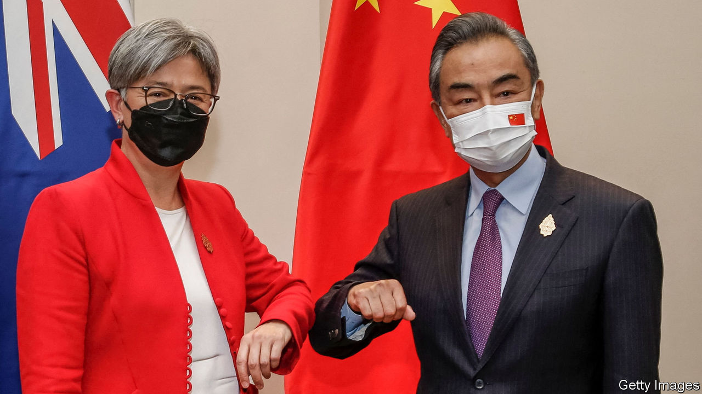

###### Talking nice

# Australia and China are on speaking terms again 

##### Both countries sound friendlier, but Australia is not changing its security policies 

 

> Jul 26th 2022 

The break-up was slow and acrimonious. Australia first rankled China, its biggest trading partner, by passing laws to prevent meddling in its democracy, and by banning Huawei, a Chinese telecoms giant, from its 5g network in 2018. Then, in early 2020, as a mysterious coronavirus outbreak in the Chinese city of Wuhan grew into a pandemic, the Australian government called for an inquiry into the origins of the disease. That was the last straw. China huffed that Australia was “poisoning bilateral relations”,  and stopped answering politicians’ calls. 

In a  election in May, Australians kicked out the conservatives who had been in office for nearly a decade and voted in a new centre-left Labor government. Ever since, the ice has begun to thaw. Two senior Chinese ministers recently met their Australian counterparts, the first such high-level talks in more than two years. A new Chinese ambassador to Australia, Xiao Qian, says he wants to break down suspicion between the two sides. He insists that “there is every reason for China and Australia to be friends and partners, rather than adversaries or enemies”.

Australia’s new government, led by Anthony Albanese, certainly wants a less confrontational relationship. Whereas the country’s previous  about China’s human-rights abuses and the risks of war in Taiwan, Labor points diplomatically to “full and frank” discussions held in private. The defence minister, Richard Marles, “raised a number of issues of concern” with his Chinese counterpart, Wei Fenghe, in June. The foreign minister, Penny Wong, “spoke frankly and listened carefully” to her opposite, Wang Yi, at a meeting in Indonesia on July 8th. “This is the first step towards stabilising the relationship,” Ms Wong argued. 

There will be no returning to the old days, though. For years Australian politicians insisted that their country could strike an easy balance between deriving its security from its alliance with America and depending heavily on China for trade. Today security is given more weight. The new government is as concerned as the last about Australia’s national interests, security and sovereignty.

China’s actions, more than words, determine how Australians feel about it. They have worried for years about Chinese cyberattacks and attempts to bankroll political candidates. Now they are increasingly concerned about China’s military aggression and its growing interest in their region. ​​Over 60% of Australians say that China is “more of a security threat to Australia” than an economic partner, according to polling by the Lowy Institute, a think-tank in Sydney. That is a spectacular reversal—in 2018 the figure was only 12%. 

The new government’s response has been to “engage with as wide a group of partners as possible,” says Justin Bassi of the Australian Strategic Policy Institute, a hawkish think-tank in Canberra, the capital. Mr Albanese was sworn in early so that he could attend a meeting of the Quad, a security grouping of America, Australia, India and Japan that seeks to counter Chinese influence. Ms Wong has criss-crossed the Pacific trying to offset China’s growing sway among island states. Speaking to an American broadcaster, Mr Marles declared that he would build “a more effective military power aimed at avoiding a catastrophic failure of deterrence”.

If anything, the bullying has strengthened Australia’s resolve. Its economy has weathered China’s trade restrictions surprisingly well. Most Aussies blame China, not their own politicians, for any economic fallout. That gives Australia’s leaders more confidence to stand up for its interests. This month the Chinese government claimed that the relationship might “set sail again” if only Australia would “correct” its opinion of China in some fundamental ways, including treating China as a partner rather than an adversary, reversing negative public opinion and resisting “control by third parties” (meaning America). Australians scoffed. Their country, said Mr Albanese, “does not respond to demands”. ■

