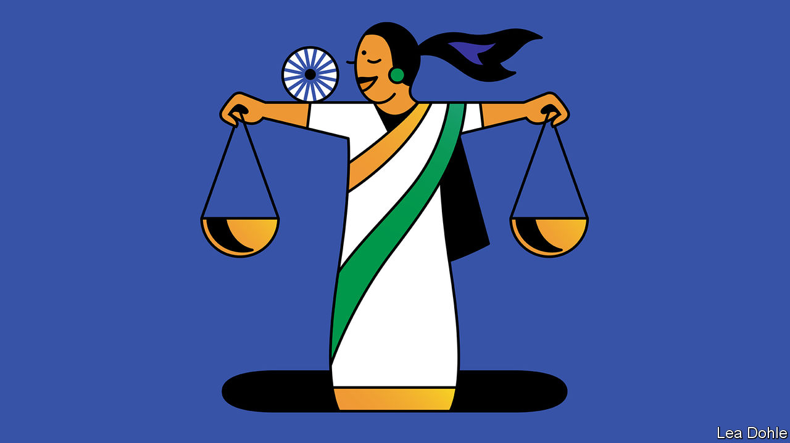

###### Banyan

# India’s Hindu-nationalist ruling party preaches social inclusion 

##### In electing Droupadi Murmu as president, the Bharatiya Janata Party shows its awesome political nous 

 

> Jul 28th 2022 

Savour, for a moment, the swearing-in this week of Droupadi Murmu as the 15th president of India. The office is largely ceremonial—like the monarchs of the United Kingdom that India’s founding fathers intended it to replace. But it is loaded with prestige and can be powerful. The president is not only head of state but titular commander-in-chief of the armed forces. She is the defender of India’s admirable constitution. And she devolves executive powers to the prime minister, whom she appoints. She also has it in her gift to dissolve the government, should it lose its majority.

Above all, the president can symbolise the kind of country India aspires to be. And here Ms Murmu’s election by the members of the national and state legislatures speaks volumes. She is only the second woman to be president and, strikingly, the first indigenous Indian. The country’s 120m-odd , members of tribal groups who live mostly in hilly or forested parts of the country, have long sat at the very bottom of Indian society’s hierarchical heap, more marginalised even than the 232m Dalits, formerly known as “untouchables”, of the Hindu caste system. Ms Murmu’s personal journey is inspiring. The first in her village to go to college, she rose to be governor of Jharkhand state. In her first speech as president, she promised to fight for the downtrodden.

Also savour, if that is the word, the political imagination of the ruling Bharatiya Janata Party (bjp) under Narendra Modi in using its dominance to nominate and elect Ms Murmu to her five-year term. During Mr Modi’s eight years as prime minister, the bjp has been a ruthless electoral juggernaut. It has promoted a Hindu-majoritarian view of India’s past and future, and has harnessed the support of a powerful paramilitary movement that drew its early inspiration from Europe’s pre-war fascist ones. Like them, it thrives on an us-versus-them sense of identity, with the country’s 200m Muslims as the chief bogeymen. 

Among bjp politicians, anti-Muslim  is rife. Yet as India celebrates the 75th anniversary of its independence on August 15th, and when, in 2024, Ms Murmu anoints Mr Modi for a third term as prime minister, as he fully expects, the bjp can point to a powerful narrative of social inclusion. As Rahul Verma of the Centre for Policy Research in Delhi points out, bringing hitherto excluded groups into the power structure will not only help the bjp at home but also, it hopes, recast perceptions of India abroad. There is talk among Modi adepts of an emerging second republic, its past scrubbed of foreign influence (including Islam) and its present defined by a .

The fact that the bjp has stolen the natural ground of social justice from under the Congress party, which now heads an , shows how far the grand old party has fallen. It would, argues Pratap Bhanu Mehta, a commentator, have done better to endorse Ms Murmu than to promote its own hackneyed candidate.

Opposition pettiness has been on most visible display, however, with the election of the vice-president, due on August 6th. Here the bjp’s calculations are more nakedly political. Among other things, the vice-president presides over Parliament’s upper house, where the bjp lacks a majority. It has chosen as its nominee a party henchman, Jagdeep Dhankhar, formerly a combative governor of West Bengal. One prominent opposition figure, Mamata Banerjee, chief minister of that state, knows him well as a past opponent. She might, therefore, have had every reason to try to thwart his election. Yet, throwing a tantrum, she refused to let her party back the (admittedly uninspiring) opposition candidate, complaining that she had not been consulted. Sometimes, the bjp hounds its political opposition. At other times, the opposition does its work for it.

As for Ms Murmu, with a dominant ruling party, a weak opposition and a craven press, her role as the guardian of India’s constitution and governing institutions only grows in importance. More so, given the judiciary’s often outrageous willingness to back the government’s vendettas against its opponents. In the republic’s early years, presidents were not afraid on occasion to push back against government excesses. Whether Ms Murmu will do the same is another matter. Many in the bjp intend to use the 75th anniversary celebrations to mark the coming of their second republic. And the bjp will certainly expect the new president to play her allotted part in it.


