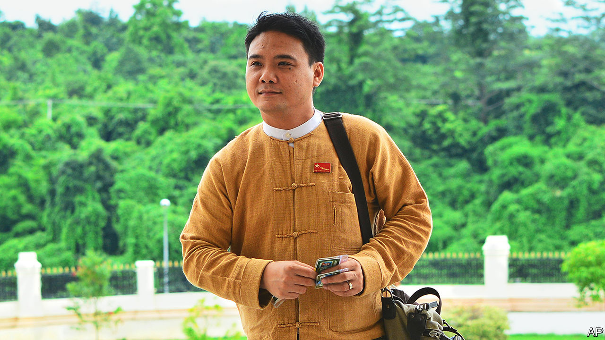

###### Desperate measures

# Myanmar’s brutal junta has brought back the death penalty 

##### By executing four activists, it hopes to intimidate the public 

 

> Jul 28th 2022 

Monday july 25th was a slow news day, judging by the front page of the  , a newspaper controlled by that country’s military regime. The vaccination drive against covid-19 “continues in various states”, went one headline; “Sagaing Region accounts for 60% of Myanmar’s honey production”, boasted another. If the  were not such a consistently boring paper, one might surmise that the front page had been designed to deter readers from turning to page two, where the eagle-eyed might have noticed a brief article recording the execution of four men over the weekend. 

The brevity of the story was inversely proportional to its significance. Though the army, or Tatmadaw, as it is known, has killed more than 2,000 Burmese extrajudicially since seizing power  in February last year, these official executions are the first in decades. A country which had thought itself inured to the army’s savagery is reeling once more. 

Two of the victims were well-known democracy activists who had long crusaded against the Tatmadaw, which has ruled Myanmar for most of the past 60 years, barring a decade-long experiment with hybrid democracy that ended with last year’s putsch. Phyo Zeya Thaw (pictured) was a rapper and former mp in the government of Aung San Suu Kyi, the country’s de facto leader until she was ousted in the coup. , better known as Ko (Brother) Jimmy, rose to fame as a student leader of a mass uprising against army rule in 1988. In the last era of military rule, both spent years languishing in prison because of their activism. 

That is where they returned last year. Since the coup, tens of thousands of Burmese have taken up arms against the Tatmadaw. The regime accused Ko Jimmy and Mr Phyo Zeya Thaw of orchestrating some of these attacks (Ko Jimmy’s wife denies the allegations). The other two men, Hla Myo Aung and Aung Thura Zaw, were charged with murdering an army informant. All four were tried by military tribunals, reportedly without legal counsel. The executions are said to have been carried out in the early hours of July 23rd. That the junta went to the trouble of dispatching these four men through the courts suggests it is attempting to apply a veneer of legitimacy to its campaign of murder—legitimacy being something General Min Aung Hlaing, who styles himself prime minister, desperately craves. 

General Min Aung Hlaing did not anticipate that his coup would provoke such . With these executions, he seems to have miscalculated again. Previous military regimes, hoping to seem benevolent, refrained from judicial executions and often released prisoners on death row when it served their interests, says Richard Horsey of Crisis Group, a think-tank in Belgium. Yet this time the regime has upped the ante. In doing so it has made martyrs of the foursome, and stiffened the resolve of the resistance, which is already retaliating.

The executions have drawn global condemnation. Having already sanctioned the Burmese top brass, their families and numerous state agencies, America now appears to be preparing further measures. The junta will shrug; the country has endured harsher Western sanctions before. It may, however, take more notice of its neighbours. The Association of South-East Asian Nations (asean), the ten-member club to which Myanmar belongs, is furious. Cambodia, which holds the chair this year, recently entreated the junta to show clemency. That its pleas have been so callously rebuffed is embarrassing. 

Cambodia had been trying to convince its fellow members that engagement with Myanmar’s junta was the way forward. It seems likely to have lost that argument. asean had already  General Min Aung Hlaing and his foreign minister from attending ministerial meetings. Now Malaysia wants to demote Myanmar further, by barring it from sending political representatives. According to the Special Advisory Council for Myanmar, a group of former un experts, the executions show “that no one has the diplomatic leverage to curb” General Min Aung Hlaing. That realisation may be starting to sink in. ■

