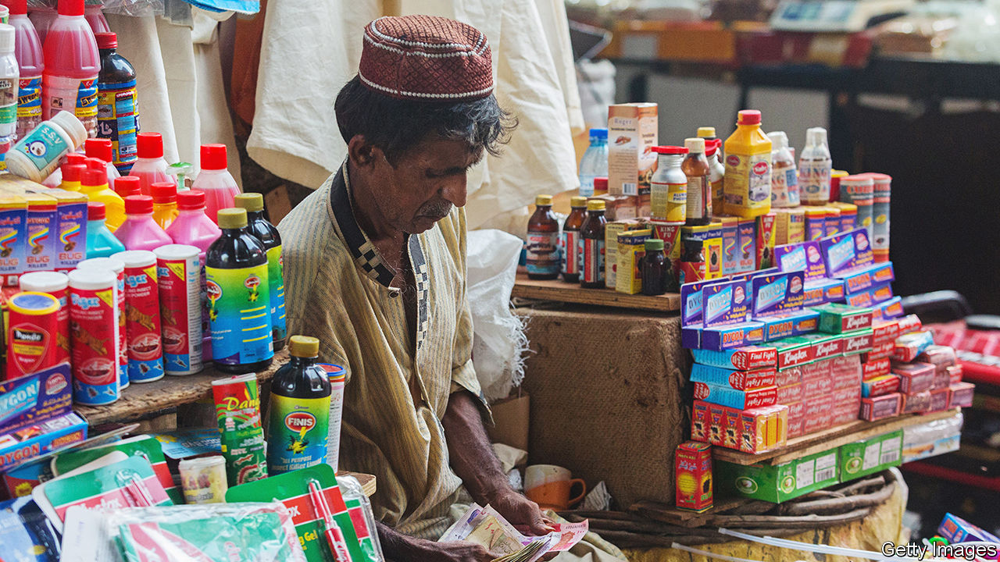

###### A fine balance

# Pakistan may be able to avoid a full-blown economic crisis 

##### But only if everything goes right 

 

> Jul 28th 2022 

On the list of unfortunate economies that markets think might soon follow Sri Lanka into debt default and economic crisis, Pakistan sits near the top. It relies heavily on imported food and energy. As commodity prices have soared, its current-account balance has widened and hard currency has drained away. In the past year, Pakistan’s foreign-exchange reserves have shrunk by more than half, to just over $9bn, about six weeks’ worth of imports. Its currency, the rupee, has lost 24% of its value against the dollar in 2022. Many reckon that a crisis is inevitable. 

Not Murtaza Syed. A former employee of the International Monetary Fund (imf) now serving as acting head of Pakistan’s central bank, Mr Syed believes the country is well equipped to survive its current troubles. It is thanks only to lazy markets’ unwillingness to take a nuanced view of individual countries’ circumstances that Pakistan finds itself lumped in with other, .

Mr Syed has something of a point. At 74% of gdp, Pakistan’s public-debt load is high for a poor country, but below the level of many other vulnerable economies. Importantly, it owes much less to foreigners, and does not rely very heavily on bond markets. Pakistan’s funding problems mostly stem from bad timing; it owes a lot to external creditors over the next year, at a time when global financial conditions are deteriorating and the cost of imports is spiking. If it can survive this pinch point, Mr Syed reckons, things will look up.

Hopes for survival received a big boost on July 13th, when the government concluded an agreement with the imf to revive a pre-existing bail-out arrangement, clearing the way for about $1.2bn to flow in. With that money, Pakistan just about has the financing to meet an estimated $35bn in external obligations over the next year. Crucially, the imf’s renewed involvement should dissuade big creditors (including China) from demanding immediate repayment; rolling over those debts would meet nearly a third of Pakistan’s funding needs. The agreement might also convince markets that they have underestimated Pakistan’s financial health.

The problem with this plan is that it leaves little margin for error. Pakistan’s current-account deficit, which mostly reflects that more is being spent on  than foreigners are spending on Pakistan’s exports, is responsible for a huge share (about a third) of its projected financing needs over the coming year. If in the coming months that deficit turns out to be larger than anticipated then the sums no longer add up. Weak inflows of capital, because of reduced investment or remittances, could also upset the delicate balance. Maintaining market confidence will be crucial. imf reports on the economy may well help in this regard, particularly if the new government shows that it is making progress towards its ambitious goals for trimming its budget deficit, which last year stood at 6% of gdp. But establishing that credibility will take time.

And time may not be on Pakistan’s side. As the troubles of the emerging world grow, markets are showing signs of becoming less discriminating, not more. This pervading gloom may help explain why Mr Syed has gone on a public-relations offensive. Yet in these conditions, markets do not seem especially inclined to listen. ■

