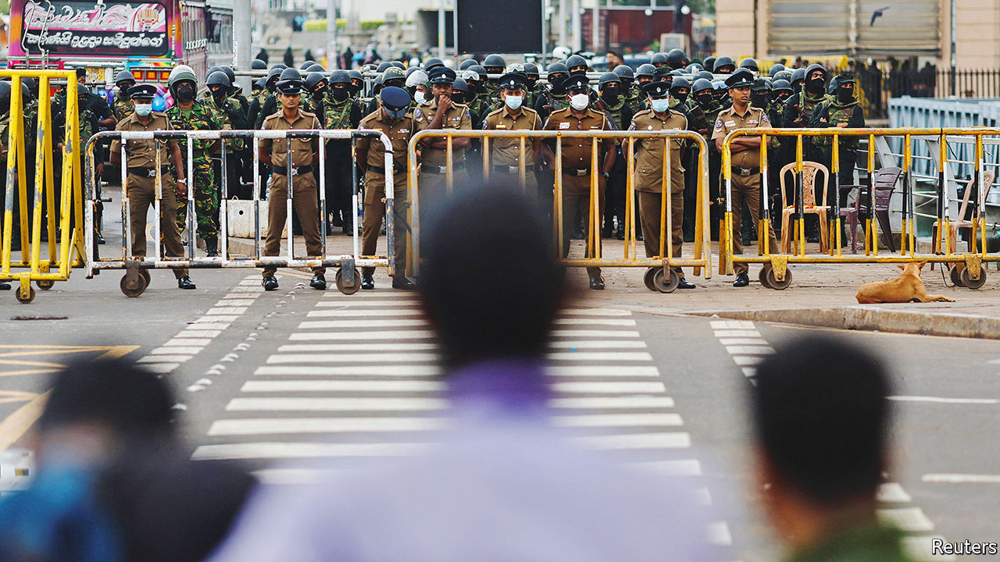

###### Obstacle course

# What it will take to fix Sri Lanka’s economy 

##### A long period of painful reforms, and yet more misery for Sri Lankans 

 

> Jul 28th 2022 

On the evening of July 21st, a relaxed mood prevailed in Sri Lanka’s presidential secretariat on the seafront of Colombo, the capital. A handful of protesters milled about in the entrance hall, which they had occupied on July 9th and turned into a library full of donated books. They said they were planning to return the premises to the state the following day, having succeeded in  Gotabaya Rajapaksa, the disgraced former president. 

The new government had other ideas. Not long after, in the early hours of July 22nd, soldiers and police in riot gear evicted the remaining protesters from the building, tore down their tents outside and put up metal barricades. They arrested several protesters and injured a handful badly enough to send them to hospital.

The raid was an inauspicious start to the presidency of Ranil Wickremesinghe, who was  on July 20th, one week after Mr Rajapaksa fled the country (he resigned the next day). The new president is already unpopular. Many Sri Lankans disapproved of his willingness in recent months to work with the former one. He accepted the job of prime minister in May after the leader of the opposition refused to take it without a guarantee that Mr Rajapaksa would resign. 

Suppressing protests is unlikely to inspire goodwill among the public. Yet goodwill is precisely what Mr Wickremesinghe will need over the coming months. Without it, his government is unlikely to survive the pain it is about to inflict in order to return the country to some semblance of economic stability.

Mr Rajapaksa’s departure has helped calm the  in the country, but it has done nothing to change its economic predicament. Sri Lanka defaulted on its external debts in May. The rupee has lost almost half of its value against the dollar since the central bank abandoned its peg in March. Inflation was 55% in June; the bank’s governor expects it to hit 70% before it begins to decline. Food-price inflation has already passed 80%. Government revenue, at around 8% of gdp, covers less than half of spending, which is closer to 19%. The lack of foreign currency means that heavily regulated imports such as fuel and medicine remain scarce while others are eye-wateringly expensive. 

Fixing the mess will be extremely difficult. The immediate concern for Mr Wickremesinghe’s government is addressing its  by coming to an agreement with the International Monetary Fund (imf), and unlocking fresh credit. Those close to the negotiations say the latest round of talks in June went well. Yet the imf is closely watching the new government’s relationship with the opposition, which could end up in charge of seeing through a three-year imf programme (Sri Lanka’s 17th). It does not help that the country has a history of not completing programmes if it suits politicians.

But even if the government convinces the imf that there is broad support for reforms, negotiations with creditors must be completed before the Fund can begin disbursing money. China and Japan are Sri Lanka’s biggest bilateral creditors, each accounting for 10% of its $32bn in external debt. Private bondholders hold about a third. China, which has lent big sums to other economies that are now also facing trouble, is seen as reluctant to accept incomplete repayment (a so-called “haircut”) lest it set a precedent. It prefers to roll over debt. Other creditors are unlikely to accept haircuts if China will not. Meanwhile, hedge funds specialising in distressed debt have begun to buy up Sri Lankan bonds and will demand to be paid back in full, further complicating negotiations. Optimists say the imf board could approve the deal—the last step before funds are released—as early as the end of the year. Others see talks dragging on for a year or longer.

Even in the best-case scenario, ordinary Sri Lankans face an extremely difficult couple of years. In an effort to tame inflation, the central bank has sharply raised interest rates twice since April, to 15.5%, in effect forcing a recession. Almost two-thirds of Sri Lanka’s 8m workers are employed in the informal economy and depend on daily wages. Many have already lost their jobs. Many more will do so over the coming months. Even those who manage to find work will find the value of their wages much reduced by inflation, as it will be months before the central bank’s policies start to temper it. Inequality will rise, too, as professionals on dollar incomes will feel the squeeze less than those earning wages in rupees. 

The impact of monetary tightening will be compounded by similar policies on the fiscal side. To fulfil the conditions of the imf programme, the government will be forced to cut spending and raise taxes. A pay freeze in the public sector and stays on infrastructure investment may curtail spending, but deep cuts will be difficult given that expenditure on welfare payments will have to rise to cushion the impact of the crisis. So the main emphasis is likely to be on raising revenue. 

In his previous job as prime minister, Mr Wickremesinghe had already restored some taxes cut by Mr Rajapaksa’s government in 2019, raising the value-added tax from 8% to 12%. If the current government decides to finish the job, the corporation tax would return to 30%, from 24%, and the top rate of income tax would rise to 34%, from 18%. Even then, the government would still have to find more money. 

It could remove corporate-tax exemptions in a range of sectors, broaden the tax base (only a fraction of the population pays income tax) and sell off state-owned enterprises such as Sri Lankan Airlines. Though possibly beneficial in the long term, in the short term such policies will cost jobs and compound the misery of an already beleaguered country. The economy is expected to shrink by at least 7% this year. 

Opposition members believe that Mr Wickremesinghe is serious about reform. But they are dubious about his cabinet, which contains many of the same people who watched over Mr Rajapaksa’s mismanagement. “Nobody in this new cabinet has ever been in favour of reform,” says Harsha de Silva of Samagi Jana Balawegaya, an opposition party. “Now they will suddenly advocate for it in parliament?”

Adding reform-minded members of the opposition to the cabinet would go some way towards addressing those concerns, as well as adding legitimacy to Mr Wickremesinghe’s government. Once he has set the course, the new president may be best off acknowledging that, like his country, he is living on borrowed time. Over the past few months, many Sri Lankans who enthusiastically voted for his predecessor’s party three years ago have changed their minds. A country heading for painful reform can ill afford this mismatch between the people and their representatives. Only fresh elections can resolve it. ■

