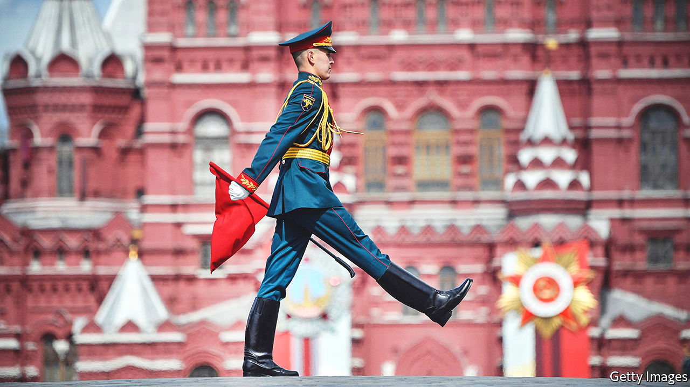
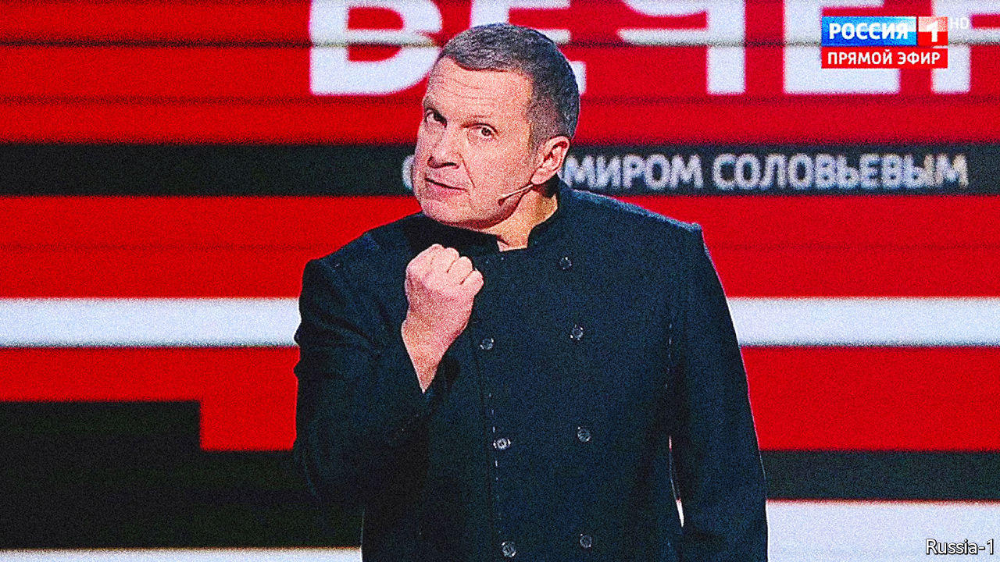
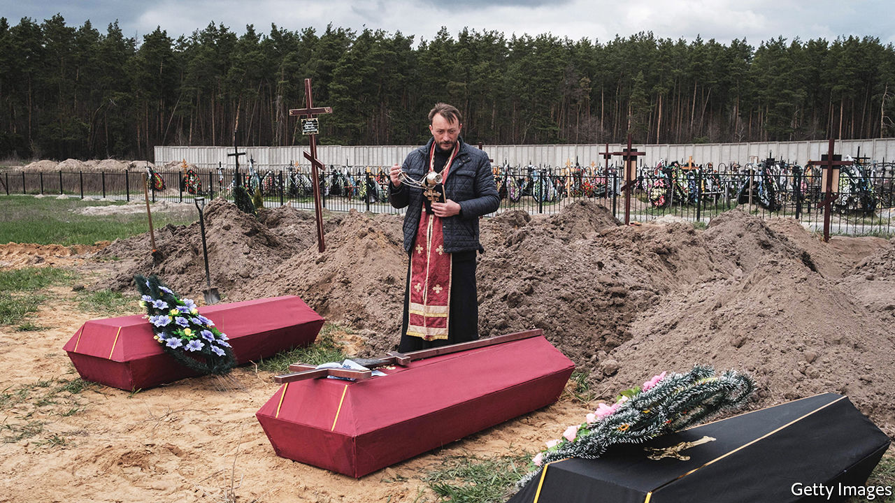
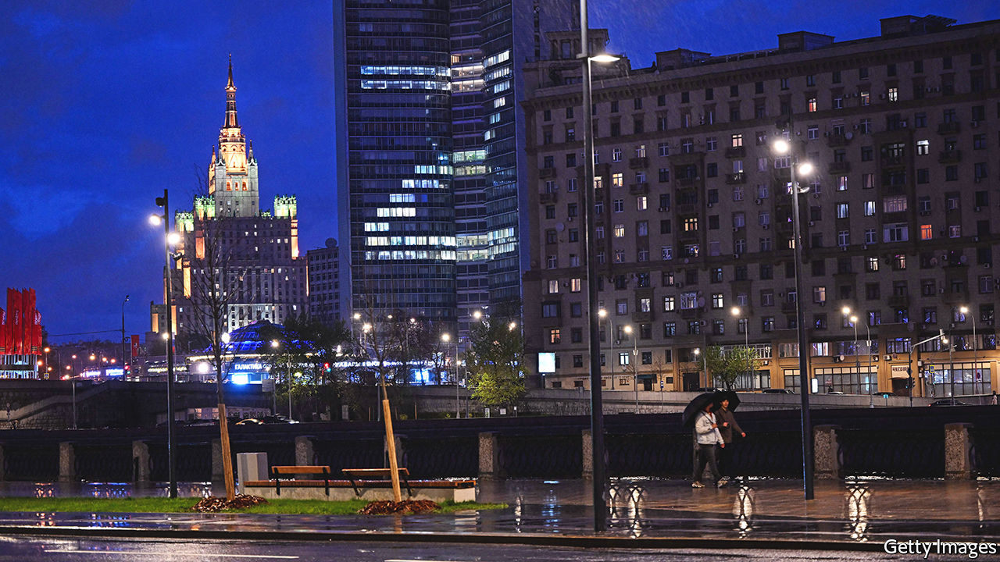

###### A dark state

# Vladimir Putin is in thrall to a distinctive brand of Russian fascism 

##### That is why his country is such a threat to Ukraine, the West and his own people 

 

> Jul 28th 2022 

What matters most in Moscow these days is what is missing. Nobody speaks openly of the war in Ukraine. The word is banned and talk is dangerous. The only trace of the fighting going on 1,000km to the south is advertising hoardings covered with portraits of heroic soldiers. And yet Russia is in the midst of a war.

In the same way, Moscow has no torch processions. Displays of the half-swastika “z” sign, representing support for the war, are rare. Stormtroopers do not stage pogroms. Vladimir Putin, Russia’s ageing dictator, does not rally crowds of ecstatic youth or call for mass mobilisation. And yet Russia is in the grip of fascism.

Just as Moscow conceals its war behind a “special military operation”, so it conceals its fascism behind a campaign to eradicate “Nazis” in Ukraine. Nevertheless Timothy Snyder, a professor at Yale University, detects the tell-tale symptoms: “People disagree, often vehemently, over what constitutes fascism,” he wrote recently in the , “but today’s Russia meets most of the criteria.” 

The Kremlin has built a cult of personality around Mr Putin and a cult of the dead around the Great Patriotic War of 1941-45. Mr Putin’s regime yearns to restore a lost golden age and for Russia to be purged by healing violence. You could add to Mr Snyder’s list a hatred of homosexuality, a fixation with the traditional family and a fanatical faith in the power of the state. None of these come naturally in a secular country with a strong anarchist streak and permissive views on sex.

Understanding where Russia is going under Mr Putin means understanding where it has come from. For much of his rule, the West saw Russia as a mafia state presiding over an atomised society. That was not wrong, but it was incomplete. A decade ago Mr Putin’s popularity began to wane. He responded by drawing on the fascist thinking that had re-emerged after the collapse of the Soviet Union. 

This may have begun as a political calculation, but Mr Putin got caught up in a cycle of grievance and resentment that has left reason far behind. It has culminated in a ruinous war that many thought would never happen precisely because it defied the weighing of risks and rewards. 

Under Mr Putin’s form of fascism, Russia is set on a course that knows no turning back. Without the rhetoric of victimhood and the use of violence, Mr Putin has nothing to offer his people. For Western democracies this onward march means that, while he is in power, dealings with Russia will be riven by hostility and contempt. Some in the West want a return to business as usual once the war is over, but there can be no true peace with a fascist Russia. 

For Ukraine, this means a long war. Mr Putin’s aim is not only to take territory, but to crush the democratic ideal that is flourishing among Russia’s neighbours and their sense of separate national identity. He cannot afford to lose. Even if there is a ceasefire, he is intent on making Ukraine fail, with a fresh use of force if necessary. It means that he will use violence and totalitarianism to impose his will at home. He is not only out to crush a free Ukraine, but is also waging war against the best dreams of his own people. So far he is winning.

War is peace

What is Russian fascism? The f word is often tossed around casually. It has no settled definition, but it feeds on exceptionalism and , a mixture of jealousy and frustration born out of humiliation. In Russia’s case, the source of this humiliation is not defeat by foreign powers, but abuse suffered by the people at the hands of their own rulers. Deprived of agency and fearful of the authorities, they seek compensation in an imaginary revenge against enemies appointed by the state. 

Fascism involves performances—think of all those rallies and uniforms—laced with the thrill of real violence. In all its varieties, Mr Snyder says, it is characterised by the triumph of the will over reason. His essay was entitled “We should say it. Russia is fascist”. In fact the first to talk about it were Russians themselves. One of them was Yegor Gaidar, the first post-Soviet prime minister. In 2007 he saw a spectre rising from Russia’s post-imperial nostalgia. “Russia is going through a dangerous phase,” he wrote. “We should not succumb to the magic of numbers but the fact that there was a 15-year gap between the collapse of the German Empire and Hitler’s rise to power and 15 years between the collapse of the ussr and Russia in 2006-07 makes one think…” 

By 2014 Boris Nemtsov, another liberal politician, was clear: “Aggression and cruelty are stoked by the television while the key definitions are supplied by the slightly possessed Kremlin master…The Kremlin is cultivating and rewarding the lowest instincts in people, provoking hatred and fighting. This hell cannot end peacefully.”

A year later Nemtsov, by then labelled a “national traitor”, was murdered beside the Kremlin. In his final interview, a few hours before his death, he warned that “Russia is rapidly turning into a fascist state. We already have propaganda modelled after Nazi Germany. We also have a nucleus of assault brigades…That’s just the beginning.” 

 


Nobody has signalled the growing influence of fascism more loudly than Mr Putin and his acolytes. Far from Moscow’s prosperous streets, the Kremlin has marked tanks, people and television channels with the letter z. The half-swastika has been painted on the doors of Russian film and theatre critics, promoters of “decadent and degenerate” Western art. Hospital patients and groups of children, some kneeling, have been arranged to form half-swastikas for posting online. 

In the 1930s Walter Benjamin, an exiled German cultural critic, analysed fascism as a performance. “The logical result of fascism is the introduction of aesthetics into political life,” he wrote. These aesthetics were designed to supplant reason and their ultimate expression was war. 

Today the two faces of the war on television, Vladimir Solovyov and Olga Skabeeva, are caricatures of Nazi propagandists. Mr Solovyov is often dressed in a black double-breasted Bavarian-style jacket. Ms Skabeeva, severe and chiselled, has a hint of the dominatrix. They project hatred and aggression. They and their guests decry the West for having declared war on Russia and plead theatrically with Mr Putin to reduce it to ashes by unleashing the full might of Russia’s nuclear arsenal.

This fantasy Armageddon is matched by real violence, the basis of the relationship between the Russian state and its people. A Levada poll commissioned by Committee Against Torture (now itself blacklisted) showed that 10% of the Russian population has experienced torture by law-enforcement agencies at some point. There is a culture of cruelty. Domestic abuse is no longer a crime in Russia. In the first week of the war young women protesters were humiliated and sexually abused in police cells. Nearly 30% of Russians say torture should be allowed. 

Atrocities committed by the Russian army in Bucha and other occupied cities are not just excesses of war or a breakdown in discipline, but a feature of army life that is spread more widely by veterans. The 64th Motor Rifle Brigade, which allegedly carried out the atrocities, was honoured by Mr Putin with the title of “Guards” for defending the “motherland and state interests” and praised for its “mass heroism and valour, tenacity and courage”. The brigade, based in the far east, is notorious in Russia for its bullying and abuse. 

Like much else coming from the Kremlin, fascism is a top-down project, a move by the ruling elite rather than a grassroots movement. It requires passive acceptance rather than mobilisation of the masses. Its aim is to disengage people and prevent any form of self-organisation. The Kremlin and television bosses can turn it up and down. In the early years of his presidency Mr Putin used money to keep the people out of politics. After the economy stalled in 2011-12 and the urban middle class came out on the streets to demand more rights, he stoked nationalism and hatred. During the political calm after the annexation of Crimea in 2014 fascism was turned down as suddenly as it had come up. 

Its resurgence in 2021-22 followed the decline in Mr Putin’s legitimacy, protests against the poisoning and arrest of Alexei Navalny, an opposition leader, and the growing alienation of younger Russians who are less susceptible to television propaganda and more open to the West. To them Mr Putin was an ageing, vengeful and corrupt grandpa who had a secret palace exposed by Mr Navalny’s much-watched YouTube film in 2021. Mr Putin needed to turn the volume back up again and Ukraine offered him the means.

Freedom is slavery

Russian fascism has deep roots, going all the way back to the early 20th century. Fascist ideas flourished among White émigrés after the Bolshevik revolution and they were partly re-imported to the Soviet Union by Stalin after the war. He feared that a victory over fascism, won with America and Britain, would empower and liberate his own people. So he turned Soviet success into the triumph of totalitarianism and Russian imperial nationalism. He re-branded war allies as enemies and fascists hellbent on destroying the Soviet Union and depriving it of its glory. 

In the decades that followed, fascism was constrained by official communist ideology and by Russians’ personal experience of fighting the Nazis alongside the Western allies. After the Soviet collapse, however, both of these constraints disappeared and the dark matter was released. In addition, the liberal elite of the 1990s completely rejected the old Soviet values, sweeping away a strong tradition of anti-fascist literature and arts. 

All the while fascism had festered undercover, within the kgb. In the late 1990s Alexander Yakovlev, the architect of democratic reforms under Mikhail Gorbachev, talked openly about the security services as a cradle of fascism. “The danger of fascism in Russia is real because since 1917 we have become used to living in a criminal world with a criminal state in charge. Banditry, sanctified by ideology—this wording suits both communists and fascists.” 

Such ambiguity was on full display in “Seventeen Moments of Spring”, a hugely popular 12-part television series made on the kgb’s orders in the 1970s. On the face of it, the series was nothing more than an attempt to rebrand the Stalinist secret police. Yuri Andropov, then kgb chief and later Soviet leader, wanted to glamorise Soviet spies and attract a new generation of young men into the service. As it turned out, the programmes helped introduce a Nazi aesthetic into Russia’s popular culture—an aesthetic that would eventually be exploited by Mr Putin.

 


The hero is a fictional Soviet spy who infiltrates the Nazi high command under the name Max Otto von Stierlitz. He is a high-ranking  in the ss, whose mission is to foil a secret plan forged between the cia and Germany near the end of the war. Played by the best-loved Soviet actors, the Nazis in the film are humane and attractive. Vyacheslav Tikhonov, who played the role of Stierlitz, was a model of male perfection. Tall and handsome, with perfect cheekbones, he shone in a sleek Nazi uniform that had been tailored in the Soviet defence ministry. 

Ordinary Russians were mesmerised. Dmitry Prigov, a Russian artist and poet, wrote: “Our wonderful Stierlitz is the perfect fascist man and the perfect Soviet man at the same time, making transgressive transitions from one to the other with subduing and untraceable ease...He is the harbinger of a new age—a time of mobility and manipulativeness.” 

Mr Putin was the beneficiary. In 1999, just before he was named as Russia’s president, voters told pollsters that Stierlitz would be one of their ideal choices for the office, behind Georgy Zhukov, the Red Army’s commander in the second world war. Mr Putin, a former kgb man who had been stationed in East Germany, had cultivated the image of a latter-day Stierlitz. 

When vtsiom, one of the pollsters, repeated the exercise in 2019, Stierlitz came in first place. “An inversion has occurred,” the pollsters said. “In 1999 Putin seemed the preferred candidate because he looked like Stierlitz; in 2019 the image of Stierlitz remains relevant because it is being implemented by the country’s most popular politician.” On June 24th this year a statue to Stierlitz was unveiled in front of the Foreign Intelligence Service (svr) headquarters that was part of the Soviet kgb. 

For Mr Putin, the fascist aesthetic is matched by a distinctively Russian fascist philosophy. He and most of his former kgb peers embraced capitalism and rallied against liberals and socialists. They also projected the humiliation they had suffered in the first post-Soviet decade onto the whole country, portraying the end of the cold war as a betrayal and defeat. 

Their prophet is Ivan Ilyin, a thinker of the early 20th century who was sent into exile by the Bolsheviks in the 1920s and embraced fascism in Italy and Germany. Ilyin saw fascism as a “necessary and inevitable phenomenon…based on a healthy sense of national patriotism”. He provided justification for their self-appointed role as the state’s guardians. As such, they were entitled to control its resources. 

After the second world war, Ilyin rejected what he saw as Hitler’s errors, such as atheism, and his crimes, including the extermination of the Jews. But he retained his faith in the fascist idea of national resurgence. In 1948 he wrote that “fascism is a complex, multifaceted phenomenon and, historically speaking, far from being outlived.” Accordingly, Mr Putin embraced religion, rejected anti-Semitism and eschewed collective leadership for his own direct rule, confirmed by plebiscites. 

Ilyin’s book, “Our Tasks”, was recommended by the Kremlin as essential reading to state officials in 2013. It ends with a short essay to a future Russian leader. Western-style democracy and elections would bring ruin to Russia, Ilyin wrote. Only “united and strong state power, dictatorial in scope and state-national in essence” could save it from chaos. 

The Ilyin work Mr Putin is said to have read and reread is “What Dismemberment of Russia Would Mean for the World”, written in 1950. In it the author argues that Western powers will try “to carry out their hostile and ridiculous experiment even in the post-Bolshevik chaos, deceptively presenting it as the supreme triumph of ‘freedom’, ‘democracy’ and ‘federalism’…German propaganda has invested too much money and effort in Ukrainian separatism (and maybe not only Ukrainian)”.

In 2005, following the first popular uprising in Ukraine, known as the Orange revolution, Mr Putin called the collapse of the Soviet Union the greatest geopolitical catastrophe of the 20th century. Drawing on anti-Ukrainian feelings in Russia, he then set his country on a path of confrontation with the West. That same year Ilyin’s body was brought back to Russia from Switzerland, where he had died in exile in 1954. Mr Putin reportedly paid for the gravestone from his own savings. In 2009 he laid flowers on Ilyin’s grave. 

Ignorance is strength

The fact that Mr Putin has embraced fascist methods and fascist thinking holds an alarming message for the rest of the world. Fascism works by creating enemies. It makes Russia the brave victim of others’ hatred even as it justifies feelings of hatred towards its real and imagined foes at home and abroad.

Dmitry Medvedev, a former president and “moderniser”, recently posted on social media: “I hate them. They are bastards and degenerates. They want us, Russia, dead…I’ll do all I can to make them disappear.” He did not bother to say who he had in mind. But Russia’s hostility has three targets: the liberal West, Ukraine and traitors at home. All of them need to take stock of what Russian fascism means. 

Mr Putin has long sought to undermine Western democracies. He has supported far-right parties in Europe, such as National Rally in France, Fidesz in Hungary and the Northern League in Italy. He has interfered in American elections, hoping to help Donald Trump defeat the Democrats. 

Even if fighting stops in Ukraine, the devotee of Ilyin in the Kremlin will not settle into an accommodation with Western democracies. Mr Putin and his men will do everything in their power to battle liberalism and sow discord. 

For centuries Russia has been partly European, but Kirill Rogov, a political analyst, wrote recently that the war in Ukraine enabled Mr Putin to cut off that part of its identity. As long as Mr Putin is in power, Russia will build alliances with China, Iran and other anti-liberal countries. It will, as ever, be in the ideological vanguard.

The outlook for Ukraine is even more bleak. A few weeks after the start of the war Ria Novosti, a state news agency, published an article that called for the purging “of the ethnic component of self-identification among the people populating the territories of historical Malorossia and Novorossia [Ukraine and Belarus] initiated by the Soviet powers.” 

Ukraine, Mr Putin said, was the source of deadly viruses, home to American-funded biological labs experimenting with strains of coronavirus and cholera. “Biological weapons were being created in direct proximity to Russia,” he warned. 

On Russian state television, Ukrainians are called worms. In a recent talk show Mr Solovyov joked: “When a doctor is deworming a cat, for the doctor it is a special operation, for the worms it is a war and for the cat it is cleansing.” Margarita Simonyan, the boss of rt, a state-controlled international tv network, stated that “Ukraine cannot continue to exist.”

The purpose of the invasion is not just to capture territory but to cleanse Ukraine of its separate identity, which threatens the identity of Russia as an imperial nation. Along with its punitive forces, the Kremlin has also dispatched hundreds of schoolteachers to re-educate Ukrainian children in the occupied territories. It equates an independent sovereign Ukraine with Nazism. Either Ukraine will cease to exist as a nation state or Russia itself will be infected by the idea of emancipation that will destroy its imperial identity. 

The bleakest of all is the outlook for Russia. Mr Putin did not plan on a war of attrition. He imagined that a strike on Kyiv would rapidly lead to a new regime in Ukraine and the submission of Ukrainian society to his will. So far, Mr Putin has failed to defeat Ukraine. But he has succeeded in defeating Russia. 

Talk of bodily contamination and cleansing is not limited to Ukraine. Russia also contains alien elements—oyster-slurping, -eating traitors who mentally live in the West and are infected with ideas of gender fluidity. The Russian people, Mr Putin declared in a tv address, will “simply spit them out like an insect in their mouth” leading to “a natural and necessary self-detoxification of society”. 

Like Stalin, Mr Putin distrusts and fears the people. They need to be controlled, manipulated and, when necessary, suppressed. He excludes them from real decision-making. As Greg Yudin, a Russian sociologist, argues, they are needed for the ritual of elections that demonstrate the legitimacy of the ruler, but the rest of the time they should be invisible. Mr Yudin calls this attitude “people on call”. 

The war changed everything. As Hitler told Goebbels in the spring of 1943, “the war…made possible for us the solution of a whole series of problems that could never have been solved in normal times”. Soon Mr Putin was able to impose de-facto military rule and censorship. He blocked Facebook, Twitter and Instagram and any remaining independent media, isolated the country from poisonous Western influence and chased anyone who objected to the war out of the country. Any public statement that challenges the Kremlin’s version of events in Ukraine is punishable by a 15-year prison sentence. 

Gregory Asmolov, of King’s College London, argues this new political reality was unimaginable only months ago and is the Kremlin’s most significant achievement in the conflict. The war has enabled Mr Putin to transform Russia into what Mr Asmolov calls a “disconnective society”. He wrote that “These efforts are driven by the notion that it’s impossible to protect the internal legitimacy of the current leadership and keep citizens loyal if Russia remains relatively open and linked up to the global networked system.” 

 


So far Mr Putin’s aim has been to paralyse Russian society rather than rally the crowds. The show of unity and mobilisation is achieved by television operating in the information space cleared of alternative voices. Among television viewers—mostly people over 60—more than 80% support the war. Among 18- to 24-year-olds, who get their news from the internet, it is less than half. This is perhaps why the symbolic representatives of the z-operation are not working men and women, but a with a red-flag and an eight-year-old “grandson”(painted on murals and imprinted on chocolate wrappers, respectively). They are the ideal television viewers and reality-show extras. 

The combination of fear and propaganda produces what Mr Rogov calls an “imposed consensus”. The state publicises opinion polls showing that the majority of Russians support the “special military operation”. The main reason people support Mr Putin is that they think everybody else does, too. The need to belong is powerful. Even when people have access to information, they “simply ignore it or rationalise it, just to avoid destroying the concept of self, country and power…created by propaganda,” notes Elena Koneva, a sociologist. 

The engine of fascism does not have a reverse gear. Mr Putin cannot turn back to a reality-based brand of authoritarianism. Expansion is in its nature. It will seek to expand both geographically and into people’s private lives. As the war drags on and casualties mount, the question is whether Mr Putin can mobilise the passive majority or whether they start to grow restive. The elites in the Kremlin, the army and the security services will watch closely.

Two plus two make four

Victor Klemperer, a German Jew who fought in the first world war and survived the second, wrote that “Nazism permeated the flesh and blood of the people through single words, idioms and sentence structures which were imposed on them in a million repetitions.” His book, “The Language of the Third Reich”, describes how the dissociating prefix  (de-) gained prominence in Germany during the war. 

 As Russian tanks stormed Ukraine in the small hours of February 24th, Mr Putin began his war against Ukraine with that same dissociating prefix. The goal, he said, was  (de-Nazification) and  (de-militarisation). Ria Novosti, the state news agency, later added that “De-Nazification inevitably will be also de-Ukrainisation.”

“Germany was almost destroyed by Nazism,” Klemperer wrote, “The task of curing it of this fatal disease is today termed ‘de-Nazification’. I hope, and indeed believe, that this dreadful word…will fade away and lead no more than a historical existence as soon as it has performed its current duty…But that won’t be for some time yet, because it is not only Nazi actions that have to vanish, but also…the typical Nazi way of thinking and its breeding-ground: the language of Nazism.” ■

