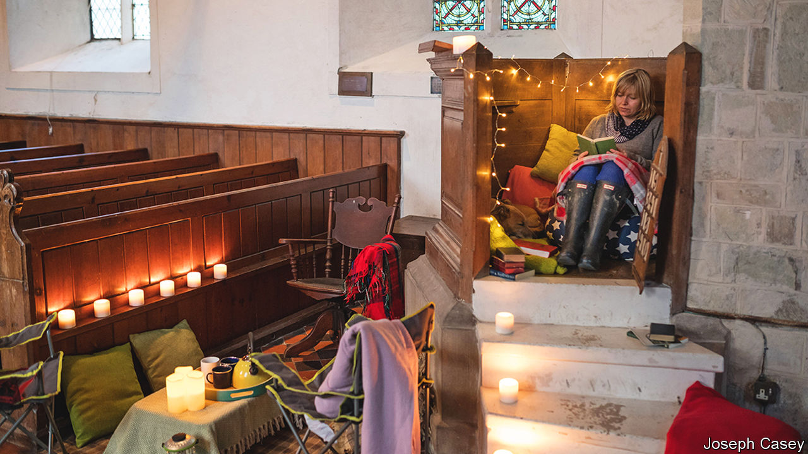

###### Happy champing

# Britain’s empty churches are turning into campsites 

##### It’s one way to keep them in use—and encourage younger visitors 

 

> Jul 28th 2022 

The graveyard of St James’s Church in Cooling, a village on the North Kent Marshes, is where Charles Dickens imagined Abel Magwitch, a “fearful man, all in coarse grey, with a great iron on his leg”, accosting young Pip in the opening scene of “Great Expectations”. Locals are used to finding tourists searching the graveyard for Pip’s relatives. “Some of them fail to differentiate fact from fiction,” says Mark Bucknall, who helps care for St James’s, which closed in 1976 due to a lack of congregants. 

For committed fans, it is possible to camp overnight in the church (or “champ”). Guests book online and find an ancient, unwieldy key in a graveyard portaloo; they enter the church to see camp beds set up in front of the altar. 

Champing is the brainchild of the Churches Conservation Trust (cct), a charity that protects historic churches. Since launching the service in 2016 the cct has welcomed 8,000 champers; 21 churches take part. Last year St Mary’s, in Longslade, Cumbria, raised £3,500 ($4,220), a large sum for a small church. St Luke’s, in Clifton, Cumbria, has a congregation of 16. Without champing, says Charlotte Bampton, its council secretary, it would shut within two years.

Visitors tend to have rather niche interests. Musicians find joy in the acoustics. Architectural historians enjoy the freedom to marvel at medieval masonry. Last summer Tilda Howard champed with friends in a church in a Northamptonshire village, in order to play Dungeons and Dragons, a fantasy role-play game. “Our victories and failures rang around the hallowed halls,” she says. Ghost-hunters have also poured in; some post videos of their nocturnal expeditions on YouTube.

Such idiosyncrasies are tolerated if it helps keep churches in good nick. In Cooling, asked if the possibility of fornication taking place on sacred ground causes him concern, a local man grins: “If it was one bloke and his goat in there, then I’d mind.” Locals worry more that guests might hold a rave or steal artefacts; some have removed historic items themselves, just to be safe. Ms Bampton is clear where the line should be drawn: “We would not be particularly impressed if people were doing occult activities, shall we say, in the church.” 

Some organisers hope a younger audience will visit churches and find a lasting comfort in the surroundings. That depends a bit on how hardy they are. Your correspondent, shivering on his camp bed, as the rain lashed against the stained-glass windows and summoned the clunking of Magwitch’s iron chains, called it a night early.

