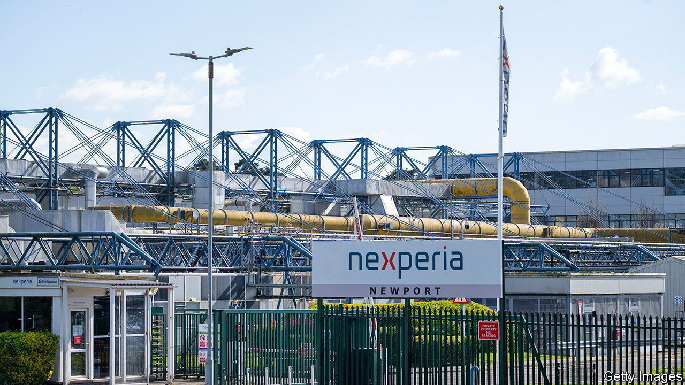
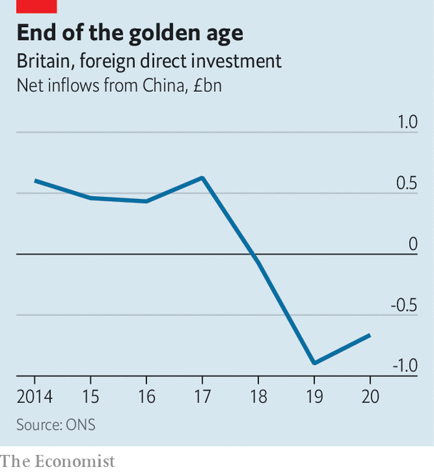

###### Red line

# Chinese investment in Britain is under the microscope 

##### Newport Wafer Fab will be the next test for the government 

 

> Jul 28th 2022 

Several issues divide Rishi Sunak and Liz Truss, the two contenders to become Britain’s next prime minister. On China, hawkishness now unites them. The government has already pledged to remove equipment made by Huawei, a Chinese firm, from the country’s 5g telecoms networks. Ms Truss promises a crackdown on TikTok, a Chinese-owned app, among others; Mr Sunak calls China the largest threat to Britain. Both claim credit for the passage last year of the National Security and Investment Act, which gave the government power to screen and scrap deals in 17 sensitive sectors involving potentially hostile foreign investors. 

On July 20th Kwasi Kwarteng, the business secretary, used the act to veto a deal for the first time. Beijing Infinite Vision Technology, a Chinese firm, was prohibited from licensing vision-sensing technology from the University of Manchester, on the basis that the intellectual property could be used in ways “which may present a national-security risk”. The technology in question, image-processing chips known as scamp-5 and scamp-7, can be used in applications from robotics to surveillance. 

That decision, combined with the bellicose rhetoric of the leadership race, is a warning to British universities, which have developed especially cosy relations with China. A report in 2021 by Civitas, a think-tank, found that over half of Russell Group universities had either current or previous research ties with companies linked to the Chinese armed forces. Universities rely on Chinese students for 6% of their total income. Mr Sunak wants to ban Confucius Institutes, on-campus language schools funded by China. 

Mr Kwarteng’s decision also suggests a tougher line on another, much more significant investment. The government is probing the acquisition of Newport Wafer Fab (nwf), Britain’s largest maker of semiconductors, on national-security grounds. The firm was bought in 2021, when the pandemic had brought it to the brink of closure, by Nexperia, a Dutch outfit itself owned by Wingtech, a Chinese firm. After much delay and flip-flopping, the government’s decision is due in early September.

The objections to the takeover are threefold. The first is that China, which is racing to build up its own semiconductor industry, should not have access to nwf’s know-how. The chips made at Newport are the basic but essential kind that control the flow of electrical power; they are used in everything from phone chargers to cars to light switches. Newport’s forte is to produce a high volume of these chips with extremely low error rates; that is expertise worth having. 

The second concern is supply-chain security. Critics point out that Wingtech is building a semiconductor fab in Shanghai; when that plant reaches capacity, the company might be inclined to shift production to China. Europe’s reliance on Russia for gas has highlighted the risks of depending on potential adversaries for inputs. “There are no plans to offshore production from Newport,” says Toni Versluijs, Nexperia’s general manager in Britain. “Neither is there any pressure from Wingtech’s shareholders to do so”.

 


The third objection centres on the plans that Nexperia does have for nwf. The firm is changing from being an open-access foundry, whose facilities are available for use by smaller companies, to a factory which makes semiconductors solely for Nexperia. Among other things that means there is nowhere to make photonics chips, which use light, not electricity, to shuffle data around. “The loss of the open photonics process at Newport Wafer Fab is bad news for the uk ecosystem,” says James Lee, a co-founder of Wave Photonics, a Cambridge-based startup that designs such chips. Rockley Photonics, a British firm that supplies semiconductors to Apple, had planned to use nwf to build its chips but now says that it will shift production to America. Mr Versluijs says that a “viable business case” is needed for external firms to use the facilities at Newport.

If Nexperia is forced to divest from nwf, it is not clear where the funds to keep the firm running would come from. Britain, unlike America and the rest of Europe, still has no published semiconductor strategy. Chinese investment has been falling for a while (see chart), and that trend is unlikely to reverse. The government has yet to work out what replaces it. ■

