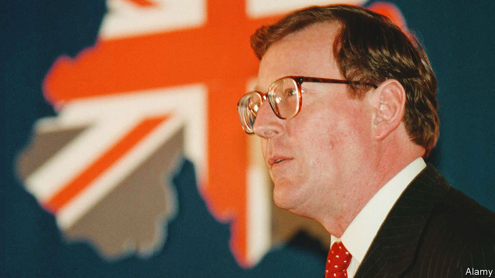

###### The unlikely dove

# Remembering David Trimble, an architect of the Good Friday Agreement 

##### Voters ended up deserting his party. But his vision endured 

 

> Jul 28th 2022 

As a law professor at Queen’s University in Belfast, David Trimble was not an obvious candidate for greatness, even in his native Northern Ireland. But quirks of fate and marks of character propelled him to become one of its most consequential leaders. His death on July 25th prompted tributes from around the world. Sir Tony Blair said that he had given “a masterclass in leadership”. Bill Clinton described him as “a leader of courage, vision and principle”. Such qualities are needed again today. 

By 1983 years of violence in Ulster had claimed well over 2,000 lives. The killing seemed unstoppable, the tribalism intractable. That year Trimble heard the shots from an ira gun—part of the group’s bloody campaign for Irish unification—which ended the life of his fellow-unionist and legal academic, Edgar Graham; he called an ambulance for the man he believed would one day lead the Ulster Unionist Party (uup), then the largest political force backing the existing constitutional settlement.

Instead, to the surprise of many, Trimble himself rose to that position. He became an mp in 1990; five years later he won the uup leadership. In 1998 came an even greater shock, when he helped negotiate the Good Friday Agreement. Having campaigned under the slogan “no guns, no government”, Trimble abandoned that pledge, becoming the province’s inaugural first minister while the ira not only held onto its guns but still used them to murder. 

Acclaim abroad, including a Nobel peace prize, was absent at home. The ira had still not fully destroyed its arsenal by the time he was driven from power in 2005. But the architecture crafted by Trimble and his nationalist counterpart, John Hume, endured. Within two years the ira’s guns had almost all gone and Gerry Adams of Sinn Féin was sharing power with Ian Paisley, a roaring hardliner. Trimble was irked at Paisley’s hypocrisy, but not wholly dissatisfied. His twin aims had been achieved: securing peace and securing the Union. 

Brexit, something he backed, has unsettled this equilibrium. One of Trimble’s final acts was to give his support to the argument now common to almost all unionists—that the Irish Sea border concocted by the eu and the British government to avoid a harder Irish land border “rips the heart out of the [Good Friday] agreement”. “I feel betrayed personally,” he said last year.

Erudite and unusually open-minded (he chose several Catholics as key advisers), Trimble could also be prickly, gauche and intellectually arrogant. He admitted to hubris for believing that unionists would keep accepting compromises while the ira remained armed. They would not, and ended up deserting the uup. But they didn’t desert his agreement. Northern Ireland today was built by Trimble and Hume. Almost all of the gunmen have gone; the principle of power-sharing is accepted; the people are free to choose their future. ■


