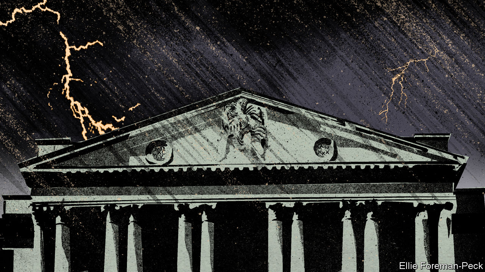
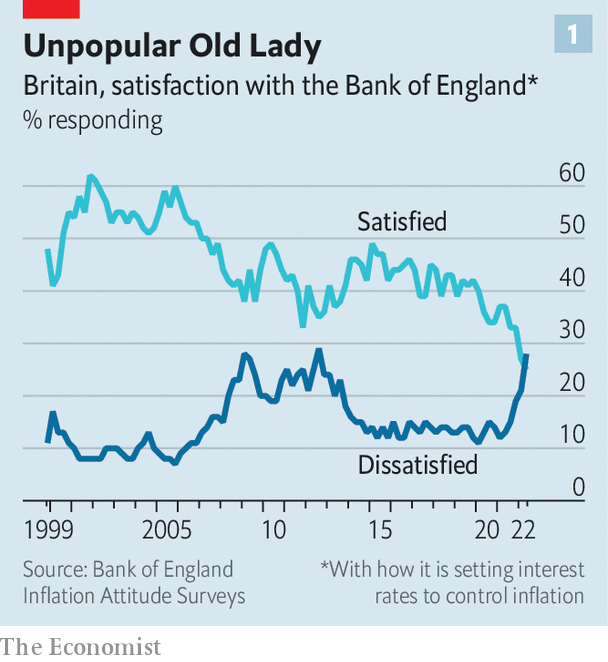
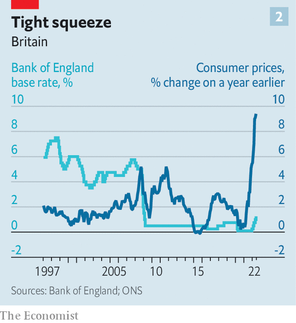

###### Dreadneedle Street

# The Bank of England must weather high inflation and meddling politicians 

##### Managing the trade-off between inflation and growth is particularly hard in Britain 

 

> Jul 28th 2022 

Andrew bailey, the governor of the Bank of England, told an audience of financiers on July 19th about an email he had received from a member of the public, requesting that he “please, please, please be more cheerful”. But Mr Bailey is not one of life’s great entertainers. The best he could do in response was: “We are not doomed, far from it. But we are in difficult times.”

No kidding. The bank must bear down on eye-wateringly high annual inflation, which reached 9.4% in June and is set to climb into double digits this autumn. That is far above its official target of 2%. The political environment is becoming more hostile: Liz Truss, the front-runner in the race to become leader of the Conservative Party and Britain’s next prime minister, has been overtly critical of the bank. For the first time since records began in 1999, more people are dissatisfied with its performance than the opposite (see chart 1). As if that were not enough, the bank is also butting heads with the government over post-Brexit financial regulation.

 


Inflation is the biggest challenge. Central bankers could not have avoided supply-chain disruptions caused by the pandemic and Brexit. They had nothing to do with Russia’s invasion of Ukraine. According to the bank’s own forecasts for the final quarter of this year, almost half of the overshoot in inflation relative to the 2% target will be explained by energy prices alone. Shocks like these end up making people poorer, come what may. “Even if central banks had somehow predicted the war and chosen to tighten monetary policy sufficiently to offset entirely its effects on overall inflation,” says Ben Broadbent, the bank’s deputy governor, “this would have entailed far weaker growth of nominal incomes, not higher real incomes.” 

Home-grown price pressures are increasing, too. In June prices of services rose by 5.2%, their fastest annual rate since December 1992. The labour market is hotter than was expected late last year, when the covid-19 furlough scheme was winding down. As Sanjay Raja of Deutsche Bank points out: “Wage growth is currently 5%, but needs to be closer to 3% to be consistent with the Bank of England’s mandate.”

Economic fine-tuning is difficult at the best of times. Raise interest rates too fast, and central banks risk stifling growth unnecessarily. Move too slowly, and they risk inflation becoming entrenched. It is devilishly hard right now. Bruna Skarica of Morgan Stanley, a bank, says that compared with the Federal Reserve and the European Central Bank, Britain’s central bank is “navigating what is probably the toughest trade-off between growth and inflation”. Like America, Britain has a tight labour market; like the euro zone, it is suffering a demand-sapping energy-price shock. 

If the precise judgments are tricky, the overall direction of travel is clear. The bank’s monetary-policy committee started raising interest rates last December (see chart 2), and will doubtless keep doing so at its meeting on August 4th. The bank does not publish its own forecast of where it expects rates to end up, but investors reckon they will peak at close to 3% early next year, before falling to 2.25% by 2025. 

 


That may be an underestimate if a new prime minister unveils big tax cuts. Ms Truss has made pledges that would deprive the Treasury of around £30bn ($36bn) of revenue relative to current policy, partly by cancelling an increase in corporation tax. Rishi Sunak, her rival for the top job, this week changed tack and dangled cuts in value-added tax on fuel. Fiscal loosening is likely to force the bank to raise rates more sharply than it otherwise would. 

Steeper rate rises will do nothing for souring public sentiment. Britons are already adjusting to pricier borrowing; over the six months to June interest rates for a common two-year fixed mortgage rose at the fastest pace since at least 1995. It may be too much to ask the public to understand that maintaining inflation at 2% would have required both superhuman foresight and an enormous recession. But politicians really ought to know better. Ms Truss in particular has latched on to the sense of rising frustration, criticising the bank for excessive money-printing and suggesting that its mandate needs toughening up.

Such pronouncements may amount to no more than campaign bluster. Ms Truss’s frankly bizarre suggestion that the bank might target the money supply makes little sense to anyone who remembers the lesson of the 1980s, which is that the relationship between the money supply and inflation (the thing that really matters) is too unstable for it to work. A sensible politician ought to be grateful for the bank’s monetary-policy independence in circumstances like these, and leave it well alone to take unpopular decisions. 

Tensions over a separate area of the bank’s remit, that of financial regulation, are more likely to continue. Britain’s departure from the eu means a huge repatriation of regulatory powers. The government wants the Bank of England to do more to encourage growth; the bank’s primary objective is financial stability. Specific spats have centred around plans to make it easier for insurers to invest in illiquid assets like infrastructure, and mooted proposals for ministers to be able to overrule regulators “in the public interest”.

It is premature to panic over these conflicts, however. For now the Treasury is suggesting only that it publicly ask regulators to review a rule it suspects is working badly. Matthew Conway of uk Finance, an industry body, would like more accountability so that individual firms have a way to complain about shoddy rule-making. 

The Bank of England has made blunders. Mr Bailey undoubtedly lacks polish as a communicator: his suggestion in February that the public should hold back from asking for bumper wage rises went down very badly. Yet even the slickest governor would find the current environment testing. Chris Marsh of Exante Data, a research firm, describes rate-setters as “moving from meeting to meeting and feeling their way”. Muddling through feels miserable. But it may not be reasonable to expect more. ■

