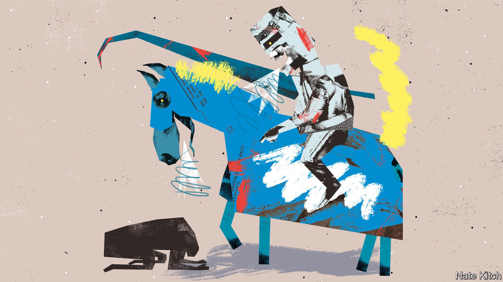

###### Bagehot

# The Conservative Party is ridiculing part of its electorate 

##### Its electoral coalition includes liberals and Europhiles. Many do not see the funny side 

 

> Jul 26th 2022 

Governments have many reasons to encourage working from home. Employees like it. There is little evidence it harms productivity. Bosses know better than politicians how to organise their workforces. Yet the government of Boris Johnson denounces the practice as an excuse for idling and daytime snacking. The Peloton, a pricey exercise bike popular with home-working professionals, has become a symbol of decadence in Tory minds. Conservative mps snigger about “woke-ing from home”. 

Such quips may entertain pensioners and blue-collar workers, who make up a growing share of the Tory electorate. But they go down less well in Woking. The wealthy Surrey town is home to an army of white-collar workers—lawyers and accountants who for decades took the train each morning to the City of London and reliably returned Conservative mps to Parliament. Their commuting patterns changed during the pandemic: the town was a hotspot of home-working. Their political allegiances are shifting, too. Many have come to see the modern Conservative Party as, at best, indifferent to their way of life. Often, it is plain insulting. 

Tories ought to know the risks of offending their electorate, because that is the story they tell of the Labour Party’s demise in its northern heartlands. A succession of north Londoners, from Peter Mandelson to Jeremy Corbyn and Sir Keir Starmer, took loyal Labour voters for granted, and at worst looked down on them. The result was Brexit and Mr Johnson’s rise. This story may be a caricature but the cultural alienation that traditional Labour supporters felt was real. Rather than learn from it, however, the Tories have imitated it in their own southern heartlands. Their electoral success rests on a coalition of voters, spread wide and thin across classes and cultures. The government’s disdain for a large chunk of them matches any of Labour’s slights.

Something profound has shifted in the British electorate. For decades people who stayed in education longer were more trusting of politicians than those who dropped out at younger ages. Europhiles were more trusting than Eurosceptics. After Brexit and the election in 2019, this historic pattern inverted. As Will Jennings of the University of Southampton shows, by May 2021 graduates and Remain voters were declaring themselves significantly less trusting than those with a basic education or those who had voted “Leave”. A new political underclass was born. 

Such people are found in large numbers in the Tories’ southern seats. The flavour of conservatism preferred here is a mixture of fiscal responsibility, social liberalism and the rule of law, says Damian Green, the head of the “One Nation” caucus of liberal Tories. These voters want their government to be quietly effective, the political discourse to be civilised and Britain’s established institutions to be respected. They stuck with the Tories in 2019 out of fear of Mr Corbyn, the far-left Labour leader. 

Now they have fewer incentives to stay. Mr Johnson’s programme of “levelling up” proved to be more about redistributing status than wealth. To lift up a new Tory electorate in the north, the old one often felt like it was being taken down a peg or two. The institutions Downing Street picked out for brawls—the bbc, the National Trust, the judiciary, universities and the civil service—are valued by many of the Tories’ traditional voters.

Partygate was particularly galling, reckon some southern Tories, to those working in management and in regulated professions, for whom workplace ethics have become a modern religion. Political scientists see competence and identity as separate drivers of voting behaviour but for some voters, being competent is a form of identity in itself. This scandal, on top of others, has disabused Britons of the notion that they are better governed than their neighbours. A study by Bobby Duffy of King’s College, London in May found that 62% of Britons, and 67% of graduates, think the government habitually breaks the rules, the highest of six European countries surveyed, including Poland and Italy.

A rising sense of alienation is driving an electoral realignment. The Liberal Democrats made big gains in Woking, and a swathe of neighbouring towns, in local elections in May. Modelling by YouGov, a pollster, in July projected that the party would seize 26 Tory constituencies in what it calls the “blue wall” of southern England, and turn 11 more into marginal seats. “A lot of Conservative voters are pretty alarmed,” says Sir Ed Davey, the Liberal Democrat leader. “They think this government is incoherent, inconsistent and chaotic.” A colleague of Sir Ed’s dubs their target the “Tim Harford voter,” after fans of the presenter of “More or Less”, a cerebral bbc radio programme about statistics. 

After insults, injury

By the time Mr Johnson resigned earlier this month, the Tories had the support of just one in five graduates and one in seven Remainers. That is an odd place to be for the party of aspiration and free trade. On paper the two remaining Tory leadership candidates are plausible antidotes. Liz Truss, the foreign secretary, promises lower payroll taxes, lower energy bills and cheaper child care. Rishi Sunak, a former chancellor, is a fastidious ex-banker who owns a Peloton and a collection of Star Wars memorabilia. They both preach the double liberalism of economic and personal freedom. 

Yet Mr Sunak has reinvented himself as a snarling populist, lashing out at human-rights lawyers and illegal migrants. It is a fascinating but unconvincing performance, like seeing Daniel Radcliffe audition for “Rambo”In a leadership debate on July 17th he ridiculed Ms Truss’s past as a Remainer and a Liberal Democrat. Which he asked, did she regret more? It was a decent enough gag. The Tories’ problem is that its electoral success still depends on binding liberals, Europhiles, National Trust volunteers, Peloton-riders and fans of Mr Harford to its tribe in large numbers. Many of these people do not see the funny side of being mocked. The Conservatives risk running out of voters to laugh at. ■


