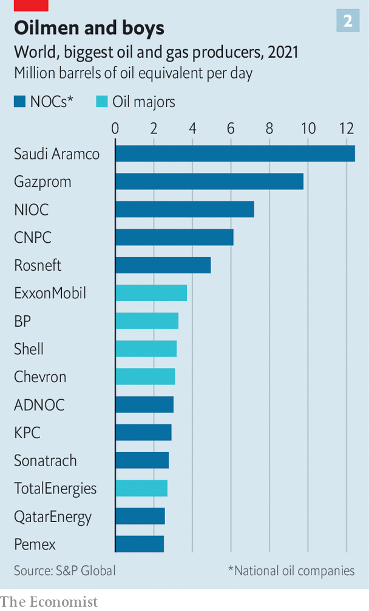

###### Nationally determined contributors

# State-run oil giants will make or break the energy transition 

##### They are intent on pumping more oil for years to come—but even they cannot completely ignore climate change 

 

> Jul 25th 2022 

Climate activists love to vilify ExxonMobil and Shell. Private-sector energy giants like them are on the receiving end of proxy battles, legal challenges and other forms of pressure to dump oil and gas in favour of renewables and other green technologies. The supermajors make for an attractive target: they have ubiquitous distribution networks and well-known brands susceptible to consumer boycotts. Such pressure is often welcome—in the fight against global warming every little counts. But in the oil market the private sector counts for less than you might think. Whether the energy transition can succeed will depend in large part on the behaviour of the world’s state-led oil behemoths.

 


If the supermajors are big oil then national oil companies (nocs in industry lingo) are enormous oil (see chart 1). Together they produce three-fifths of the world’s crude (see chart 2) and half its natural gas, compared with just over a tenth for large international oil firms (the rest is pumped by smaller independent companies). They sit on two-thirds of the remaining reserves of discovered oil and gas globally. Four—adnoc of the United Arab Emirates (uae), pdvsa of Venezuela, QatarEnergy and Saudi Aramco—possess enough hydrocarbons to continue producing at current rates for over four decades. 

 


If you thought that private-sector oilmen were making out like bandits of late from crude prices of $100 or more a barrel, their haul pales beside that of their state-sponsored counterparts. According to Wood Mackenzie, an energy consultancy, if oil prices averaged $70 until 2030, the 16 largest nocs would pocket $1.1trn more than if they averaged $50, the base case. Half that bounty would go to the Emirati, Kuwaiti, Qatari and Saudi nocs. Russian giants such as Rosneft, mostly shunned by the West after the invasion of Ukraine in February but embraced by China and other Asian customers, would capture nearly a fifth. And as the private sector gets shamed and squeezed into embracing a lower-carbon future, the nocs’ clout will only grow. 

 


It is worrying, then, that enormous oil’s decarbonisation record is so poor. Whereas the leading majors’ emissions of greenhouse gases have stabilised or peaked, the same is true of just two state-run firms: Brazil’s Petrobras and Colombia’s Ecopetrol. Kavita Jadhav of Wood Mackenzie reckons the state-run giants are allocating less than 5% of their capital spending to the energy transition, compared with 15% on average for American and European firms (see chart 3). Between 2005 and 2020 developing-world nocs also filed many fewer patent applications for green ideas than their international rivals, according to Amy Myers Jaffe and colleagues at Tufts University’s Climate Policy Lab.

 


Not all state mastodons are the same, however. As Daniel Yergin, an energy expert now at s&amp;p Global, a research firm, observes, nocs are much more diverse than private firms. s&amp;p Global identifies 65 of them worldwide (see chart 4), from basket cases like pdvsa, mismanaged by Venezuela’s left-wing dictatorship, to professionally run listed firms which are, in principle, accountable to minority shareholders (notably Aramco or Norway’s Equinor). Small wonder they differ in their shade of brown.

Many of the brownest nocs are in Africa, Asia and Latin America. Most are poorly run and have smallish or unattractive reserves. The Algerian and Venezuelan companies emit three to four times as much carbon in oil production as do the more geologically blessed and better managed firms such as adnoc and Aramco, and flare seven to ten times as much gas per barrel as does QatarEnergy. 

This record, plus governance problems, is increasingly costing such nocs the support of international firms that have historically supplied them with technical and financial muscle. Christyan Malek of JPMorgan Chase, a bank, calculates that the oil majors underwrite between 40% and 60% of investments made by nocs outside the Persian Gulf. Now, as one Western oil executive confides, even huge revenues from an African project may not be worth it “given how much grief I’m getting”. Ben Cahill of the Centre for Strategic and International Studies, an American think-tank, puts Algeria’s Sonatrach, Angola’s Sonangol, Indonesia’s Pertamina, Mexico’s pemex and Nigeria’s nnpc in this category. They may pump more now, to squeeze out as much revenue as possible before their assets become completely stranded. 

At the other end of the green spectrum, ambitious nocs are using today’s fossil windfall to expand away from dirty energy, especially in countries with dwindling reserves and serious targets to slash greenhouse-gas emissions. Alex Martinos of Energy Intelligence, a publisher, reckons these mostly medium-sized firms have in the past three years followed European majors in accelerating spending on clean energy, often outpacing similar investments by American companies. Examples include Malaysia’s Petronas and Thailand’s ptt, which have moved rapidly into renewables. ptt is also making a push into electric vehicles. Ecopetrol is involved in wind and solar projects, and recently acquired an electricity-transmission company. China’s cnooc now wants its carbon emissions to peak by 2028 and vows that non-fossil energy will make up over half its domestic output by 2050, in line with President Xi Jinping’s pledge that Chinese emissions will start to fall before 2030. 

The most significant group sits somewhere in the middle. These are companies, mostly in the Gulf and Russia, with low-cost, lower-carbon and long-lived reserves that will outlast both less well-endowed nocs and the majors. They will keep pumping for years, even decades. But some of them are trying to do it more cleanly. 

Petrobras reckons that production of oil from its newer fields results in 40% less greenhouse-gas emissions per barrel than the global average. Rather than going big on renewables, the Brazilian firm is decarbonising oil operations with investments in all-electric production facilities and vessels. It recently secured a $1.3bn green loan, where the interest rate drops if the firm spews less carbon, and has tied executive pay to emissions targets.

The middle group’s capital-spending plans, though they appear distinctly brown overall, also conceal interesting specks of green—especially if you zoom out from their own projects to those co-sponsored by other state entities. Take the uae. Its industry minister, Sultan al-Jaber, says that “we saw the writing on the wall 16 years ago.” That is when it created Masdar, a pioneering clean-energy firm which today has investments in 40 countries. 

Together with adnoc and Mubadala, a giant sovereign-wealth fund, Masdar is, among other things, betting big on hydrogen; it has signed agreements with Germany and Japan to develop green supply chains to export that promising clean fuel. Mr al-Jaber talks of a “realistic energy transition”—which is to say one that involves some fossil fuels for a while. But, he insists, “future-proofing our oil and gas operations has always been high on our agenda.” The uae is home to irena, an international renewables agency, and will host the annual un climate summit in 2023.

Then there is the biggest mastodon in the room, Saudi Arabia. Mr Yergin praises Aramco’s “big, diversified” research-and-development programme. The colossus is, he says, applying its “world-class engineering ability, scale and execution skills” to the energy transition. Ms Myers Jaffe of Tufts University calls its innovation efforts “very aggressive”, pointing to wagers on cleaning up emissions through carbon capture. Beyond Aramco, Saudi Arabia is investing $5bn in a green-hydrogen project in its futuristic desert city of Neom, with the goal of becoming the world’s biggest hydrogen exporter. 

A hedging bet must not be mistaken for a fundamental change in strategy. Last year the Saudi energy minister, Abdulaziz bin Salman, stated the kingdom’s vision clearly: “We are still going to be the last man standing, and every molecule of hydrocarbon will come out.” Most nocs will share this sentiment for the foreseeable future. It is a testament to lamentable climate inaction that even the slightest state-led de-browning can seem almost encouraging. ■


