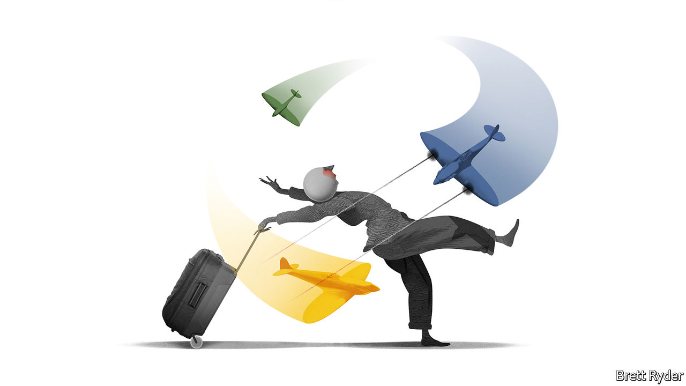

###### Schumpeter

# The Spirit deal is a missed opportunity for creative destruction 

##### The airline agrees to sell itself to JetBlue, despite antitrust fears 

 

> Jul 28th 2022 

To understand the significance of the drawn-out takeover battle for Spirit Airlines, a Florida-based ultra-low-cost carrier (ulcc), it helps to know something about one of the main protagonists. Even his opponents describe Bill Franke as brilliant. The entrepreneur is now in his 80s, but he once recounted how, on his first experience of air travel, as a young boy flying with his family to Paraguay in 1948, he had to suck oxygen from a tube as the Douglas dc-4 ascended over the Andes. It must have gone to his head. Since then he has become one of few people to have made billions out of , despite the industry’s tumultuous ups and downs.

His secret has been rigid adherence to the no-frills model: low basic fares, lots of add-ons, single-manufacturer fleets, fuel efficiency and strict cost-control. In 2006 his private-equity firm, Indigo Partners, took over Spirit, sold it in 2013 and bought Frontier Airlines, a ulcc based in Denver. Indigo has big stakes in Wizz Air, one of Europe’s biggest low-cost carriers, Volaris in Mexico and Jetsmart in South America. This year he went further, orchestrating Frontier’s $2.6bn cash-and-shares merger with Spirit. The aim was to create America’s fifth-largest , a jumbo-sized ulcc that would combine networks on either side of the United States with little overlap. It was Mr Franke at his intrepid best. 

Against him was a bigger-spending foe, though. JetBlue Airways, on the more gentrified end of low-cost air travel, had offered $3.7bn in cash for Spirit. On July 27th Spirit and Frontier called off their merger agreement. A day later JetBlue said it had agreed to buy Spirit. Whether the deal succeeds partly depends on the answers to two related questions.

The first has to do with the zeal of President Joe Biden’s antitrust crackdown. His administration wants to usher in a new era of pro-competition litigation. Airlines are near the top of its hit list. The second question concerns the structure of the industry itself. Who could do more to bash down the prices of the high-fare heavyweights such as Delta, United and American Airlines? Is it the “tweeners” like JetBlue that call themselves low-cost but resemble full-service airlines? Or the insurgent ulccs that promise a Spartan model, grumpy passengers notwithstanding? 

In its campaign to inject more competition into American business, the White House has drawn attention to what it considers an overconcentrated domestic airline industry. The Department of Justice (doj) is on the warpath, too, on behalf of “travellers who cannot afford a plane ticket home to visit family”, as Jonathan Kanter, assistant attorney-general, has put it. He makes clear the doj is keen to “litigate, not settle”. Last year it sued to block the so-called Northeast Alliance between American and JetBlue in America’s lucrative north-east market. This would not only harm passengers in New York and Boston, it argued, but diminish JetBlue’s incentive to compete on fares with American across the country. The case goes to court in September. It is a big reason why Spirit has reservations about selling itself to JetBlue. It could drag on for months, leaving Spirit’s shareholders in limbo. 

There is a bigger reason, however. JetBlue’s takeover of Spirit would be even likelier to fall foul of the doj than either the Northeast Alliance or a Frontier-Spirit combo. The transaction could potentially be tied up for not months but years. JetBlue, after all, has its sights set on eliminating Spirit, America’s largest ulcc, simply to bag its aeroplanes, pilots and airport slots. JetBlue also intends to remove seats on aircraft it takes over from Spirit in order to offer its plusher service, which would inevitably push up average seat costs. Moreover, it will have less incentive to sell its lowest no-frills fares on routes formerly operated by Spirit.

JetBlue counters that acquiring Spirit will make it a stronger rival to the network carriers, bringing down prices overall. It cites the “JetBlue effect”, which, it claims, forces legacy carriers to drop fares by about 16% on average when it goes head to head with them on non-stop routes. That may be so. Yet it ignores the impact of its higher fares on passengers who might have flown on Spirit. 

That leads to the second question: what industry structure would promote lower fares and more choice overall? JetBlue contends that its in-between model has three times more of a fare impact on legacy carriers than the ulcc model does on similar routes. Frontier calls this a fantasy. It notes that JetBlue itself has admitted to lowering fares in response to its no-frills rivals. It also argues that the “ulcc effect” drives fares down for longer than the JetBlue effect does.

Moreover, it is possible that a bigger no-frills carrier would create demand from a new cohort of travellers, as has happened in Europe. Keith McMullan of Aviation Strategy, a consultancy, notes that in 2019 Spirit and Frontier had a combined domestic market share of 8%. That compares with a total of 20% in Europe for Ryanair, a Dublin-based no-frills giant, and Wizz Air. A combination of Frontier and Spirit, especially with the hundreds of new Airbus jets both firms have on order, might have increased that share significantly, making it as disruptive as its European counterparts. 

No thrills 

JetBlue shrugs off the threat its annihilation of Spirit would pose to America’s no-frills market. Its advisers argue that Frontier and other ulccs could quickly move into parts of America vacated by Spirit. That overlooks the troubled state of the industry since the covid-19 pandemic. Pilots, crew and engineers are thin on the ground (and off it). Travel chaos abounds. Normally, when the industry suffers a slump, a shake-out helps ease such bottlenecks in favour of low-cost airlines. That hasn’t happened yet, perhaps because overconcentration has cushioned the impact on the debt-laden legacy carriers. It may do soon. It is a pity that a combined Frontier and Spirit, chaired by the indefatigable Mr Franke, may not be around to fly the flag for creative destruction. ■


