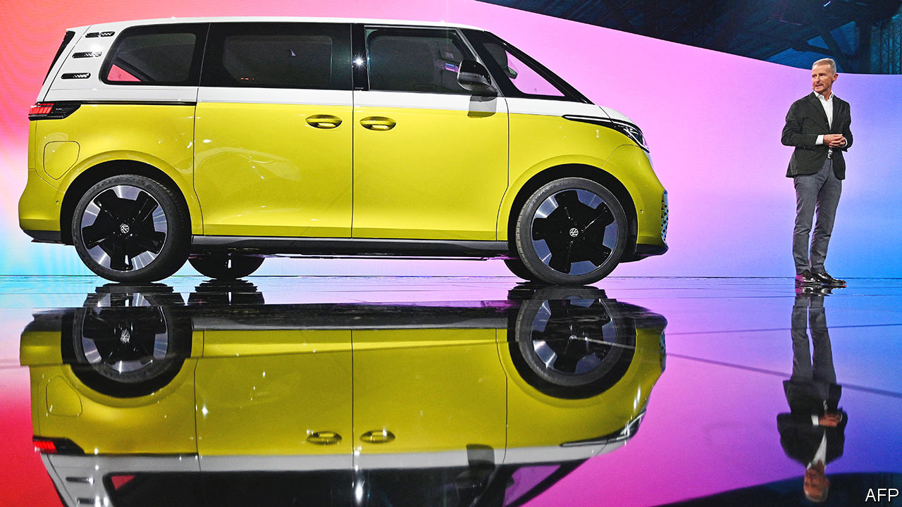

###### Diess-fenestration

# Volkswagen’s new boss faces some enduring challenges 

##### Can Oliver Blume do better than Herbert Diess? 

 

> Jul 28th 2022 

The id.buzz camper van is a symbol of what Herbert Diess hoped to achieve as boss of Volkswagen. The battery-powered update of the classic vw bus, launched in 2022, sought to haul an old-fashioned institution into the electric era. But Mr Diess’s effort to turn the German giant into an electric-vehicle (ev) juggernaut ended abruptly on July 22nd, when the firm announced he would leave the top job in a few weeks. He will be succeeded by Oliver Blume, who now runs Porsche, the group’s high-performance marque. 

Mr Diess was poached from bmw, initially to shake up the struggling mass-market vw brand by cutting costs and jobs. In 2018 he was named boss of the whole vast firm, which made 8.6m cars last year and owns eight car brands, from Porsche to the considerably less fancy Skoda. His task was to clear up the mess left by “dieselgate” and electrify Volkswagen, literally as well as metaphorically. He has earmarked nearly €90bn ($90bn) for investment in evs, batteries and software by 2026. 

His abrasiveness, which helped land him the job, soon got him into trouble. He was prone to cloth-eared gaffes, once claiming ignorance of China’s widely reported mistreatment of Uyghurs. His leaked email implying that electrification made 10% of the group’s 300,000 German employees surplus to requirements did not endear him to workers, whose representatives occupy half the seats on the group’s supervisory board and can veto changes to strategy. Nor did his frequent reminders that it took vw 30 hours to make a car that Tesla, America’s ev champion, could knock out in ten.

Mr Blume is seen as more conciliatory. In other ways, he looks set to continue pretty much where Mr Diess left off. The big bets are mostly locked in, says Pedro Pacheco of Gartner, a consultancy. He will also face the same impediments: knotty governance, slow decision-making and poor productivity. 

As Mr Diess has found, vw’s size makes it hard to turn around, let alone turn into a Tesla-like tech firm. Its mass-market electric offerings have underwhelmed. Jefferies, an investment bank, reckons vw will have spent 40% more than Tesla in their competing quests to make 2m evs a year by 2023. Serious troubles at Cariad, a 5,000-strong software division, could delay the launch of new Audi and Porsche evs by a couple of years. That may have been the final straw for the Porsche and Piëch families, vw’s biggest shareholders, who had hitherto had Mr Diess’s back. 

All car bosses must weigh developing software in-house with relying on third parties for systems that may soon define a marque’s image. Mr Blume may rethink Mr Diess’s go-it-alone strategy. His other problems include China, where the group’s sales slipped by a fifth in the first half of 2022. Globally vw is falling further behind its closest rival, Toyota. Mr Blume’s softer approach to labour relations is unlikely to reverse unions’ insistence on keeping jobs in high-wage Germany. And he must engineer the forthcoming initial public offering of Porsche, which he will continue to run. He has already pledged never to electrify the 911, Porsche’s flagship sports car. That conservative decision hints at what may be the symbol of his tenure. ■


