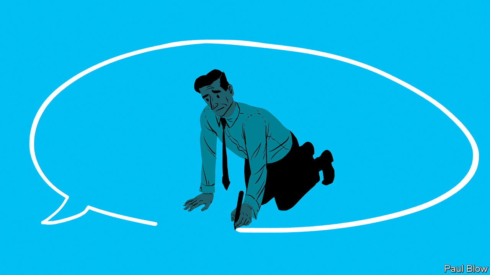

###### Bartleby

# Why it’s OK not to be perfect at work 

##### A backlash against the tyranny of high expectations 

 

> Jul 28th 2022 

It is the world’s most tired interview question: what is your greatest weakness? And Rishi Sunak, one of the two remaining candidates in the race to become Britain’s prime minister, gave the world’s most tired answer—perfectionism—when he was asked it at an online hustings earlier this month. 

No interviewee would answer this question with an unambiguous negative (“stupidity”, say, or “body odour”). Like all those who have reached for it before, Mr Sunak will have intended his reply to signal that his flaws are virtues, especially compared with the shambolic style of Boris Johnson’s outgoing government. 

But this classic response is riskier than it once was. In Mr Sunak’s case that is because the job of prime minister is largely to triage problems and make decisions at a relentless pace; even his supporters worry that his deliberative style would be a problem. More generally, perfectionism is increasingly out of step with the ways that products are developed, employees are treated and workforces are organised. 

Start with product development. Lots of digital types embrace the concept of the minimum viable product (mvp), in which companies ship prototypes that can be refined, or indeed scrapped, on the basis of feedback from early adopters. The essence of the mvp approach is anti-perfectionism: don’t procrastinate, don’t spend time sweating the tiniest details, get your product into users’ hands and see how it does. Fussing about font sizes and nice-to-have features is a waste of time; the market will hone things for you, dispensing its judgments cumulatively and dispassionately. 

A growing emphasis on employees’ well-being is another reason why perfectionism is out of favour. The trait is on the rise: a study published in 2017 found that it had been steadily increasing among American, British and Canadian college students between 1989 and 2016 (before you blame Instagram, one big reason is rising parental expectations). The tyranny of excessively high expectations is not good for you: a big literature review in 2016 concluded that perfectionism is associated with a string of mental-health disorders, from depression and burnout to stress and self-harm. 

It matters what kind of perfectionist someone is. Psychologists distinguish between a “self-oriented” version, in which people put pressure on themselves to perform flawlessly; an “other-oriented” type, in which people hold their colleagues to the highest of standards; and a “socially prescribed” version, in which employees think that they will only get on if they meet the impossible expectations of those around them. People in the last camp seem to be especially prone to stress. A recent Italian study found that, whereas having extremely high standards for your own performance was not a predictor of burnout, being afraid of making mistakes was.

Perfectionists may also hurt team cohesiveness. In a study conducted in 2020, Emily Kleszewski and Kathleen Otto of Philipps-University of Marburg asked people to rate potential co-workers based on descriptions of their levels and categories of perfectionism. Perfectionists were regarded as being less socially skilled and less likeable than non-perfectionists. You don’t have to like your colleagues for them to be effective: in that same study, perfectionists were rated as more competent than non-perfectionists. But when more and more work is organised around small groups working together, it can help not to loathe each other. 

By now your inner curmudgeon may well be frothing at the mouth. Nit-picking micro-managers are deeply annoying but they are nowhere near as bad as people who don’t have any standards. Demanding bosses can be the difference between good products and superb ones: “that’ll do” was not the mantra that made Steve Jobs successful. Some jobs actively require perfectionism—copy editors, say, or medicines regulators. And since when did being exacting become a health risk? 

Fortunately, discouraging perfectionism does not mean sacrificing high standards. In a paper published last year, three academics at the University of Ottawa found that people who strove for excellence did better on tests of creative thinking than people who sought perfection. Managers can explicitly define what counts as high-quality work. Deadlines can prevent endless procrastination. Mr Sunak’s call not to let the perfect be the enemy of the good came as he sat in front of a poster that misspelled the word “campaign”. That took things too far.


