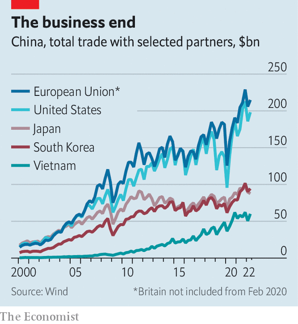

###### Showing more bottle

# Relations between China and Europe grow more tense 

##### In a continent once keen on close ties with China, views have grown much warier 

 

> Jul 28th 2022 

An old factory building in a former industrial district of Prague has been converted into one of the city’s cultural highlights. It houses the dox Centre for Contemporary Art, a privately run gallery where a current exhibition takes aim at China and Russia. One picture shows China’s leader, Xi Jinping, suckling a baby with the head of Vladimir Putin. In another the two presidents’ faces are blended into one that gazes grimly forward (see picture). Below it are bottles resembling Molotov cocktails. They evoke “resistance from ordinary people”, says the artist, Badiucao. 

Renowned for his political satire, Badiucao grew up in China and now lives in Australia. His works in Prague reflect a view that is widely shared among European governments. It is that the challenge from China—once viewed as distant, ill-defined and less relevant to Europeans than to Americans—is now evident close to home. Shortly before Russia invaded Ukraine, Mr Xi and Mr Putin declared that their friendship had “no limits”. Especially among countries that were once part of the Soviet empire, such as the Czech Republic, Mr Xi’s moral support for Mr Putin is seen as menacing to European security. 

European countries had been getting uneasy about China long before the war in Ukraine. Several had imposed curbs on its investment in critical infrastructure, such as telecoms networks. In 2019 the European Union began calling China a “systemic rival” (as well as a “partner” and “economic competitor”). Since then, governments that once hesitated to offend China, fearing economic reprisals, have become blunter. In recent days, the two contenders to take over as Britain’s prime minister have vied to show toughness on China: gone is the “” of ties that officials proclaimed in 2015. 

Europe’s new mood was evident at the opening in May of Badiucao’s exhibition. On the day before, someone claiming to be a Chinese diplomat telephoned Michaela Silpochova, dox’s artistic director. Ms Silpochova says she was told that if the exhibition went ahead, it would damage relations between her country and China. Not only did it proceed, but the Czech foreign minister, Jan Lipavsky, attended the opening ceremony. In a speech, he praised dox for hosting Badiucao’s work, in contrast with some other international venues that, he said, had given in to “justified or imagined fears of repression” by China. 

China’s mood has changed, too. No longer do its officials and foreign-policy pundits speak so assuredly of a Europe that is straining at the American leash and that wants to deal with China as a business partner, not a potential enemy. “It would be hard for the us and Europe to co-ordinate to oppose the so-called China challenge,” said , a nationalist tabloid in Beijing, in 2020. China’s state-controlled media now seem less sure. These days they argue that America, in its struggle with Russia, is stifling Europe’s strategic autonomy and making it pay a heavy price for supporting Ukraine. In other words Europe is, at least for now, co-ordinating closely with America on security matters, despite the pain. 

 


Ties with Europe matter to China for two main reasons. One is economic: the eu is China’s biggest trading partner (see chart) and has technology that China craves. The other is political: China hopes its economic clout will deter European governments from supporting American policies that China resents, on everything from human rights to dealings with Taiwan. The downturn in relations is therefore a blow to China’s ambitions. 

In an article published in June, Xin Hua, a scholar of European affairs at Shanghai International Studies University, attacked Western assessments that China is “losing Europe”. Since the second world war, he said, European governments had usually “dodged and weaved” between China and America, and would continue doing so. In Europe, however, many analysts see an enduring shift towards China-scepticism. China’s support for Russia is only part of the problem. There are many other concerns relating to everything from China’s trade practices to its escalating human-rights abuses and the danger, highlighted by the covid-19 pandemic, of European over-dependence on China’s economy. 

The unravelling of China’s European diplomacy is clear even in central and eastern Europe, where since 2012 it had been trying to create a bridgehead on the continent. In 2012 it launched a forum in the region for discussing trade, investment and cultural ties, calling it the “16 plus one” (the one being China). Eleven of the members, including the Czech Republic, were also in the eu. In 2019 the group became the “17 plus one” when another eu country, Greece, became the first member from outside post-communist Europe. China hoped that their demand for infrastructure such as roads and ports would make them pliant. Greece set an example in 2017 by blocking an eu effort at the un to condemn China’s human-rights violations.

Plus, minus

As Thorsten Benner of the Global Public Policy Institute in Berlin puts it, the group has now “somewhat imploded”. Hungary remains strongly pro-China. But in February 2021 six other eu countries in the group failed to send their leaders to a virtual summit with Mr Xi (his first appearance at such an event). In May that year one of them, Lithuania, withdrew entirely: its foreign minister called the group “divisive”. Now the Czech Republic is mulling whether to leave, too. Like Lithuania, it says the group’s economic benefits have failed to match expectations. 

Lithuania has gone a step further by beefing up its relations with Taiwan, which China claims as its territory. In November 2021 Lithuania allowed Taiwan to open an office in Vilnius, the capital, and call it the “Taiwanese Representative Office” instead of using the name “Taipei”, which Taiwan’s missions abroad usually adopt in order to avoid trouble. To China, “Taiwanese” suggests something more official. It abhors recognition of the island’s government. 

China’s response has shaken the eu. It has blocked Lithuanian exports to China, as well as some products containing Lithuanian parts. The eu has called this a threat to the bloc’s internal market and has filed a complaint, backed by America, Britain and others, in the World Trade Organisation (wto). China’s action has boosted eu discussions about enacting an “anti-coercion instrument” that it could use to impose trade sanctions against external bullies. 

China may not be quaking. wto disputes can take years to settle. The anti-coercion tool would require tricky discussions within the eu about how the group can avoid being dragged into fights by the wayward action of one member. Some European officials were uneasy about Lithuania allowing Taiwan to open an office with the offending name. 

But the eu’s anger over China’s treatment of Lithuania is only one symptom of a deeper malaise. Last year the eu imposed human-rights-related sanctions on China for the first time since the crushing of the Tiananmen Square protests in 1989. The measures targeted four officials and an organisation deemed complicit in the persecution of Uyghurs in the Chinese region of Xinjiang. China hit back wildly, placing sanctions on a wide range of prominent European politicians, scholars and think-tanks. The European Parliament responded by shelving ratification of an agreement on bilateral investment that had been reached between China and the eu in 2020 with much (overblown) fanfare. 

Probably more ominous, at least for China, have been unusually public signs of accord between America and its allies, including European countries, on issues relating to China. In June last year President Joe Biden held a series of summits with leaders of the g7, nato and the eu. Unusually, all of the meetings produced statements that suggested anxiety about China. The g7 called on it to uphold human rights in Xinjiang and Hong Kong; nato said it posed “systemic challenges to the rules-based international order and to areas relevant to alliance security”. The statement mentioned Taiwan for the first time, calling for “peace and stability” in the Taiwan Strait. The eu one also used these words—not tough, but enough to rile China. Under Mr Biden, America has stepped up efforts to co-ordinate China-related strategies with European countries. “China is more likely to respond favourably if it cannot play one of us off against another,” Janet Yellen, America’s treasury secretary, told eu economic leaders in Brussels in May. 

China has responded tetchily. During an online summit in April with eu chiefs, Mr Xi told Europe to “form its own perception of China” and “adopt an independent China policy”, or so Chinese media paraphrased him as saying. The eu’s head of foreign policy, Josep Borrell, called it a “dialogue of the deaf”, with China keeping tight-lipped about its stance on Ukraine and on human-rights issues. “So, we could not talk about Ukraine a lot, but we did not agree on anything else,” Mr Borrell said. 

The mood after Merkel

In Europe, many eyes are on Germany, a country with huge clout in the eu and much to lose in China: it has big investments there in industries ranging from car-making to chemicals. Those who worry about China’s shadow are not unhappy about Angela Merkel’s departure from office in December. As Germany’s chancellor, she had been at the forefront of eu efforts to keep relations with China from turning sour. In a phone call with her last September, Mr Xi noted a “high level of trust” between their countries. 

Mrs Merkel’s successor, Olaf Scholz, is guarded about his views on many matters, not least China. But his government is drafting a China strategy paper that is expected to be published late this year or early next. It is far from clear what tone it will set and how much it will deal with some of the trickiest problems, such as how systemic rivalry should affect co-operation in areas such as climate change or how to respond to China’s threats against Taiwan. But Wolfgang Niedermark, a board member of the Association of German Industries, says many German firms have already accepted the need to reduce dependency on China. “They are more conscious of the risks and they are willing to pay a certain premium” to diversify, he says. 

China appears in no mood for introspection. It blames nato’s eastern expansion for provoking the war in Ukraine—seemingly oblivious to the security needs of some of China’s partners in the (now) 16-plus-one group that also happen to be nato’s newer members. In June  blamed the European Parliament for what it described as the “increasingly hostile” public mood towards China in Europe. “The social and public opinion basis in Europe for co-operation and engaging with China is being gradually destroyed,” it said. That much may prove to be true. ■

