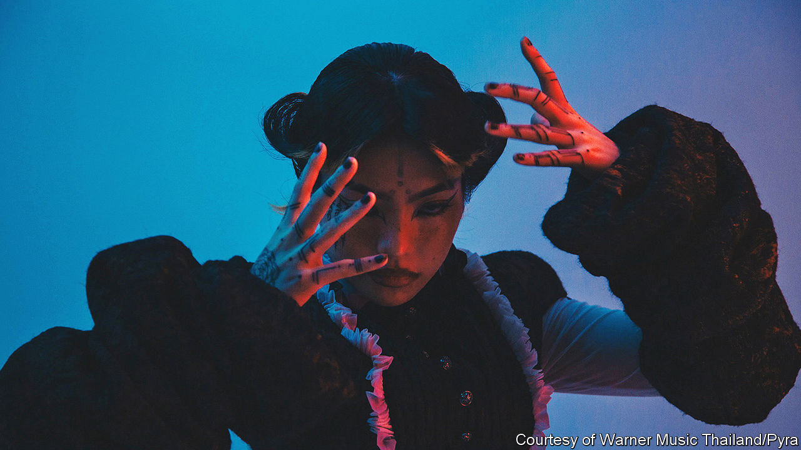

###### Pop music and dissent

# A Thai pop star uses her music to critique her homeland 

##### Known for her “dystopian pop”, Pyra has been driven out by Thailand’s conservatism 

 

> Jul 28th 2022 

The video is captioned “UGLY TRUTH ABOUT THAILAND”. Peeralada Sukawat—better known by her stage name, Pyra—looks into the camera and rolls her eyes. “Bangkok babies in Mercedes,” she raps over looping drums and a synth beat. “Rich gets richer, poor gets poorer,/Inequality’s a bitch, this place is gettin’ shittier.” Unable to perform during lockdown, the musician took to TikTok to release short clips in which she criticised her country’s inequities and what she called the “dictatorship regime”:

Where tax is spent on submarines,

People dying in the street,

Health care is not a priority. 

Pyra didn’t think anyone “would care about my sarcastic videos”. She was wrong: they were watched and shared by hundreds of thousands. In their comments on the clips, many viewers expressed similar feelings of disillusionment with Thailand or with other countries’ governments.

But abuse flooded in, too, not just on TikTok but on all Pyra’s accounts. She feared she had been designated a threat to national security by Thai officials, and that the online barbs were the work of government-paid trolls. In any case, the conservatism of Thai society had become too much for her. Wary of further retribution, she announced in March that she had moved to London. “U can’t be the best version of yourself living in an environment that you’re tryin’ to outgrow,” she wrote.

The singer has earned plaudits for her unique brand of “dystopian pop” and idiosyncratic fashion sense, as well as for her determination to expose Thailand’s ills. In January nme, a British music website, chose Pyra as its Best Solo Act from Asia. recently selected her as one of its emerging Asian entertainers under 30. 

Ironically, her first hit was a nationalist song—a hymn to Thai mothers on which she was chosen to sing at the age of nine. That precocious success instilled a passion for music, and she taught herself music production as a teenager. While studying at Chulalongkorn University in Bangkok, Pyra became interested in politics and the media and, she says, developed a sense of righteous anger. “When I realised that everything is tied to politics, it became about me living in an oppressed society. I started to develop a sense of how to stand up for myself and other people.” 

Her music became an outlet for this discontent. Her first adult single, “Stay”, a brooding hip-hop song, was independently released in 2016. Two years later came “White Lotus”, a single blending lyrics about mental health and Taoist and Buddhist philosophy with hip-hop, pop, dance beats and traditional Thai instruments. After a tour of Asia and a gig at Burning Man festival in Nevada, Pyra had a recording stint with Warner Music Thailand. 

In collaboration with Sean Hamilton, a Grammy-nominated producer, she released “Bangkok” in 2020. Though she has called the song a tribute to the “political activists who have fought bravely and sacrificed so much for the cause of freedom and democracy”, the lyrics are deliberately oblique. At that point, she was still “careful not to produce material that would eliminate me straight away”. 

She had good reason to be cautious, as Thailand’s government has often sought to silence critics. For instance, Rap Against Dictatorship, a hip-hop collective, attracted the ire of the authorities with tracks such as “Prathet Ku Mee” (“What My Country Has Got”), which lambasted corruption and the stifling of free speech. In 2020 Dechathorn Bamrungmuang, one of the group’s members, was arrested and charged with sedition after appearing at a pro-democracy protest. 

He was released; but a report compiled by a clutch of ngos suggests his phone may have been infected by spyware. (This month Chaiwut Thanakamanusorn, the minister of digital economy and society, seemed to admit that the government has used spyware to monitor some individuals, though he later backtracked.) A Thai court recently banned Rap Against Dictatorship’s latest song because it criticises the monarchy. More drastically still, Faiyen, a folk band, fled abroad in 2014 after speaking out against Thailand’s  laws, an act that can itself incur a prison term. The musicians have since been granted asylum in France. 

“We don’t have the laws to support creative freedom. Anybody can accuse us of criminal defamation,” says Pailin Wedel, a Thai-American journalist and film-maker. “When we can’t make stories about reality, it really limits us.” Natapanu Nopakun, a spokesman for the Ministry of Foreign Affairs, insists that the government is “very supportive of Thai arts and culture in any form and any kind of content”. At the same time, “there is a line, everything has a line.”

Pyra understood the risks, from both official and freelance sources, when releasing her denunciations on TikTok. “They come for you when you’re specific about things,” she notes. Yet coded language or allusiveness wouldn’t have resonated with youngsters on the social-media platform, she suggests. “To make a TikTok clip go viral, the approach is the opposite of making music [and] art. You need to be direct.” 

Now safely ensconced in Britain, she says she can focus on bringing her creative ideas to fruition. “I can finally breathe. I have stopped feeling heavy political oppression.” Her adopted country is by no means a paradise: her latest videos on TikTok condemn its immigration policy and poke fun at its crisis of leadership. But a weight has lifted: “Here in the uk, everyone dresses as they like, everyone is free to express themselves, and no one questions me. I feel I belong here.” ■

