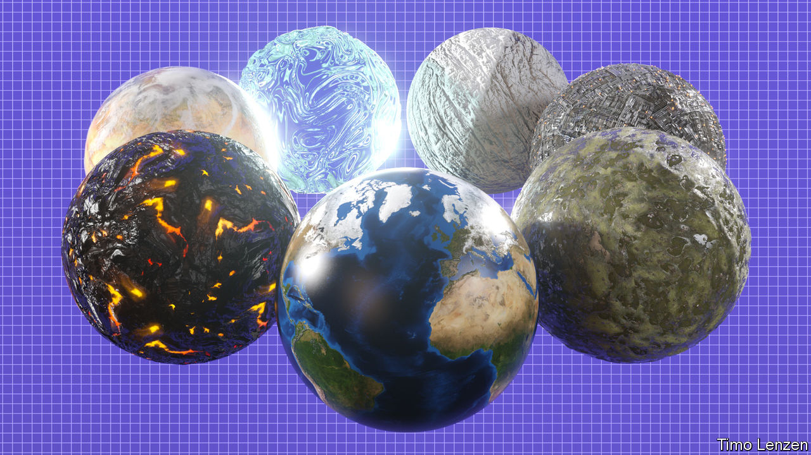

###### Technology and terminology

# In “The Metaverse”, Matthew Ball explains where the idea came from 

##### And where it might be going 

 

> Jul 27th 2022 

 By Matthew Ball. 

Do you remember the information superhighway? In the early 1990s pundits predicted that high-speed data networks would soon connect millions of people, letting them exchange information and linking them to “movies and television shows, shopping services, electronic mail and huge collections of data”, as the  put it. Yet today millions use Netflix and Amazon, Gmail and Wikipedia, and no one talks of “cruising the information superhighway”—or ever did. The vision was prescient, but the jargon died.

Something similar may now be happening with the term “metaverse”. It is also the subject of feverish speculation—this time about the possibilities of 3d virtual worlds, and a sense that video-game technology and online communication are converging in interesting ways. But its definition is elusive, and none of the multitudes who congregate in virtual worlds today, such as players of the game “Fortnite”, actually use the word.

It broke into public consciousness in October 2021, when Facebook renamed itself Meta, signalling its ambitions in this new arena. People who had not previously heard the word “metaverse” assumed it was a new Facebook product. But the term has been used in tech circles for years, and other companies, including Microsoft and Roblox, had in fact already staked their own claims to be metaverse merchants. 

Metaverse is a relatively new name for an old idea, explains Matthew Ball, a technology analyst (and occasional contributor to ), in his survey of the topic. The word was coined in 1992 by Neal Stephenson in his novel “Snow Crash”. Mr Ball traces the concept of a parallel, synthetic reality back to “Pygmalion’s Spectacles”, a short story of 1935 by Stanley Weinbaum, and later tales by Ray Bradbury, Philip K. Dick, Isaac Asimov and William Gibson. Strikingly, all their synthetic worlds are dystopias—a detail modern tech bosses have failed to notice, or chosen to ignore. 

Mr Ball’s summary of the history of virtual worlds, in both fiction and computer science, provides helpful context. But his book’s most valuable contribution may prove to be his definition of the metaverse: an interoperable network of 3d virtual worlds that can be accessed simultaneously by millions of users, who can exert property rights over virtual items. 

This definition is interesting as much for what it leaves out as for what it includes. It is not simply a rebranding of virtual reality: headsets are optional, and today virtual worlds are mostly accessed using flat screens. Nor are blockchains or non-fungible tokens mentioned, though Mr Ball concedes they may have a role. He insists that, just as there is only one internet, made up of many different networks and services that have more value for being connected, there should be only one metaverse, made up of many virtual worlds.

Given that virtual worlds already exist, the next steps will include scaling them up to support more users (online games carefully limit their numbers), making them more realistic and accessible, and devising new hardware to allow greater immersion. Progress is being made on all those fronts. But by far the biggest challenge will be to make connections between what are currently separate worlds. For example, it is not yet possible to take an item of virtual clothing from “Fortnite” into “Minecraft”.

Mr Ball is optimistic that “economic gravity” will drive companies to co-operate in devising and adopting open standards, because the market that this will unlock will be much bigger than any of them could create alone. He adduces the so-called protocol wars of the 1970s-90s, when rival computer-networking standards vied for supremacy. Ultimately an open standard prevailed, the Internet Protocol, because a common format created a bigger market.

Similarly it makes economic sense, Mr Ball argues, for virtual worlds to share data and interoperate. Today people buy fewer objects inside games and other virtual worlds than they might if ownership rights were firmer and items more portable. Tackle those problems, and more people might be willing to fork out. Economics, Mr Ball says, “will drive standardisation and interoperation over time”. 

He draws an illuminating analogy with the history of smartphones. Another way to think of the metaverse, he points out, is as the successor to the rise of the mobile internet. Mobile devices extended, but also changed, the way people experience the internet, with the advent of things like navigation apps and ride-hailing. The metaverse could represent a comparable kind of shift, transforming what the internet can do and how it is used.

But isn’t the smartphone industry dominated by the duopoly of Apple and Google? This is one case where “economic gravity” has not led to interoperability. Mr Ball thinks regulatory action is needed to loosen the duo’s grips on payment systems and app stores, which “limit the growth potential not only of virtual-world platforms, but also the internet at large”.

The author wisely avoids spending too much time trying to imagine all the future uses of the metaverse, or analysing which of today’s tech giants are best-placed to exploit it. Nor does he dig very deeply into the inevitable regulatory and governance challenges. It is far too early in the game. Think of those predictions from 1993: they were broadly correct, but Netflix, Amazon, Gmail and Wikipedia did not exist. The rise of smartphones, too, toppled previous industry leaders. The metaverse could cause a similar changing of the guard.

Even the word metaverse may not stick, Mr Ball admits. Something like it will have arrived by the end of the decade, but “we may ultimately use a different term for this future”. Like the information superhighway, this latest buzzword seems to point in the right direction, but may get lost along the way. For anyone who wants to understand the process and what is at stake, Mr Ball’s lucid and timely book offers a portal into a new realm. ■

